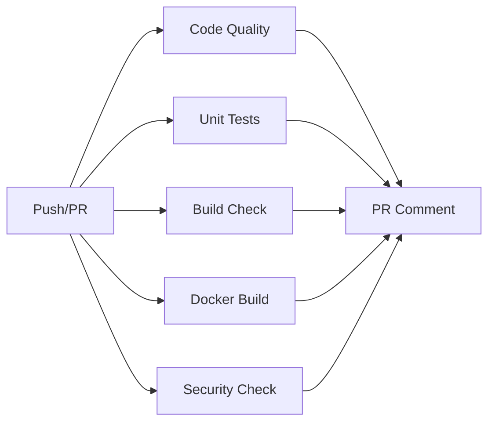

# 🚀 CI/CD ガイド

**最終更新**: 2025年7月11日  
**対象**: 開発チーム全員

---

## 📋 概要

このガイドでは、Real Estate DXシステムのCI/CD（継続的インテグレーション/継続的デリバリー）パイプラインについて説明します。

---

## 🔄 CI/CD ワークフロー

### 実装されたワークフロー

| ワークフロー | ファイル | トリガー | 説明 |
|------------|----------|---------|------|
| CI | `ci.yml` | Push/PR | コード品質チェック、テスト、ビルド |
| PR Checks | `pr-check.yml` | PR作成/更新 | PR固有のチェック |
| Dependency Check | `dependency-check.yml` | 週次/手動 | 依存関係の更新・脆弱性チェック |
| Deploy Preview | `deploy-preview.yml` | PR作成/更新 | プレビュー環境デプロイ（テンプレート） |

---

## 🏃 CI パイプライン

### ジョブ構成



### 各ジョブの詳細

#### 1. Code Quality
- **ESLint**によるコード規約チェック
- **TypeScript**の型チェック
- 現在は`continue-on-error: true`で失敗を許容

#### 2. Unit Tests
- **Jest**によるユニットテスト実行
- **PostgreSQL**と**Redis**のテスト環境を自動構築
- カバレッジレポートの生成

#### 3. Build Check
- 各アプリケーション（API、Web）のビルド可能性確認
- **Turbo**を使用した効率的なビルド

#### 4. Docker Build
- Dockerイメージのビルド可能性確認
- ビルドキャッシュを活用した高速化

#### 5. Security Check
- `pnpm audit`による脆弱性チェック
- 高severity以上の脆弱性を検出

---

## 🔍 PR チェック

### 自動チェック項目

#### PR タイトル規約
Conventional Commitsに準拠:
```
<type>(<scope>): <subject>

例:
feat(api): add user authentication
fix(web): resolve navigation issue
docs: update CI/CD guide
```

**使用可能なtype**:
- `feat`: 新機能
- `fix`: バグ修正
- `docs`: ドキュメント
- `style`: コードスタイル
- `refactor`: リファクタリング
- `perf`: パフォーマンス改善
- `test`: テスト
- `build`: ビルドシステム
- `ci`: CI/CD
- `chore`: その他
- `revert`: リバート

#### ファイルサイズチェック
- 1MB以上のファイルを検出
- 大きなファイルはGit LFSの使用を推奨

#### 条件付きテスト
- 変更されたファイルに基づいて必要なテストのみ実行
- 効率的なCI実行時間

---

## 📦 依存関係管理

### Dependabot設定
- **スケジュール**: 毎週月曜日 9:00 (JST)
- **グループ化**: minor/patchアップデートは一括
- **対象**:
  - npm (JavaScript/TypeScript)
  - pip (Python)
  - docker (Dockerイメージ)
  - github-actions

### 定期チェック
- 古いパッケージの検出
- セキュリティ脆弱性の検出
- ライセンスコンプライアンス
- バンドルサイズ分析

---

## 🛠️ ローカルでのCI実行

### 事前チェック
```bash
# リントチェック
pnpm lint

# 型チェック
pnpm typecheck

# テスト実行
pnpm test

# ビルドチェック
pnpm build
```

### act を使用したローカルCI実行
```bash
# actのインストール
brew install act  # macOS
# または
curl https://raw.githubusercontent.com/nektos/act/master/install.sh | sudo bash

# CIワークフロー実行
act push

# 特定のジョブのみ実行
act -j code-quality
```

---

## 🚨 エラー対応

### TypeScriptエラー
現在、多数のTypeScriptエラーが存在するため、CIでは`continue-on-error: true`を設定しています。

**対応方針**:
1. 段階的にエラーを修正
2. 修正完了後、`continue-on-error`を削除

### テスト失敗
1. ローカルで再現確認
2. テストDBの状態確認
3. 環境変数の設定確認

### Docker ビルド失敗
1. ローカルでDockerビルドを実行
2. ビルドコンテキストの確認
3. Dockerfileの構文確認

---

## 🔐 シークレット管理

### 必要なGitHub Secrets
```yaml
# リポジトリ設定 > Secrets and variables > Actions で設定

# 基本認証
JWT_SECRET: <ランダムな文字列>

# Google Cloud (将来の実装用)
GCP_PROJECT_ID: <プロジェクトID>
GCP_SA_KEY: <サービスアカウントキー>

# その他の外部サービス
GEMINI_API_KEY: <API キー>
```

---

## 📈 CI/CD メトリクス

### 監視項目
- **ビルド成功率**: 目標 > 95%
- **平均実行時間**: 目標 < 10分
- **テストカバレッジ**: 目標 > 80%

### 改善ポイント
1. **並列実行**の最適化
2. **キャッシュ**戦略の改善
3. **不要なステップ**の削除

---

## 🚀 今後の拡張計画

### Phase 1 (短期)
- [ ] TypeScriptエラーの解消
- [ ] テストカバレッジの向上
- [ ] E2Eテストの追加

### Phase 2 (中期)
- [ ] Google Cloud Buildとの連携
- [ ] プレビュー環境の自動構築
- [ ] パフォーマンステストの追加

### Phase 3 (長期)
- [ ] 本番環境への自動デプロイ
- [ ] カナリアリリース
- [ ] A/Bテスト基盤

---

## 📚 参考資料

- [GitHub Actions Documentation](https://docs.github.com/en/actions)
- [Conventional Commits](https://www.conventionalcommits.org/)
- [Dependabot Documentation](https://docs.github.com/en/code-security/supply-chain-security/keeping-your-dependencies-updated-automatically)

---

**問題が発生した場合は、開発チームSlackチャンネルで相談してください。**