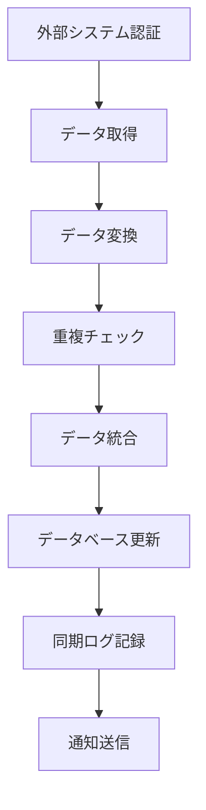

# 外部システム連携設計書

**バージョン**: 1.0  
**作成日**: 2025年7月10日  
**更新日**: 2025年7月10日  

---

## 📋 概要

### 目的
不動産業界の主要システムとの連携により、物件情報の自動取得・掲載・管理を実現し、業務効率を大幅に向上させる。

### 設計原則
1. **テナント分離**: 各テナントが独自の認証情報を管理
2. **セキュリティ**: 認証情報の暗号化保存
3. **可用性**: 接続エラー時の自動復旧
4. **拡張性**: 新システム追加の容易さ
5. **監査**: 全操作の完全ログ記録

---

## 🏗️ システム構成

### アーキテクチャ概要
```
┌─────────────────────────────────────────────────────────────┐
│                     Web Application                        │
│                 (External System Settings)                 │
└─────────────────────┬───────────────────────────────────────┘
                      │
┌─────────────────────┴───────────────────────────────────────┐
│                  API Gateway                               │
│             (Authentication & Routing)                     │
└─────────────────────┬───────────────────────────────────────┘
                      │
┌─────────────────────┴───────────────────────────────────────┐
│            External System Connector                       │
│                (Node.js + RPA)                             │
└─────────────────────┬───────────────────────────────────────┘
                      │
      ┌───────────────┼───────────────┐
      │               │               │
┌─────┴─────┐   ┌─────┴─────┐   ┌─────┴─────┐
│   REINS   │   │  AtHome   │   │ハトサポ   │
│(Web RPA)  │   │(API+RPA)  │   │(Web RPA)  │
└───────────┘   └───────────┘   └───────────┘
```

### コンポーネント構成
| コンポーネント | 責務 | 技術スタック |
|--------------|------|-------------|
| External System Manager | 外部システム管理・設定 | TypeScript, React |
| Credential Manager | 認証情報暗号化・管理 | Node.js, crypto |
| RPA Engine | Web自動化・データ抽出 | Puppeteer, Playwright |
| API Client | REST API連携 | axios, fetch |
| Queue Manager | 非同期処理・リトライ | Bull, Redis |

---

## 🔐 セキュリティ設計

### 1. 認証情報管理

#### 暗号化仕様
```typescript
interface EncryptionConfig {
  algorithm: 'aes-256-gcm'
  keyLength: 32
  ivLength: 16
  tagLength: 16
}

interface EncryptedCredentials {
  iv: string              // 初期化ベクター (hex)
  authTag: string         // 認証タグ (hex)
  encryptedData: string   // 暗号化データ (hex)
  tenantId: string        // テナントID
  systemType: string      // システム種別
}
```

#### テナント別キー生成
```typescript
class TenantKeyManager {
  private static generateTenantKey(tenantId: string): string {
    const masterKey = process.env.MASTER_ENCRYPTION_KEY!
    const salt = Buffer.from(tenantId + 'salt', 'utf8')
    
    return crypto.pbkdf2Sync(
      masterKey,
      salt,
      100000,    // iterations
      32,        // key length
      'sha256'   // hash function
    ).toString('hex')
  }
  
  static encryptForTenant(
    tenantId: string, 
    data: string
  ): EncryptedCredentials {
    const key = this.generateTenantKey(tenantId)
    const iv = crypto.randomBytes(16)
    const cipher = crypto.createCipher('aes-256-gcm', key)
    cipher.setAAD(Buffer.from(tenantId))
    
    let encrypted = cipher.update(data, 'utf8', 'hex')
    encrypted += cipher.final('hex')
    
    return {
      iv: iv.toString('hex'),
      authTag: cipher.getAuthTag().toString('hex'),
      encryptedData: encrypted,
      tenantId,
      systemType: 'external'
    }
  }
}
```

### 2. アクセス制御
- **認証**: JWT + テナントID検証
- **認可**: RBAC (Role-Based Access Control)
- **監査**: 全操作ログ記録
- **分離**: テナント間完全分離

---

## 📊 対応システム仕様

### 1. REINS（指定流通機構）

#### 連携仕様
```typescript
interface REINSConnector {
  // 基本情報
  systemType: 'REINS'
  baseUrl: 'https://system.reins.or.jp'
  connectionType: 'WEB_SCRAPING'
  
  // 認証情報
  credentials: {
    username: string
    password: string
    organizationCode?: string
  }
  
  // 機能
  functions: {
    login(): Promise<boolean>
    searchProperties(filters: PropertyFilters): Promise<Property[]>
    getPropertyDetails(propertyId: string): Promise<PropertyDetails>
    registerProperty(property: Property): Promise<RegisterResult>
    updateProperty(propertyId: string, updates: PropertyUpdate): Promise<UpdateResult>
    deleteProperty(propertyId: string): Promise<DeleteResult>
    logout(): Promise<void>
  }
}
```

#### RPA実装
```typescript
class REINSRPAClient {
  private browser: Browser
  private page: Page
  
  async login(credentials: REINSCredentials): Promise<boolean> {
    try {
      await this.page.goto('https://system.reins.or.jp/login')
      
      // ログインフォーム入力
      await this.page.fill('#username', credentials.username)
      await this.page.fill('#password', credentials.password)
      
      if (credentials.organizationCode) {
        await this.page.fill('#orgCode', credentials.organizationCode)
      }
      
      // ログイン実行
      await this.page.click('#loginButton')
      
      // ログイン成功確認
      await this.page.waitForSelector('.dashboard', { timeout: 10000 })
      
      return true
    } catch (error) {
      this.logger.error('REINS login failed', { error })
      return false
    }
  }
  
  async searchProperties(filters: PropertyFilters): Promise<Property[]> {
    try {
      await this.page.goto('https://system.reins.or.jp/search')
      
      // 検索条件設定
      if (filters.priceMin) {
        await this.page.fill('#priceMin', filters.priceMin.toString())
      }
      if (filters.priceMax) {
        await this.page.fill('#priceMax', filters.priceMax.toString())
      }
      if (filters.area) {
        await this.page.selectOption('#area', filters.area)
      }
      
      // 検索実行
      await this.page.click('#searchButton')
      await this.page.waitForSelector('.property-list')
      
      // 結果抽出
      const properties = await this.page.$$eval('.property-item', elements => {
        return elements.map(el => ({
          id: el.getAttribute('data-property-id'),
          title: el.querySelector('.title')?.textContent?.trim(),
          price: this.parsePrice(el.querySelector('.price')?.textContent),
          area: this.parseArea(el.querySelector('.area')?.textContent),
          address: el.querySelector('.address')?.textContent?.trim(),
          // ... other fields
        }))
      })
      
      return properties
    } catch (error) {
      this.logger.error('REINS search failed', { error, filters })
      throw error
    }
  }
}
```

### 2. AtHome（アットホーム）

#### 連携仕様
```typescript
interface AtHomeConnector {
  systemType: 'ATHOME'
  baseUrl: 'https://api.athome.co.jp'
  connectionType: 'REST_API'
  
  credentials: {
    apiKey: string
    clientId: string
    clientSecret: string
  }
  
  functions: {
    authenticate(): Promise<AuthToken>
    getProperties(params: GetPropertiesParams): Promise<PropertyList>
    createProperty(property: Property): Promise<CreateResult>
    updateProperty(propertyId: string, updates: PropertyUpdate): Promise<UpdateResult>
    deleteProperty(propertyId: string): Promise<DeleteResult>
    uploadImage(propertyId: string, image: File): Promise<ImageUploadResult>
  }
}
```

#### API実装
```typescript
class AtHomeAPIClient {
  private baseUrl = 'https://api.athome.co.jp/v1'
  private authToken: string | null = null
  
  async authenticate(credentials: AtHomeCredentials): Promise<boolean> {
    try {
      const response = await fetch(`${this.baseUrl}/auth/token`, {
        method: 'POST',
        headers: {
          'Content-Type': 'application/json',
        },
        body: JSON.stringify({
          client_id: credentials.clientId,
          client_secret: credentials.clientSecret,
          grant_type: 'client_credentials'
        })
      })
      
      const data = await response.json()
      this.authToken = data.access_token
      
      return !!this.authToken
    } catch (error) {
      this.logger.error('AtHome authentication failed', { error })
      return false
    }
  }
  
  async getProperties(params: GetPropertiesParams): Promise<PropertyList> {
    const url = new URL(`${this.baseUrl}/properties`)
    
    // パラメータ設定
    if (params.priceMin) url.searchParams.set('price_min', params.priceMin.toString())
    if (params.priceMax) url.searchParams.set('price_max', params.priceMax.toString())
    if (params.area) url.searchParams.set('area', params.area)
    if (params.limit) url.searchParams.set('limit', params.limit.toString())
    if (params.offset) url.searchParams.set('offset', params.offset.toString())
    
    const response = await fetch(url.toString(), {
      headers: {
        'Authorization': `Bearer ${this.authToken}`,
        'Content-Type': 'application/json',
      }
    })
    
    if (!response.ok) {
      throw new Error(`AtHome API error: ${response.status}`)
    }
    
    return await response.json()
  }
}
```

### 3. ハトサポ（ハトマークサポート）

#### 連携仕様
```typescript
interface HatosapoConnector {
  systemType: 'HATOSAPO'
  baseUrl: 'https://www.hatosapo.jp'
  connectionType: 'WEB_SCRAPING'
  
  credentials: {
    username: string
    password: string
    companyCode?: string
  }
  
  functions: {
    login(): Promise<boolean>
    getPropertyList(): Promise<Property[]>
    postProperty(property: Property): Promise<PostResult>
    updateProperty(propertyId: string, updates: PropertyUpdate): Promise<UpdateResult>
    deleteProperty(propertyId: string): Promise<DeleteResult>
    uploadImages(propertyId: string, images: File[]): Promise<ImageUploadResult>
  }
}
```

---

## 🔄 データ同期仕様

### 1. 同期フロー


### 2. データマッピング
```typescript
interface DataMapper {
  // REINS → 内部システム
  mapREINSProperty(reinsData: REINSProperty): InternalProperty
  
  // AtHome → 内部システム
  mapAtHomeProperty(athomeData: AtHomeProperty): InternalProperty
  
  // 内部システム → 外部システム
  mapToREINS(internalData: InternalProperty): REINSProperty
  mapToAtHome(internalData: InternalProperty): AtHomeProperty
}

class PropertyDataMapper implements DataMapper {
  mapREINSProperty(reinsData: REINSProperty): InternalProperty {
    return {
      externalId: reinsData.propertyId,
      externalSystemType: 'REINS',
      title: reinsData.propertyName,
      price: this.parsePrice(reinsData.price),
      area: this.parseArea(reinsData.area),
      address: this.normalizeAddress(reinsData.address),
      propertyType: this.mapPropertyType(reinsData.category),
      description: reinsData.description,
      images: reinsData.images?.map(img => ({ url: img.url, caption: img.caption })),
      metadata: {
        reinsId: reinsData.propertyId,
        lastSyncAt: new Date().toISOString(),
        source: 'REINS'
      }
    }
  }
}
```

### 3. 同期スケジュール
```typescript
interface SyncSchedule {
  // 定期同期
  fullSync: '0 2 * * *'      // 毎日 2:00
  incrementalSync: '*/30 * * * *'  // 30分ごと
  
  // イベント同期
  onPropertyCreate: 'immediate'
  onPropertyUpdate: 'immediate'
  onPropertyDelete: 'immediate'
}

class SyncScheduler {
  async scheduleSync(tenantId: string, systemType: ExternalSystemType): Promise<void> {
    // Bull Queue でジョブスケジュール
    await this.syncQueue.add('fullSync', {
      tenantId,
      systemType,
      syncType: 'full'
    }, {
      repeat: { cron: '0 2 * * *' },
      attempts: 3,
      backoff: 'exponential'
    })
    
    await this.syncQueue.add('incrementalSync', {
      tenantId,
      systemType,
      syncType: 'incremental'
    }, {
      repeat: { cron: '*/30 * * * *' },
      attempts: 2,
      backoff: 'fixed'
    })
  }
}
```

---

## ⚡ エラーハンドリング・復旧

### 1. エラー分類
```typescript
enum ExternalSystemErrorType {
  AUTHENTICATION_ERROR = 'AUTHENTICATION_ERROR',    // 認証エラー
  NETWORK_ERROR = 'NETWORK_ERROR',                   // ネットワークエラー
  RATE_LIMIT_ERROR = 'RATE_LIMIT_ERROR',            // レート制限エラー
  DATA_FORMAT_ERROR = 'DATA_FORMAT_ERROR',          // データ形式エラー
  SYSTEM_MAINTENANCE = 'SYSTEM_MAINTENANCE',        // システムメンテナンス
  UNKNOWN_ERROR = 'UNKNOWN_ERROR'                   // 不明なエラー
}

interface ExternalSystemError {
  type: ExternalSystemErrorType
  message: string
  details?: Record<string, any>
  retryable: boolean
  retryAfter?: number
}
```

### 2. 復旧戦略
```typescript
class ErrorRecoveryStrategy {
  async handleError(error: ExternalSystemError, context: ErrorContext): Promise<RecoveryAction> {
    switch (error.type) {
      case ExternalSystemErrorType.AUTHENTICATION_ERROR:
        return this.handleAuthenticationError(error, context)
      
      case ExternalSystemErrorType.NETWORK_ERROR:
        return this.handleNetworkError(error, context)
      
      case ExternalSystemErrorType.RATE_LIMIT_ERROR:
        return this.handleRateLimitError(error, context)
      
      case ExternalSystemErrorType.SYSTEM_MAINTENANCE:
        return this.handleMaintenanceError(error, context)
      
      default:
        return this.handleUnknownError(error, context)
    }
  }
  
  private async handleAuthenticationError(error: ExternalSystemError, context: ErrorContext): Promise<RecoveryAction> {
    // 認証情報の再検証
    const credentials = await this.getCredentials(context.tenantId, context.systemType)
    const testResult = await this.testConnection(credentials)
    
    if (!testResult.success) {
      // 管理者に通知
      await this.notificationService.sendAlert({
        tenantId: context.tenantId,
        type: 'EXTERNAL_SYSTEM_AUTH_FAILED',
        message: `${context.systemType} 認証エラー: 認証情報を確認してください`,
        severity: 'HIGH'
      })
      
      return { action: 'PAUSE', retryAfter: 3600 } // 1時間後に再試行
    }
    
    return { action: 'RETRY', retryAfter: 60 } // 1分後に再試行
  }
  
  private async handleNetworkError(error: ExternalSystemError, context: ErrorContext): Promise<RecoveryAction> {
    const backoffTime = Math.min(300, 30 * Math.pow(2, context.retryCount)) // 指数バックオフ
    
    return { action: 'RETRY', retryAfter: backoffTime }
  }
}
```

### 3. 監視・アラート
```typescript
interface SystemHealthMonitor {
  checkConnectionStatus(tenantId: string, systemType: ExternalSystemType): Promise<ConnectionStatus>
  recordMetrics(tenantId: string, systemType: ExternalSystemType, metrics: SystemMetrics): Promise<void>
  triggerAlert(alert: SystemAlert): Promise<void>
}

interface SystemMetrics {
  responseTime: number
  successRate: number
  errorRate: number
  lastSyncTime: Date
  syncedRecords: number
  failedRecords: number
}
```

---

## 🧪 テスト仕様

### 1. 単体テスト
```typescript
describe('ExternalSystemConnector', () => {
  describe('REINS Connector', () => {
    it('should authenticate successfully with valid credentials', async () => {
      const connector = new REINSConnector()
      const credentials = { username: 'test', password: 'test' }
      
      const result = await connector.authenticate(credentials)
      
      expect(result).toBe(true)
    })
    
    it('should handle authentication failure gracefully', async () => {
      const connector = new REINSConnector()
      const credentials = { username: 'invalid', password: 'invalid' }
      
      const result = await connector.authenticate(credentials)
      
      expect(result).toBe(false)
    })
    
    it('should extract property data correctly', async () => {
      const connector = new REINSConnector()
      const mockData = createMockREINSData()
      
      const properties = await connector.extractPropertyData(mockData)
      
      expect(properties).toHaveLength(10)
      expect(properties[0]).toHaveProperty('id')
      expect(properties[0]).toHaveProperty('title')
      expect(properties[0]).toHaveProperty('price')
    })
  })
})
```

### 2. 統合テスト
```typescript
describe('External System Integration', () => {
  it('should sync properties from REINS to internal system', async () => {
    const tenantId = 'test-tenant'
    const systemType = 'REINS'
    
    // 外部システムに接続
    const connector = await getConnector(tenantId, systemType)
    
    // データ取得
    const externalProperties = await connector.getProperties()
    
    // 内部システムに同期
    const syncResult = await syncService.syncProperties(tenantId, externalProperties)
    
    expect(syncResult.success).toBe(true)
    expect(syncResult.syncedCount).toBeGreaterThan(0)
  })
})
```

### 3. E2Eテスト
```typescript
describe('External System E2E', () => {
  it('should complete full property sync workflow', async () => {
    // 1. 認証情報設定
    await page.goto('/settings/external-systems')
    await page.fill('#reins-username', 'test-user')
    await page.fill('#reins-password', 'test-password')
    await page.click('#save-credentials')
    
    // 2. 接続テスト
    await page.click('#test-connection')
    await page.waitForSelector('.connection-success')
    
    // 3. 同期実行
    await page.click('#sync-properties')
    await page.waitForSelector('.sync-complete')
    
    // 4. 結果確認
    const syncedCount = await page.textContent('.synced-count')
    expect(parseInt(syncedCount)).toBeGreaterThan(0)
  })
})
```

---

## 📊 運用・監視

### 1. 運用指標
```typescript
interface OperationMetrics {
  // 接続状況
  connectionUptime: number        // 接続稼働率
  authenticationSuccessRate: number // 認証成功率
  
  // 同期性能
  syncFrequency: number          // 同期頻度
  syncLatency: number            // 同期遅延
  syncThroughput: number         // 同期スループット
  
  // エラー統計
  errorRate: number              // エラー率
  errorTypes: Record<string, number> // エラー種別統計
  
  // データ品質
  dataAccuracy: number           // データ精度
  duplicateRate: number          // 重複率
}
```

### 2. 監視ダッシュボード
```typescript
interface MonitoringDashboard {
  // システム状況
  systemStatus: {
    reins: 'ONLINE' | 'OFFLINE' | 'MAINTENANCE'
    athome: 'ONLINE' | 'OFFLINE' | 'MAINTENANCE'
    hatosapo: 'ONLINE' | 'OFFLINE' | 'MAINTENANCE'
  }
  
  // 同期状況
  syncStatus: {
    lastSyncTime: Date
    nextSyncTime: Date
    syncedRecords: number
    failedRecords: number
  }
  
  // パフォーマンス
  performance: {
    avgResponseTime: number
    successRate: number
    errorRate: number
  }
}
```

---

## 🔄 更新・メンテナンス

### 1. システム更新手順
1. **テスト環境での検証**
2. **段階的ロールアウト**
3. **本番環境への適用**
4. **監視・確認**

### 2. メンテナンス計画
- **定期メンテナンス**: 毎月第3土曜日 2:00-4:00
- **緊急メンテナンス**: 障害発生時随時
- **システム更新**: 四半期ごと

---

## 📋 付録

### A. 外部システム仕様書
各外部システムの詳細仕様・API仕様書は別途管理

### B. エラーコード一覧
```typescript
enum ExternalSystemErrorCode {
  // 認証エラー
  AUTH_001 = 'Invalid credentials',
  AUTH_002 = 'Authentication timeout',
  AUTH_003 = 'Account locked',
  
  // ネットワークエラー
  NET_001 = 'Connection timeout',
  NET_002 = 'DNS resolution failed',
  NET_003 = 'SSL certificate error',
  
  // データエラー
  DATA_001 = 'Invalid data format',
  DATA_002 = 'Missing required fields',
  DATA_003 = 'Data size limit exceeded'
}
```

### C. 設定項目一覧
```typescript
interface ExternalSystemConfig {
  timeout: number                // タイムアウト時間（秒）
  retryCount: number            // リトライ回数
  retryInterval: number         // リトライ間隔（秒）
  batchSize: number             // バッチ処理サイズ
  rateLimitRequests: number     // レート制限（リクエスト/分）
  syncSchedule: string          // 同期スケジュール（cron形式）
}
```

---

**承認者**: システム設計責任者  
**承認日**: 2025年7月10日