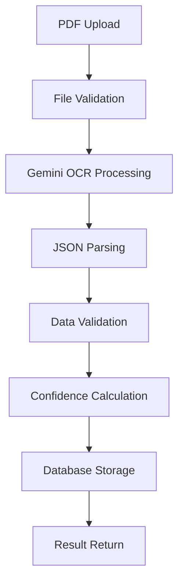

# 不動産売買DXシステム システム仕様書

**バージョン**: 1.2  
**作成日**: 2025年7月10日  
**更新日**: 2025年7月10日  

---

## 📋 システム概要

### システム構成
- **アーキテクチャ**: マイクロサービス + モノレポ構成
- **展開方式**: コンテナベース（Docker）
- **インフラ**: Google Cloud Platform
- **データベース**: PostgreSQL（マルチテナント）
- **キャッシュ**: Redis
- **ファイルストレージ**: Google Cloud Storage

---

## 🏗️ アーキテクチャ仕様

### システム全体構成
```
┌─────────────────────────────────────────────────────────────┐
│                     Load Balancer                          │
└─────────────────────┬───────────────────────────────────────┘
                      │
┌─────────────────────┴───────────────────────────────────────┐
│                  Web Application                           │
│              (Next.js 14 + TypeScript)                     │
└─────────────────────┬───────────────────────────────────────┘
                      │
┌─────────────────────┴───────────────────────────────────────┐
│                    API Gateway                             │
│              (Node.js + Express)                           │
└─────────────────────┬───────────────────────────────────────┘
                      │
        ┌─────────────┼─────────────┐
        │             │             │
┌───────┴──────┐ ┌───┴────┐ ┌─────┴─────┐
│  Core API    │ │AI-OCR  │ │External   │
│ (Node.js)    │ │Worker  │ │System     │
│              │ │(Python)│ │Connector  │
└───────┬──────┘ └───┬────┘ └─────┬─────┘
        │            │            │
        └─────────────┼─────────────┘
                      │
        ┌─────────────┼─────────────┐
        │             │             │
   ┌────┴───┐    ┌───┴────┐   ┌───┴────┐
   │PostgreSQL│  │ Redis  │   │  GCS   │
   │(Primary) │  │(Cache) │   │(Files) │
   └─────────┘  └────────┘   └────────┘
```

### マイクロサービス構成
| サービス | 責務 | 技術スタック |
|---------|-----|-------------|
| Web App | ユーザーインターフェース | Next.js 14, TypeScript, shadcn/ui |
| Core API | 基幹API・認証・データ管理 | Node.js, Express, Prisma |
| AI-OCR Worker | AI文書処理・OCR | Python, FastAPI, Gemini API |
| External Connector | 外部システム連携・RPA | Node.js, Puppeteer, Playwright |
| Notification Service | 通知・メール配信 | Node.js, Bull Queue |

---

## 🔐 セキュリティ仕様

### 1. 認証・認可
- **認証方式**: JWT + OAuth 2.0
- **セッション管理**: Redis Session Store
- **多要素認証**: TOTP対応
- **権限管理**: Role-Based Access Control (RBAC)

### 2. データ暗号化仕様

#### 2.1 保存時暗号化
- **アルゴリズム**: AES-256-GCM
- **キー管理**: Google Cloud KMS
- **対象データ**: 
  - 外部システム認証情報
  - 個人情報
  - 契約情報
  - 機密文書

#### 2.2 テナント別暗号化キー
```typescript
// 暗号化キー生成方式
const generateTenantKey = (tenantId: string): string => {
  const masterKey = process.env.MASTER_ENCRYPTION_KEY!
  return crypto.pbkdf2Sync(
    tenantId, 
    masterKey, 
    100000, // iterations
    32,     // key length
    'sha256'
  ).toString('hex')
}
```

#### 2.3 認証情報暗号化
```typescript
interface EncryptedCredentials {
  iv: string          // 初期化ベクター
  authTag: string     // 認証タグ
  encryptedData: string // 暗号化データ
  algorithm: string   // 暗号化アルゴリズム
}
```

### 3. 通信セキュリティ
- **HTTPS**: TLS 1.3以上
- **API認証**: Bearer Token + API Key
- **CORS**: 厳格なオリジン制限
- **CSP**: Content Security Policy適用

### 4. データ分離（マルチテナント）
- **物理分離**: テナント別暗号化キー
- **論理分離**: Row Level Security (RLS)
- **アクセス制御**: Prisma Middleware
- **監査ログ**: 全操作ログ記録

---

## 🗄️ データベース仕様

### 1. PostgreSQL設定
```sql
-- 基本設定
shared_preload_libraries = 'pg_stat_statements'
max_connections = 200
shared_buffers = 256MB
effective_cache_size = 1GB
work_mem = 8MB
maintenance_work_mem = 64MB

-- パフォーマンス設定
checkpoint_completion_target = 0.9
wal_buffers = 16MB
default_statistics_target = 100
random_page_cost = 1.1
effective_io_concurrency = 200
```

### 2. マルチテナント設計
```sql
-- Row Level Security設定例
ALTER TABLE properties ENABLE ROW LEVEL SECURITY;
CREATE POLICY tenant_isolation_properties ON properties
  FOR ALL TO app_user
  USING (tenant_id = current_setting('app.current_tenant_id', true));

-- テナント別インデックス
CREATE INDEX CONCURRENTLY idx_properties_tenant_status 
ON properties (tenant_id, status) 
WHERE status IN ('ACTIVE', 'PENDING');
```

### 3. 外部システム認証情報テーブル
```sql
CREATE TABLE external_system_auth (
    id UUID PRIMARY KEY DEFAULT gen_random_uuid(),
    tenant_id UUID NOT NULL REFERENCES tenants(id) ON DELETE CASCADE,
    system_type VARCHAR(50) NOT NULL,
    system_name VARCHAR(100) NOT NULL,
    
    -- 暗号化されたクレデンシャル
    encrypted_username TEXT NOT NULL,
    encrypted_password TEXT NOT NULL,
    encrypted_api_key TEXT,
    
    -- 暗号化メタデータ
    encryption_iv VARCHAR(32) NOT NULL,
    encryption_auth_tag VARCHAR(32) NOT NULL,
    
    -- 接続状態
    is_active BOOLEAN DEFAULT true,
    last_test_at TIMESTAMP,
    last_error TEXT,
    
    -- 設定・メタデータ
    settings JSONB,
    created_at TIMESTAMP DEFAULT NOW(),
    updated_at TIMESTAMP DEFAULT NOW(),
    
    UNIQUE(tenant_id, system_type)
);

-- インデックス
CREATE INDEX idx_external_auth_tenant ON external_system_auth(tenant_id);
CREATE INDEX idx_external_auth_system ON external_system_auth(system_type);
CREATE INDEX idx_external_auth_active ON external_system_auth(is_active) WHERE is_active = true;
```

---

## 🤖 AI-OCR仕様

### 1. Gemini API統合
```python
# API設定
GEMINI_CONFIG = {
    'model': 'gemini-1.5-flash',
    'api_key': os.getenv('GOOGLE_CLOUD_API_KEY'),
    'timeout': 30,
    'max_retries': 3,
    'temperature': 0.1  # 一貫性重視
}

# OCR処理パイプライン
def process_document(pdf_data: bytes, document_type: str) -> OCRResult:
    """
    1. PDF前処理・検証
    2. Gemini API呼び出し
    3. 結果構造化・検証
    4. 信頼度計算
    5. データベース保存
    """
```

### 2. 処理フロー


### 3. 対応文書フォーマット
| 文書種別 | 抽出項目 | 信頼度閾値 |
|---------|---------|-----------|
| 登記簿謄本 | 所有者、面積、権利関係 | 90% |
| 契約書 | 契約者、金額、期日 | 85% |
| 査定書 | 査定額、査定根拠 | 80% |
| 証明書 | 証明内容、発行者 | 90% |

---

## 🔗 外部システム連携仕様

### 1. 連携アーキテクチャ
```typescript
interface ExternalSystemConnector {
  authenticate(credentials: Credentials): Promise<AuthResult>
  fetchProperties(filters: PropertyFilters): Promise<Property[]>
  createProperty(property: Property): Promise<CreateResult>
  updateProperty(id: string, updates: Partial<Property>): Promise<UpdateResult>
  deleteProperty(id: string): Promise<DeleteResult>
  testConnection(): Promise<ConnectionStatus>
}
```

### 2. 対応システム仕様
| システム | 連携方式 | 認証方式 | データ形式 |
|---------|---------|---------|-----------|
| REINS | Web Scraping | ログイン認証 | HTML → JSON |
| AtHome | REST API | API Key + OAuth | JSON |
| ハトサポ | Web Scraping | ログイン認証 | HTML → JSON |
| SUUMO | REST API | API Key | JSON |
| LIFULL | REST API | API Key | JSON |

### 3. RPA実装仕様
```typescript
// Puppeteer設定
const BROWSER_CONFIG = {
  headless: process.env.NODE_ENV === 'production',
  viewport: { width: 1366, height: 768 },
  timeout: 30000,
  waitUntil: 'networkidle2'
}

// RPA処理フロー
class ExternalSystemRPA {
  async loginToSystem(credentials: Credentials): Promise<void>
  async navigateToPropertyList(): Promise<void>
  async extractPropertyData(): Promise<Property[]>
  async createProperty(property: Property): Promise<void>
  async updateProperty(id: string, updates: Partial<Property>): Promise<void>
  async logout(): Promise<void>
}
```

---

## 📊 監視・ログ仕様

### 1. アプリケーション監視
- **APM**: New Relic / Datadog
- **ログ監視**: Google Cloud Logging
- **エラー監視**: Sentry
- **メトリクス**: Prometheus + Grafana

### 2. ログ出力仕様
```typescript
interface LogEntry {
  timestamp: string
  level: 'error' | 'warn' | 'info' | 'debug'
  service: string
  tenantId?: string
  userId?: string
  requestId: string
  message: string
  metadata: Record<string, any>
  duration?: number
  error?: ErrorDetails
}
```

### 3. パフォーマンス監視
- **レスポンス時間**: 95パーセンタイル < 500ms
- **可用性**: 99.9%以上
- **エラー率**: 0.1%未満
- **リソース使用率**: CPU < 70%, Memory < 80%

---

## 🚀 デプロイ・運用仕様

### 1. CI/CDパイプライン
```yaml
# GitHub Actions設定
name: Deploy to GCP
on:
  push:
    branches: [main]
  
jobs:
  test:
    runs-on: ubuntu-latest
    steps:
      - name: Run Tests
        run: |
          npm run test:unit
          npm run test:integration
          npm run test:e2e
          
  deploy:
    needs: test
    runs-on: ubuntu-latest
    steps:
      - name: Deploy to Cloud Run
        run: |
          gcloud run deploy real-estate-dx \
            --image gcr.io/real-estate-dx/app:latest \
            --platform managed \
            --region asia-northeast1
```

### 2. インフラ構成
```yaml
# Google Cloud Platform
services:
  - Cloud Run (Application)
  - Cloud SQL (PostgreSQL)
  - Cloud Storage (File Storage)
  - Cloud KMS (Key Management)
  - Cloud Logging (Log Management)
  - Cloud Monitoring (Metrics)
  - Cloud CDN (Content Delivery)
```

### 3. スケーリング仕様
- **水平スケーリング**: Auto Scaling 1-10 instances
- **垂直スケーリング**: CPU 1-4 cores, Memory 1-8GB
- **データベース**: Read Replica対応
- **キャッシュ**: Redis Cluster対応

---

## 🧪 テスト仕様

### 1. テスト戦略
```typescript
// テスト構成
├── tests/
│   ├── unit/           # 単体テスト (Jest)
│   ├── integration/    # 統合テスト (Supertest)
│   ├── e2e/            # E2Eテスト (Playwright)
│   ├── load/           # 負荷テスト (Artillery)
│   └── security/       # セキュリティテスト (OWASP ZAP)
```

### 2. テスト環境
- **開発環境**: Docker Compose
- **ステージング環境**: GCP環境複製
- **本番環境**: Blue-Green Deployment

### 3. 品質指標
- **テストカバレッジ**: 90%以上
- **セキュリティ**: OWASP Top 10準拠
- **パフォーマンス**: 1000同時接続対応
- **可用性**: 99.9%以上

---

## 📋 運用仕様

### 1. バックアップ戦略
- **データベース**: 日次フルバックアップ + 継続的WALバックアップ
- **ファイル**: GCS Cross-Region Replication
- **設定**: Git管理 + 暗号化保存

### 2. 障害対応
- **自動復旧**: Health Check + Auto Restart
- **手動復旧**: 運用手順書 + 24時間サポート
- **災害復旧**: RTO: 4時間, RPO: 1時間

### 3. 容量管理
- **ストレージ**: テナントあたり100GB制限
- **処理量**: 月間10万件OCR処理対応
- **ユーザー**: テナントあたり500ユーザー対応

---

## 🔄 更新履歴

### v1.2 (2025-07-10)
- 外部システム連携仕様を追加
- セキュリティ仕様を強化（暗号化詳細追加）
- データベース設計を更新（ExternalSystemAuth追加）
- RPA仕様を詳細化

### v1.1 (2025-07-09)
- AI-OCR技術仕様を追加
- マルチテナント設計を詳細化
- 監視・ログ仕様を追加

### v1.0 (2025-07-08)
- 初版作成
- 基本システム仕様定義
- インフラ構成決定

---

**承認者**: システム設計責任者  
**承認日**: 2025年7月10日