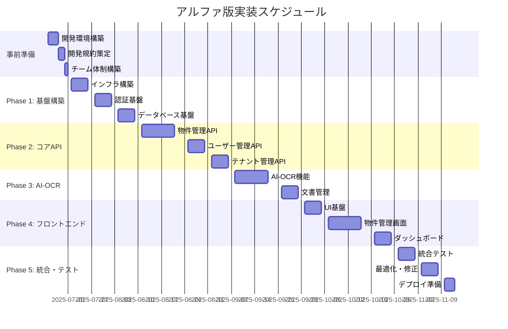

# アルファ版実装準備計画

| Ver | 日付 | 作成 / 変更者 | 変更概要 |
|-----|------|---------------|----------|
| 1.0 | 2025-07-10 | システム管理者 | 初版作成（アルファ版実装準備・チーム開発体制） |

---

## 1. 実装準備概要

### 1.1 現在の状況
- ✅ **技術的実現可能性検証**: 100%完了（21/21項目成功）
- ✅ **PoC実装**: AI-OCR・RPA・法令API動作確認済み
- ✅ **技術スタック確定**: Next.js 14 + TypeScript + PostgreSQL + Google Cloud

### 1.2 アルファ版実装目標
- **目標**: MVP（Minimum Viable Product）として核心機能を実装
- **期間**: 12-16週間
- **開発体制**: 3-5名のチーム開発
- **リリース範囲**: 基本機能 + AI-OCR + 認証・認可

---

## 2. 事前準備必要項目

### 2.1 開発体制・プロセス整備（最優先）

#### 🔧 開発環境・ツール整備
| 項目 | 必要性 | 優先度 | 期間 |
|------|--------|--------|------|
| **Git リポジトリ設定** | 必須 | 最高 | 1日 |
| **開発環境構築手順書** | 必須 | 最高 | 2日 |
| **CI/CD パイプライン** | 必須 | 高 | 3-5日 |
| **コード品質チェック** | 必須 | 高 | 2-3日 |
| **開発・ステージング環境** | 必須 | 高 | 3-5日 |

#### 📋 開発規約・ガイドライン
| 項目 | 必要性 | 優先度 | 期間 |
|------|--------|--------|------|
| **コーディング規約** | 必須 | 最高 | 2日 |
| **Git ワークフロー** | 必須 | 最高 | 1日 |
| **コードレビュー規約** | 必須 | 高 | 1日 |
| **イシュー管理規約** | 必須 | 高 | 1日 |
| **設計・アーキテクチャ規約** | 必須 | 高 | 2-3日 |

#### 👥 チーム開発体制
| 項目 | 必要性 | 優先度 | 期間 |
|------|--------|--------|------|
| **役割分担明確化** | 必須 | 最高 | 1日 |
| **コミュニケーション規約** | 必須 | 高 | 1日 |
| **開発進捗管理** | 必須 | 高 | 1日 |
| **品質保証プロセス** | 必須 | 高 | 2日 |

### 2.2 技術仕様書・設計書詳細化（必須）

#### 📐 詳細設計書
| 項目 | 必要性 | 優先度 | 期間 |
|------|--------|--------|------|
| **データベース詳細設計** | 必須 | 最高 | 3-5日 |
| **API仕様書（OpenAPI）** | 必須 | 最高 | 3-5日 |
| **UI/UX設計書** | 必須 | 高 | 5-7日 |
| **セキュリティ実装ガイド** | 必須 | 高 | 2-3日 |
| **マイクロサービス設計** | 必須 | 高 | 3-5日 |

#### 🧪 テスト設計・品質保証
| 項目 | 必要性 | 優先度 | 期間 |
|------|--------|--------|------|
| **テスト戦略・計画** | 必須 | 最高 | 3日 |
| **ユニットテスト設計** | 必須 | 高 | 2-3日 |
| **統合テスト設計** | 必須 | 高 | 2-3日 |
| **E2Eテスト設計** | 必須 | 中 | 2-3日 |
| **パフォーマンステスト設計** | 推奨 | 中 | 2日 |

### 2.3 インフラ・デプロイ準備（重要）

#### 🏗️ インフラ構築
| 項目 | 必要性 | 優先度 | 期間 |
|------|--------|--------|------|
| **Google Cloud環境セットアップ** | 必須 | 高 | 3-5日 |
| **IaC (Terraform) 実装** | 必須 | 高 | 5-7日 |
| **データベース環境構築** | 必須 | 高 | 2-3日 |
| **監視・ログ設計** | 必須 | 中 | 3-5日 |
| **バックアップ・DR設計** | 推奨 | 中 | 2-3日 |

---

## 3. アルファ版実装タスク分解

### 3.1 Phase 1: 基盤構築（3-4週間）

#### 🏗️ インフラ・基盤（高優先）
```yaml
Epic: インフラ基盤構築
Story Points: 21

Stories:
  - Google Cloud環境構築・IaCコード実装 (5pt)
  - PostgreSQL + Redis セットアップ (3pt)
  - CI/CDパイプライン構築 (5pt)
  - 開発・ステージング環境構築 (3pt)
  - 監視・ログ設定 (3pt)
  - セキュリティ設定（IAM・VPC） (2pt)
```

#### 🔐 認証・認可基盤（最優先）
```yaml
Epic: 認証・認可システム
Story Points: 13

Stories:
  - JWT認証システム実装 (5pt)
  - OAuth 2.0 統合 (3pt)
  - RBAC権限管理システム (3pt)
  - MFA（多要素認証）実装 (2pt)
```

#### 🗄️ データベース基盤（最優先）
```yaml
Epic: データベース基盤
Story Points: 13

Stories:
  - Prisma スキーマ設計・実装 (5pt)
  - マイグレーション戦略実装 (3pt)
  - マルチテナントスキーマ実装 (3pt)
  - 初期データSeeding (2pt)
```

### 3.2 Phase 2: コアAPI実装（4-5週間）

#### 🏠 物件管理API（高優先）
```yaml
Epic: 物件管理システム
Story Points: 21

Stories:
  - 物件CRUD API実装 (5pt)
  - 物件検索・フィルタリング (5pt)
  - 物件画像・ファイル管理 (3pt)
  - 物件状態管理（公開・非公開） (3pt)
  - 物件履歴・監査ログ (2pt)
  - 物件一括インポート機能 (3pt)
```

#### 👥 ユーザー管理API（高優先）
```yaml
Epic: ユーザー管理システム
Story Points: 13

Stories:
  - ユーザーCRUD API実装 (3pt)
  - ユーザープロフィール管理 (3pt)
  - ユーザー権限管理 (3pt)
  - ユーザーアクティビティログ (2pt)
  - ユーザー招待・承認機能 (2pt)
```

#### 🏢 テナント管理API（中優先）
```yaml
Epic: テナント管理システム
Story Points: 13

Stories:
  - テナントCRUD API実装 (3pt)
  - テナント設定管理 (3pt)
  - テナントユーザー管理 (3pt)
  - テナント使用量監視 (2pt)
  - テナント課金連携 (2pt)
```

### 3.3 Phase 3: AI-OCR機能実装（2-3週間）

#### 🤖 AI-OCR システム（高優先）
```yaml
Epic: AI-OCR機能
Story Points: 21

Stories:
  - Gemini API統合・設定 (3pt)
  - PDF アップロード・前処理 (3pt)
  - OCR処理・構造化抽出 (5pt)
  - OCR結果検証・修正機能 (3pt)
  - 物件マスターへの自動登録 (5pt)
  - OCR処理状況・履歴管理 (2pt)
```

#### 📄 文書管理システム（中優先）
```yaml
Epic: 文書管理システム
Story Points: 13

Stories:
  - ファイルアップロード・管理 (3pt)
  - 文書カテゴリ管理 (2pt)
  - 文書検索・フィルタリング (3pt)
  - 文書バージョン管理 (3pt)
  - 文書アクセス権限管理 (2pt)
```

### 3.4 Phase 4: フロントエンド実装（3-4週間）

#### 🎨 UI基盤・共通コンポーネント（最優先）
```yaml
Epic: UI基盤
Story Points: 13

Stories:
  - shadcn/ui セットアップ (2pt)
  - 認証画面（ログイン・サインアップ） (3pt)
  - 共通レイアウト・ナビゲーション (3pt)
  - 共通コンポーネント実装 (3pt)
  - レスポンシブ対応 (2pt)
```

#### 🏠 物件管理画面（高優先）
```yaml
Epic: 物件管理UI
Story Points: 21

Stories:
  - 物件一覧・検索画面 (5pt)
  - 物件詳細・編集画面 (5pt)
  - 物件新規作成画面 (3pt)
  - 物件画像・ファイル管理 (3pt)
  - 物件インポート画面 (3pt)
  - 物件状態管理画面 (2pt)
```

#### 📊 ダッシュボード（中優先）
```yaml
Epic: ダッシュボード
Story Points: 13

Stories:
  - 概要ダッシュボード (5pt)
  - 物件統計・チャート (3pt)
  - 最近のアクティビティ (3pt)
  - 通知・アラート表示 (2pt)
```

#### 🤖 AI-OCR画面（高優先）
```yaml
Epic: AI-OCR UI
Story Points: 13

Stories:
  - PDF アップロード画面 (3pt)
  - OCR 処理状況表示 (3pt)
  - OCR 結果確認・修正画面 (5pt)
  - 登録済み物件との照合画面 (2pt)
```

---

## 4. 実装優先度マトリックス

### 4.1 機能優先度（MoSCoW法）

#### Must Have（必須機能）
- ✅ **認証・認可システム**
- ✅ **物件管理システム**
- ✅ **ユーザー管理システム**
- ✅ **AI-OCR機能**
- ✅ **基本UI・ダッシュボード**

#### Should Have（重要機能）
- 📋 **テナント管理システム**
- 📋 **文書管理システム**
- 📋 **API管理・監視**
- 📋 **セキュリティ機能**

#### Could Have（あると良い機能）
- 📝 **CRM機能**
- 📝 **レポート機能**
- 📝 **外部API連携**
- 📝 **高度な検索機能**

#### Won't Have（アルファ版では実装しない）
- ❌ **RPA自動化**
- ❌ **法令CI-CD**
- ❌ **サブスクリプション管理**
- ❌ **契約書生成**

### 4.2 技術実装優先度

#### 最優先（Week 1-2）
1. **開発環境構築**
2. **Git・CI/CD設定**
3. **Google Cloud基盤構築**
4. **データベース設計**
5. **認証基盤**

#### 高優先（Week 3-8）
1. **物件管理API**
2. **ユーザー管理API**
3. **AI-OCR実装**
4. **基本UI実装**

#### 中優先（Week 9-12）
1. **テナント管理**
2. **文書管理**
3. **ダッシュボード**
4. **セキュリティ強化**

#### 低優先（Week 13-16）
1. **監視・ログ**
2. **パフォーマンス最適化**
3. **テスト強化**
4. **ドキュメント整備**

---

## 5. チーム開発体制・役割分担

### 5.1 推奨チーム構成

#### 👥 3-5名体制
```
Tech Lead (1名) - 技術リーダー・アーキテクト
├─ Frontend Engineer (1名) - UI/UX実装
├─ Backend Engineer (1-2名) - API・データベース
├─ Full Stack Engineer (1名) - 全体サポート
└─ DevOps Engineer (0.5名) - インフラ・CI/CD
```

#### 📋 役割分担詳細
| 役割 | 担当領域 | 主要タスク |
|------|----------|------------|
| **Tech Lead** | 全体設計・技術判断 | アーキテクチャ・コードレビュー・技術選定 |
| **Frontend Engineer** | UI/UX実装 | React/Next.js・shadcn/ui・TypeScript |
| **Backend Engineer** | API・データベース | Node.js・PostgreSQL・Prisma・認証 |
| **Full Stack Engineer** | 全体サポート | フロント・バック両方・統合テスト |
| **DevOps Engineer** | インフラ・運用 | Google Cloud・IaC・CI/CD・監視 |

### 5.2 開発プロセス

#### 🔄 スプリント計画（2週間スプリント）
```
Sprint 1-2: 基盤構築・開発環境
Sprint 3-4: 認証・ユーザー管理
Sprint 5-6: 物件管理API
Sprint 7-8: AI-OCR機能
Sprint 9-10: 基本UI実装
Sprint 11-12: テナント管理・文書管理
Sprint 13-14: 統合・テスト
Sprint 15-16: 最適化・デプロイ準備
```

#### 🎯 デイリースタンドアップ
- **時間**: 毎日朝9:00（15分）
- **内容**: 昨日の作業・今日の予定・ブロッカー
- **ツール**: Slack・Microsoft Teams

#### 📊 進捗管理
- **ツール**: GitHub Issues・Projects
- **更新頻度**: 毎日
- **レビュー**: 週1回（金曜日）

---

## 6. 開発ツール・環境設定

### 6.1 必須ツール

#### 💻 開発環境
| ツール | 用途 | 必要性 |
|--------|------|--------|
| **VS Code** | コードエディタ | 必須 |
| **Claude Code** | AI開発支援 | 必須 |
| **Git** | バージョン管理 | 必須 |
| **Docker** | コンテナ環境 | 必須 |
| **Node.js 20+** | ランタイム | 必須 |
| **pnpm** | パッケージマネージャー | 必須 |

#### 🔧 開発支援ツール
| ツール | 用途 | 必要性 |
|--------|------|--------|
| **GitHub** | リポジトリ・CI/CD | 必須 |
| **Vercel** | フロントエンドデプロイ | 推奨 |
| **Prisma Studio** | データベース管理 | 必須 |
| **Postman** | API テスト | 推奨 |
| **Figma** | UI設計 | 推奨 |

### 6.2 品質保証ツール

#### 🛡️ コード品質
| ツール | 用途 | 設定 |
|--------|------|------|
| **ESLint** | 静的解析 | Next.js + TypeScript設定 |
| **Prettier** | コード整形 | Tailwind CSS統合 |
| **TypeScript** | 型チェック | strict モード |
| **Jest** | ユニットテスト | React Testing Library |
| **Cypress** | E2Eテスト | 主要画面テスト |

#### 📊 監視・分析
| ツール | 用途 | 設定 |
|--------|------|------|
| **Sentry** | エラー監視 | Next.js統合 |
| **Vercel Analytics** | パフォーマンス分析 | 自動設定 |
| **GitHub Actions** | CI/CD | 自動テスト・デプロイ |

---

## 7. 実装スケジュール

### 7.1 全体スケジュール（16週間）



### 7.2 週次マイルストーン

#### Week 1-2: 事前準備・基盤構築
- ✅ 開発環境構築完了
- ✅ Google Cloud基盤構築完了
- ✅ CI/CD パイプライン構築完了

#### Week 3-4: 認証・データベース基盤
- ✅ 認証システム実装完了
- ✅ データベース設計・実装完了
- ✅ 基本API構造完了

#### Week 5-8: コアAPI実装
- ✅ 物件管理API完了
- ✅ ユーザー管理API完了
- ✅ テナント管理API完了

#### Week 9-10: AI-OCR実装
- ✅ AI-OCR機能実装完了
- ✅ 文書管理機能完了

#### Week 11-14: フロントエンド実装
- ✅ UI基盤・共通コンポーネント完了
- ✅ 物件管理画面完了
- ✅ ダッシュボード完了

#### Week 15-16: 統合・デプロイ
- ✅ 統合テスト完了
- ✅ パフォーマンス最適化完了
- ✅ 本番デプロイ準備完了

---

## 8. リスク管理・緩和策

### 8.1 技術リスク

#### 高リスク項目
| リスク | 影響度 | 対策 |
|--------|--------|------|
| **AI-OCR精度不足** | 高 | 実装済みPoCで検証済み・代替手段準備 |
| **マルチテナント複雑性** | 高 | 段階的実装・シンプル設計優先 |
| **パフォーマンス問題** | 中 | 早期負荷テスト・最適化 |

#### 中リスク項目
| リスク | 影響度 | 対策 |
|--------|--------|------|
| **外部API制限** | 中 | レート制限・キャッシュ戦略 |
| **セキュリティ脆弱性** | 高 | 継続的セキュリティテスト |
| **データ整合性** | 中 | トランザクション・バリデーション強化 |

### 8.2 プロジェクトリスク

#### 開発リスク
| リスク | 影響度 | 対策 |
|--------|--------|------|
| **スケジュール遅延** | 高 | バッファー期間・スコープ調整 |
| **品質問題** | 高 | 継続的テスト・コードレビュー |
| **要件変更** | 中 | アジャイル開発・変更管理 |

#### チームリスク
| リスク | 影響度 | 対策 |
|--------|--------|------|
| **スキル不足** | 中 | 事前学習・ペアプログラミング |
| **コミュニケーション不足** | 中 | 定期MTG・ドキュメント化 |
| **メンバー離脱** | 高 | 知識共有・冗長性確保 |

---

## 9. 成功指標・品質基準

### 9.1 技術品質指標

#### コード品質
- **TypeScript カバレッジ**: 95%以上
- **ESLint エラー**: 0件
- **テストカバレッジ**: 80%以上
- **ビルド時間**: 5分以内

#### パフォーマンス
- **API応答時間**: P95 < 500ms
- **フロントエンド読み込み**: First Contentful Paint < 2秒
- **データベースクエリ**: 平均 < 100ms

#### セキュリティ
- **脆弱性スキャン**: Critical 0件
- **セキュリティテスト**: 月1回実施
- **認証・認可**: 100%実装

### 9.2 ビジネス品質指標

#### 機能完成度
- **Must Have機能**: 100%実装
- **Should Have機能**: 80%実装
- **AI-OCR精度**: 95%以上

#### ユーザビリティ
- **画面遷移**: 3クリック以内
- **エラー処理**: 100%実装
- **レスポンシブ**: 100%対応

---

## 10. 次ステップ・アクション

### 10.1 即座に実行すべきタスク

#### 📋 Week 1（今週）
1. **Git リポジトリ構築**
2. **開発環境構築ガイド更新**
3. **チーム編成・役割分担**
4. **コーディング規約策定**
5. **タスク管理システム構築**

#### 📋 Week 2（来週）
1. **Google Cloud環境構築開始**
2. **CI/CD パイプライン構築**
3. **データベース詳細設計**
4. **API仕様書作成**
5. **セキュリティガイドライン策定**

### 10.2 推奨実装順序

#### 🎯 実装優先度（確定）
1. **最優先**: 認証・認可 + データベース基盤
2. **高優先**: 物件管理API + 基本UI
3. **中優先**: AI-OCR + ユーザー管理
4. **低優先**: テナント管理 + 高度機能

---

## 11. 結論・推奨アプローチ

### 11.1 推奨アプローチ

**🎯 段階的実装・継続的統合アプローチを推奨**

#### 理由
1. ✅ **技術的実現性**: 100%検証済み
2. ✅ **PoC実装**: 核心機能動作確認済み
3. ✅ **チーム開発**: 体制・プロセス整備可能
4. ✅ **リスク管理**: 段階的実装でリスク最小化

#### 成功要因
- **明確な役割分担**: Tech Lead中心の体制
- **継続的品質管理**: 自動テスト・CI/CD
- **段階的実装**: MVP → 機能追加
- **定期的レビュー**: 週次進捗確認

### 11.2 最終推奨事項

**🚀 アルファ版実装開始を推奨**

技術的実現可能性は100%確認済みであり、必要な準備作業も明確化されています。チーム体制を整備し、段階的実装アプローチで進めることで、高品質なアルファ版を16週間で実現可能です。

---

## 12. 関連文書

### 12.1 技術仕様書
- [技術的実現可能性総合検証結果](../technical_feasibility/技術的実現可能性総合検証結果.md)
- [開発環境構築ガイド](../architecture/開発環境構築ガイド.md)
- [技術選定根拠書](../architecture/技術選定根拠書.md)

### 12.2 設計書
- [システム仕様書](../システム仕様書.md)
- [機能仕様書一覧](../機能仕様書/)
- [非機能要件一覧](../architecture/非機能要件一覧.md)

### 12.3 実装ガイド
- [コーディング規約](../development_guides/コーディング規約.md)（要作成）
- [API設計ガイド](../development_guides/API設計ガイド.md)（要作成）
- [セキュリティ実装ガイド](../development_guides/セキュリティ実装ガイド.md)（要作成）

**準備完了。アルファ版実装開始推奨！**