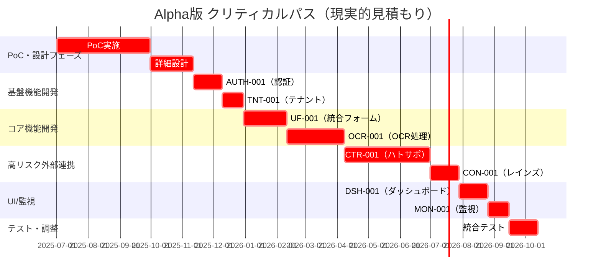
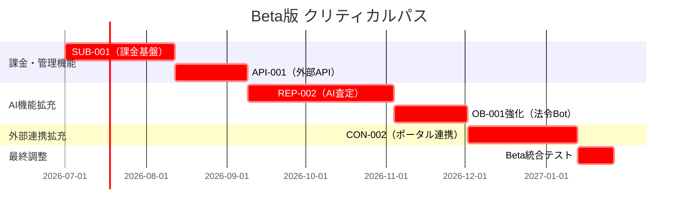

### **リリーススコープ定義 v2.0**

**文書ID:** `SCOPE-001`
**文書名:** `Alpha/Beta版 機能スコープ定義`

**更新履歴:**
- v1.0 (2025-06-01): 初版作成
- v2.0 (2025-07-11): ベータ版スコープを実際の痛み解決に特化、AIモデル更新

---

### 1. はじめに

本ドキュメントは、各機能の段階的なリリース（Alpha版、Beta版）におけるスコープを定義するものである。**Beta版では、実際の作業者の痛みを解決する機能（複数入力解消・法令準拠自動化）に焦点を当て**、AI分析等の付加価値機能よりも日常業務の効率化を優先する。これにより、開発の優先順位を明確にし、早期のフィードバック獲得と市場投入を可能にすることを目的とする。

---

### 2. 機能別スコープ定義

#### **`UF-001` Unified Form**
- **Alpha版 (MVP):**
  - 物件の基本情報（住所、価格、面積、写真など）を手動で入力・保存できる。
  - `OCR-001`の基本的な結果がフォームに反映される。
  - 「保存」ボタンのみ。外部連携の自動同期は行わない。
- **Beta版: 複数入力負荷解消の核心機能**
  - **1回入力で全サイト配信**: REINS、AtHome、SUUMO、LIFULL等への同時掲載
  - **配信状況監視**: 各サイトの掲載状況をリアルタイム監視
  - **個別調整機能**: サイト固有の項目調整
  - **配信履歴管理**: 配信成功・失敗の詳細ログ
  - **アルファ版機能継続**: 既存ワークフローも並行利用可能
  - 排他制御（ペシミスティックロック）を実装する。

#### **`OCR-001` 登記簿PDFのAI-OCR**
- **Alpha版 (MVP):**
  - ユーザーが登記簿PDFをアップロードできる。
  - 主要な項目（甲区の所有者、乙区の抵当権など）を抽出し、`UF-001`に転記する（精度はベストエフォート）。
  - **Gemini 2.0 Flash**（OCR最適化モデル）を使用。
  - 単一のジョブ実行のみを想定。
- **Beta版:**
  - 抽出精度を向上させる。
  - 抽出結果の確信度をUIに表示し、ユーザーが修正できるインターフェースを提供する。
  - 複数ジョブの同時実行に対応する（キューイング）。
  - 基本的なアクセス制御（自身がアップロードしたファイルのみ閲覧可能）を実装する。

#### **`AUTH-001` ユーザー認証・ログイン**
- **Alpha版 (MVP):**
  - メールアドレスとパスワードによる基本的なログイン・ログアウト機能。
  - ユーザー登録機能（招待制ではなく、誰でも登録可能）。
  - `broker_agent` `tenant_admin` の基本的なロールを識別できる。
- **Beta版:**
  - パスワードリセット機能。
  - テナントの概念を導入し、ユーザーは特定のテナントに所属する。
  - `tenant_admin`が自組織のユーザーを招待・管理できる。
  - RBACの定義を拡充し、各機能のアクセス制御と連携する。

#### **`DSH-001` 案件ダッシュボード**
- **Alpha版 (MVP):**
  - 担当する案件がシンプルなリスト形式で表示される。
  - 案件名、顧客名、ステータス（手動更新）が表示される。
  - 各案件から`UF-001`画面へ遷移できる。
- **Beta版:**
  - 案件のフィルタリング・検索機能を実装する。
  - `CRM-001`のタスク情報を表示する。
  - システムからの通知（連携失敗など）を表示する通知エリアを実装する。
  - SSEによるリアルタイム更新を実装する。

#### **`CRM-001` 軽量CRM機能**
- **Alpha版 (MVP):**
  - 顧客情報（氏名、連絡先）を手動で登録・一覧表示できる。
  - 案件と顧客を紐づけられる。
  - 活動履歴（電話、訪問など）をフリーテキストで記録できる。
- **Beta版:**
  - 「次のタスク」を期日付きで設定できる。
  - 期日が来たタスクが`DSH-001`に通知される。
  - 顧客の検索・フィルタリング機能を実装する。
  - データ保持期間と論理削除の基本機能を実装する。

#### **`REP-001` 物件概要書（募集資料）の生成**
- **Alpha版 (MVP):**
  - 固定の単一テンプレートのみ提供。
  - `UF-001`のデータを反映し、PDFを生成・ダウンロードできる。
  - カスタマイズ機能は最小限（表示写真の選択程度）。
- **Beta版:**
  - 複数のデザインテンプレートから選択可能にする。
  - 表示項目の選択やテキストの自由入力など、カスタマイズ機能を拡充する。
  - リアルタイムプレビュー機能を実装する。

#### **`REP-002` 査定書の生成**
- **Alpha版 (MVP):**
  - `UF-001`のデータを反映し、査定価格や取引事例を手動入力してPDFを生成できる。
  - 単一の固定テンプレートのみ。
- **Beta版:**
  - 「AIコメントアシスト」機能の初期版を実装（**Gemini 2.5 Flash**使用）。
  - 複数のデザインテンプレートから選択可能にする。
  - AI生成コンテンツである旨の注釈を自動付与する。

#### **`OB-001` Ordinance Bot**
- **Alpha版 (MVP):**
  - `UF-001`に住所が入力されると、バックグラウンドで関連法令・条例の検索を実行する。
  - 結果をプレーンテキストで`legal_staff`が確認できる画面を提供する（`CTR-001`への自動反映は行わない）。
- **Beta版: 法令準拠自動化の支援機能**
  - **法令チェック機能**: 宅建業法・表示規約チェック（**Gemini 2.5 Flash**使用）
  - **禁止表現検出**: 「完璧」「絶対」等の使用禁止語句チェック
  - **修正提案**: 法令違反項目の具体的修正案提示
  - **チェック履歴**: 法令チェック結果の監査ログ
  - 検索対象とする法令・条例の範囲を拡充する。

#### **`CTR-001` 契約書・重説の自動生成**
- **Alpha版 (MVP):**
  - RPAによるハトサポ連携のコア機能を実装。
  - 主要な契約書（土地建物売買）1種類のみを対象とする。
  - 成功/失敗のみをユーザーに通知する。
- **Beta版: 法令準拠自動化の核心機能**
  - **法令準拠テンプレート**: 宅建業法・民法改正対応済み
  - **重要事項説明書自動生成**: 物件情報から自動作成
  - **必須条項自動挿入**: 法定記載事項の自動補完
  - **契約進捗管理**: 法的期限の自動追跡・アラート
  - **電子契約対応**: ハトサポBB連携での電子締結
  - **法令チェック機能**: 契約書の法令適合性自動検証
  - 内部のDocxテンプレートエンジン（Phase-out計画のPhase 1）をバックアップとして実装する。

#### **`CON-001` レインズ連携**
- **Alpha版 (MVP):**
  - レインズ指定の共通CSVフォーマットを生成・ダウンロードする機能のみ提供。
  - API連携は行わない。
- **Beta版:**
  - アットホーム経由でのAPI連携機能を実装。
  - 連携ステータスをダッシュボードで確認できるようにする。

#### **`CON-002` 不動産ポータルサイト連携**
- **Alpha版 (MVP):**
  - 1〜2社の主要ポータル（API連携が可能なもの）との連携に限定。
  - RPA連携は含めない。
- **Beta版:**
  - 連携可能なポータルサイトを拡充する。
  - RPAによる連携方式を実装する。
  - 連携の自動停止（フェイルセーフ）機構を導入する。

#### **`MIG-001` データ移行ウィザード**
- **Alpha版 (MVP):**
  - 固定された単一のCSVフォーマット（本システムが指定）のインポートにのみ対応。
  - カラムマッピング機能は提供しない。
- **Beta版:**
  - ウィザード形式のUIを実装し、カラムマッピングのプレビュー・修正機能を提供する。
  - 主要な移行元システム（ハトサポBB等）のフォーマットに対応したマッピング定義を提供する。

#### **`LCP-001` 法令CI-CDパイプライン**
- **Alpha版 (MVP):**
  - 法改正の自動検知と、開発者へのメール通知までを実装。
  - ブランチ作成やテスト、デプロイは手動で行う。
- **Beta版:**
  - プルリクエスト作成時の自動テスト実行を実装。
  - `legal_staff`による監査インターフェースを実装。
  - 承認後の本番環境への自動デプロイを実装する。

#### **`API-001` 外部連携用 公開API**
- **Alpha版 (MVP):**
  - スコープ外。初期リリースでは提供しない。
- **Beta版:**
  - 物件情報を読み取り専用で取得できるAPI (`GET /api/v1/properties`) を限定的に公開。
  - APIキーによるシンプルな認証を実装する。

---

### 3. システム運営・管理機能スコープ

#### **`TNT-001` テナント管理機能**
- **Alpha版 (MVP):**
  - 基本的なテナント作成・削除機能（管理者のみ）
  - テナント固有のデータ分離（Schema-per-tenant方式）
  - 基本的な企業情報設定（会社名、ロゴ、連絡先）
  - シンプルな管理者画面での一覧表示
- **Beta版:**
  - テナント設定の詳細管理（営業時間、対応エリア等）
  - ブランディング設定（色テーマ、カスタムロゴ等）
  - テナント間データ移行機能
  - 使用量・課金情報の詳細表示

#### **`SUB-001` サブスクリプション管理機能**
- **Alpha版 (MVP):**
  - Freeプランのみ提供（課金機能なし）
  - 基本的な使用量監視（警告表示のみ、制限適用は緩和）
  - プラン比較表示（将来プランの紹介）
  - 使用量ダッシュボードの基本機能
- **Beta版:**
  - 有料プラン（Standard/Premium）の提供開始
  - 実際の課金処理・決済連携
  - プラン変更機能（アップグレード/ダウングレード）
  - 請求書生成・証憑管理機能

#### **`ADM-001` システム管理機能**
- **Alpha版 (MVP):**
  - システム管理者ダッシュボード（基本的な監視）
  - テナント一覧・基本管理機能
  - システム管理者アカウント管理
  - 基本的なシステム設定変更
- **Beta版:**
  - 詳細な監視・アラート機能
  - 高度なユーザー管理・権限制御
  - システム統計・分析レポート
  - 自動運用機能・機能フラグ管理

#### **`MON-001` 使用量監視・制限機能**
- **Alpha版 (MVP):**
  - リアルタイム使用量監視（基本リソース）
  - 制限値到達時の警告表示（制限は緩和、UXレビュー優先）
  - 使用量ダッシュボード（ユーザー・管理者向け）
  - 基本的なアラート・通知機能
- **Beta版:**
  - 厳密な制限適用・機能停止
  - 高度な使用量分析・予測機能
  - 異常使用検知・システム保護機能
  - 詳細なレポート・統計生成

#### **`SUP-001` サポート・問い合わせ管理機能**
- **Alpha版 (MVP):**
  - 基本的な問い合わせフォーム・チケット管理
  - FAQ・ヘルプドキュメント（基本項目）
  - α版ユーザーからのフィードバック収集機能
  - シンプルなサポート担当者向け管理画面
- **Beta版:**
  - 高度なチケット管理・ワークフロー
  - 自動分類・優先度設定・担当者アサイン
  - 満足度調査・フィードバック分析機能
  - ナレッジベース・自動回答機能 

---

### 4. 長期リリース計画（RC版〜将来拡張）

#### **RC版（Release Candidate）**
**目標：本格的な商用稼働に向けた最終調整**
- **スケジュール:** Beta版終了から3-6ヶ月後
- **重点項目:**
  - **パフォーマンス最適化**: 大量データ・同時ユーザー対応
  - **セキュリティ強化**: ペネトレーションテスト・脆弱性対応
  - **監査・コンプライアンス**: 個人情報保護・業界標準対応
  - **運用体制**: 監視・障害対応・SLA策定
  - **ドキュメント**: ユーザーガイド・運用マニュアル整備

#### **正式版 v1.0（GA: General Availability）**
**目標：商用環境での安定稼働開始**
- **スケジュール:** RC版から1-3ヶ月後
- **提供機能:**
  - 全Alpha・Beta機能の商用レベル品質
  - 24/7サポート体制
  - SLA保証（稼働率99.5%以上）
  - 有料プラン課金開始
  - エンタープライズ向け機能（SSO等）

---

### 5. 将来拡張計画（v2.0以降）

#### **Phase 2: 業務効率化強化 (v1.1-1.5)**
**想定時期:** GA後6-12ヶ月
- **AIアシスタント機能拡張**
  - `REP-002` 査定書でのAI市場分析強化
  - `OB-001` 法令検索でのGPT-4o連携
  - 自動コメント生成・要約機能
- **連携システム拡充**
  - 金融機関API連携（住宅ローン審査）
  - 建築会社システム連携
  - 税理士・司法書士向けAPI提供
- **分析・レポート機能**
  - 営業活動分析ダッシュボード
  - 市場動向レポート自動生成
  - 顧客セグメント分析

#### **Phase 3: 新規事業領域 (v2.0-3.0)**
**想定時期:** GA後1-3年
- **賃貸管理機能**
  - 賃貸物件管理・入居者管理
  - 家賃管理・メンテナンス依頼
  - オーナー向けレポート機能
- **投資分析機能**
  - 不動産投資収益分析
  - ポートフォリオ管理
  - リスク評価・シミュレーション
- **BtoC機能拡張**
  - エンドユーザー向け物件検索
  - VR・360度内見機能
  - オンライン契約・決済機能

#### **Phase 4: 海外展開（条件付き実装）**
**想定時期:** 国内市場安定後（3-5年後）
**前提条件:** 海外展開戦略の確定
- **国際化対応本格実装**
  - 英語・中国語・韓国語UI完全対応
  - 通貨・単位・法令の各国対応
  - 現地法令・商慣習への適応
- **海外不動産市場対応**
  - 各国不動産データベース連携
  - 現地パートナー企業連携
  - 海外投資家向け分析機能

---

### 6. 技術的負債・移行計画

#### **段階的な技術移行**
- **ハトサポ依存からの脱却 (v1.2-2.0)**
  - 内製テンプレートエンジンの段階的拡充
  - RPA依存度の段階的削減
  - 完全内製化への移行計画
- **AI基盤の強化 (v1.5-2.0)**
  - Claude API依存からマルチプロバイダー対応
  - 自社ファインチューンモデルの検討
  - エッジAI（ローカル処理）の導入検討

#### **Plan B: 緊急代替案詳細**

##### **RPA機能停止時の対応（CTR-001）**
**トリガー条件:**
- ハトサポBBでCAPTCHA導入検知
- 連続3日間でRPA成功率50%以下
- ハトサポからの公式停止要請

**緊急対応フロー（48時間以内）:**
1. **即座フェイルセーフ発動**
   - RPA機能を完全停止
   - ユーザーに「一時的手動モード」への切替通知
   - CSVダウンロード機能への自動リダイレクト

2. **手動フォールバック詳細**
   ```
   手動操作フロー:
   1. 本システムでデータ入力完了
   2. 「ハトサポ用CSV」ボタンでデータエクスポート
   3. ハトサポBBへ手動ログイン・データ投入
   4. 生成された契約書PDFを本システムへアップロード
   5. 案件ステータス手動更新
   
   所要時間: 1案件あたり約15分（従来の1時間から75%削減維持）
   ```

3. **内製エンジン緊急開発**
   - 既存のDocxテンプレートエンジンを6ヶ月で完成
   - 基本的な売買契約書のみ先行実装
   - 段階的に複雑な特約条項対応を追加

##### **AI機能停止時の対応（OCR-001, REP-002）**
**代替処理方式:**
- **OCR失敗時:** 手動入力サポートUIで効率化
- **AI査定失敗時:** テンプレート文言 + 手動カスタマイズ
- **法令検索失敗時:** 外部法令データベースへのリンク提供

**ユーザーインパクト軽減策:**
- 手動作業の効率化UI実装
- 入力支援機能（住所補完、価格相場表示等）
- チュートリアル動画・ガイド充実化

#### **スケーラビリティ対応**
- **アーキテクチャ進化 (v2.0-3.0)**
  - マイクロサービス化の段階的実施
  - イベント駆動アーキテクチャ導入
  - 地理的分散・CDN対応

---

### 7. 成功指標（KPI）・検証項目

#### **Alpha版成功指標**
- ユーザー登録数: 50社以上
- 継続利用率: 60%以上（月次）
- 主要機能利用率: 70%以上
- 重大バグ: 0件

#### **Beta版成功指標**
- ユーザー登録数: 200社以上
- 継続利用率: 75%以上（月次）
- NPS（Net Promoter Score）: +30以上
- システム稼働率: 99%以上

#### **GA版成功指標**
- 有料契約数: 100社以上（初年度）
- ARR（年間経常収益）: 5,000万円以上
- 顧客満足度: 4.0/5.0以上
- システム稼働率: 99.5%以上

この長期計画により、段階的な機能拡充と持続的な事業成長を目指す。

---

### 8. プロジェクト管理・リスク管理

#### **8.1. クリティカルパス分析**

以下の機能・作業がプロジェクト全体の進捗を左右するクリティカルパスとして特定される：

##### **Alpha版クリティカルパス（54週間）**


**クリティカルパス詳細（現実的見積もり）:**
1. **PoC実施** (12週間) - 技術的実現可能性の確認
2. **詳細設計** (6週間) - PoCの結果を踏まえた設計
3. **AUTH-001** (4週間) - OAuth2.0、MFA実装の複雑性
4. **TNT-001** (3週間) - スキーマ分離、動的切り替えの実装
5. **UF-001** (6週間) - 複雑なフォーム設計とバリデーション
6. **OCR-001** (8週間) - AI精度調整、複数プロバイダー対応
7. **CTR-001** (12週間) - RPA実装、フェイルセーフ機能、テンプレートエンジン
8. **CON-001** (4週間) - API連携、エラーハンドリング
9. **DSH-001** (4週間) - リアルタイム更新、通知システム
10. **MON-001** (3週間) - 監視システム、アラート設定
11. **統合テスト** (4週間) - システム全体の動作確認

##### **Beta版クリティカルパス（24週間）**


**Beta版詳細見積もり:**
- **SUB-001** (6週間) - 決済連携、請求処理の実装
- **API-001** (4週間) - 外部システム向けAPI設計・実装
- **REP-002** (8週間) - AI査定の精度調整・プロンプト最適化
- **OB-001強化** (4週間) - 法令検索の精度向上・対象拡大
- **CON-002** (6週間) - 複数ポータルサイト対応・RPA実装
- **Beta統合テスト** (2週間) - 全機能の結合テスト

#### **8.2. リスクバッファ設定**

各フェーズに以下のリスクバッファを設定し、スケジュール遅延に対応する：

| フェーズ | 基本期間 | リスクバッファ | 合計期間 | バッファ理由 |
|----------|----------|----------------|----------|-------------|
| **Alpha版** | 54週間 | **+16週間** | 70週間（約16ヶ月） | 外部API仕様変更、RPA不安定性、AI精度調整 |
| **Beta版** | 24週間 | **+8週間** | 32週間（約8ヶ月） | AI精度調整、課金システム連携、複数RPA対応 |
| **RC版** | 12週間 | **+4週間** | 16週間（約4ヶ月） | パフォーマンス調整、セキュリティ監査、運用体制構築 |

##### **主要リスク要因と対応策**

| リスク分類 | 具体的リスク | 発生確率 | 影響度 | 対応策 | バッファ |
|-----------|-------------|----------|--------|--------|----------|
| **技術的リスク** | ハトサポBB仕様変更 | 中 | 極高 | RPA監視強化、内製テンプレートエンジン並行開発 | **+8週間** |
| **技術的リスク** | アットホームAPI変更 | 低 | 中 | API仕様変更監視、代替連携準備 | +2週間 |
| **品質リスク** | AI精度不達成 | 高 | 高 | 複数モデル比較、プロンプト最適化、ファインチューニング | **+6週間** |
| **外部依存リスク** | 外部サービス障害 | 低 | 高 | フェイルセーフ機能、代替手段準備 | +2週間 |
| **人的リスク** | 主要メンバー離脱 | 低 | 高 | ドキュメント整備、ナレッジ共有、並行開発体制 | +3週間 |
| **新規リスク** | CAPTCHA導入 | 低 | 極高 | 早期検知システム、緊急代替案準備 | **+12週間** |
| **新規リスク** | 複数AI機能同時調整 | 中 | 高 | 機能別専任チーム編成、段階的リリース | +4週間 |

#### **8.3. マイルストーン管理**

##### **Go/No-Go判定ポイント**
各フェーズで以下の判定基準により、次フェーズ進行可否を決定：

**Alpha版 → Beta版 判定基準**
- [ ] 主要機能（UF-001, OCR-001, CTR-001）の基本動作確認
- [ ] 50社以上のユーザー登録達成
- [ ] 重大障害（P0/P1）の解決
- [ ] システム稽働率95%以上を2週間継続

**Beta版 → RC版 判定基準**
- [ ] 課金システム（SUB-001）の動作確認
- [ ] NPS +30以上の達成
- [ ] システム稼働率99%以上を1ヶ月継続
- [ ] セキュリティ監査の合格

#### **8.4. ステークホルダー管理**

| ステークホルダー | 関与レベル | 報告頻度 | 判定権限 |
|------------------|------------|----------|----------|
| **プロダクトオーナー** | 最高 | 週次 | Go/No-Go最終判定 |
| **技術責任者** | 最高 | 週次 | 技術的Go/No-Go判定 |
| **品質責任者** | 高 | 隔週 | 品質基準合否判定 |
| **営業責任者** | 中 | 月次 | 市場受容性判定 |
| **法務・コンプライアンス** | 中 | 月次 | 法的要件適合判定 |

この包括的なプロジェクト管理により、リスクを最小化しつつ確実な価値提供を実現する。 