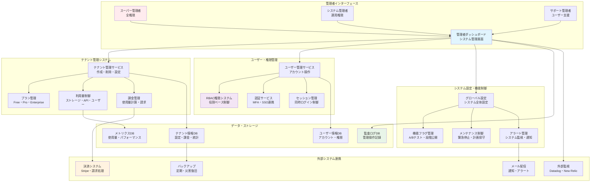
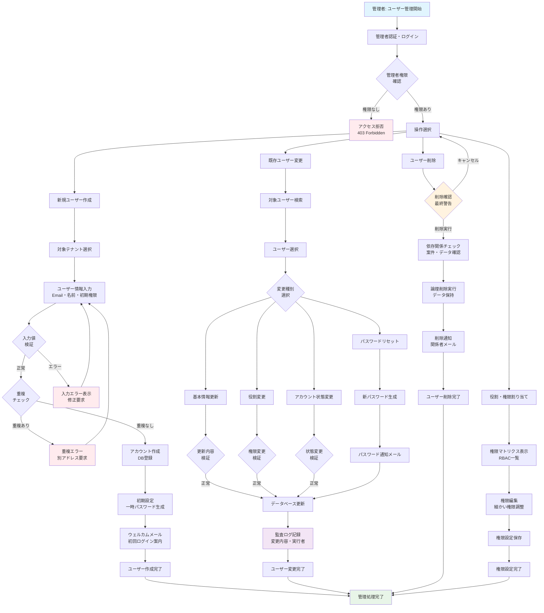
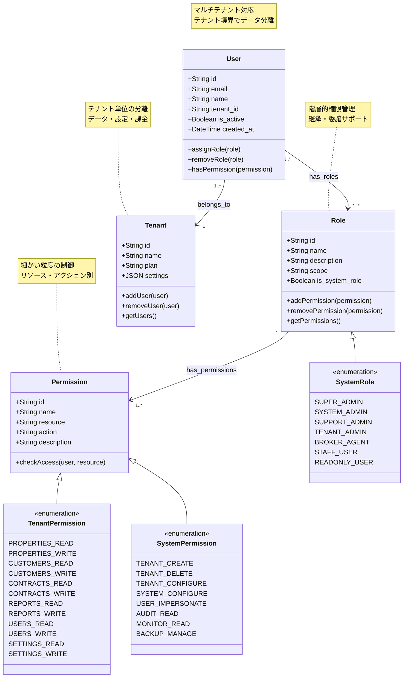

# 機能仕様書 ADM-001: システム管理機能

## バージョン管理

| Ver | 日付 | 作成 / 変更者 | 変更概要 |
|-----|------|---------------|----------|
| 1.0 | 2025-06-30 | システム設計チーム | 初版作成 |

## 1. 機能概要

### 1.1 機能の目的
システム全体の運用管理を行う機能。システム管理者がテナント管理、ユーザー管理、システム設定、監視等を統合的に行えるWeb管理画面を提供する。

### 1.2 対象ユーザー
- **システム管理者**: 全体システム管理権限
- **運用担当者**: 監視・保守作業
- **サポート担当**: ユーザーサポート、問い合わせ対応

### 1.3 主要機能
- 統合管理ダッシュボード
- テナント・ユーザー一元管理
- システム設定・構成管理
- 監視・アラート管理
- ログ・監査機能

## 2. 機能要件

### 2.1 管理ダッシュボード

#### 2.1.1 システム概要表示
**概要情報**:
```yaml
システム状態:
  - サービス稼働状況（正常/警告/異常）
  - 現在の負荷状況（CPU/メモリ/ディスク）
  - アクティブテナント数
  - 同時接続ユーザー数

テナント統計:
  - 総テナント数（プラン別内訳）
  - 月次新規登録数
  - 使用量上位テナント（リスク管理）
  - 問題のあるテナント（制限超過等）

システムアラート:
  - 現在発生中の重要アラート
  - 過去24時間のアラート件数
  - 解決待ちの問題数
```

#### 2.1.2 リアルタイム監視
**監視項目**:
```yaml
パフォーマンス:
  - API応答時間（平均/最大）
  - データベース接続プール状況
  - 外部API呼び出し成功率
  - ストレージ使用率

エラー監視:
  - エラー発生率（5xx/4xx）
  - 失敗したバックアップ
  - データ整合性エラー
  - セキュリティアラート
```

### 2.2 テナント管理（α版重要機能）

#### 2.2.1 テナント一覧・検索
**機能概要**: 全テナントの一覧表示と管理

**一覧画面仕様**:
```yaml
表示項目:
  - テナント名/表示名
  - 現在のプラン
  - 登録日/最終ログイン
  - ユーザー数/使用量状況
  - 状態（アクティブ/警告/制限）

検索・フィルタ:
  - テナント名・企業名での検索
  - プラン種別フィルタ
  - 状態フィルタ
  - 登録日期間フィルタ
  - 使用量基準ソート

一括操作:
  - 複数テナント選択
  - 一括メール送信
  - 一括設定変更
  - 一括エクスポート
```

#### 2.2.2 テナント詳細管理
**詳細情報**:
```yaml
基本情報タブ:
  - 企業情報・連絡先
  - 契約情報・プラン詳細
  - 使用量履歴・制限状況
  - ログイン履歴・アクセス状況

設定管理タブ:
  - 機能有効化/無効化
  - 制限値の個別調整
  - セキュリティ設定
  - カスタム設定

操作履歴タブ:
  - 管理者による操作履歴
  - システム自動処理履歴
  - エラー発生履歴
  - サポート対応履歴
```

### 2.3 ユーザー管理

#### 2.3.1 システム管理者管理
**管理項目**:
```yaml
管理者権限:
  - super_admin: 全権限
  - tenant_manager: テナント管理のみ
  - support_staff: 閲覧・サポート対応のみ
  - monitor_only: 監視画面閲覧のみ

アカウント管理:
  - 管理者アカウント作成・削除
  - 権限レベル変更
  - パスワードリセット
  - 2FA設定強制

アクセス制御:
  - IP制限設定
  - ログイン時間制限
  - セッション管理
  - 同時ログイン制限
```

#### 2.3.2 テナントユーザー支援
**サポート機能**:
```yaml
ユーザー代理操作:
  - パスワードリセット代行
  - アカウント有効化/無効化
  - 権限変更（テナント管理者承認後）
  - データ復旧支援

問題解決支援:
  - ログイン問題の調査
  - データアクセス問題の特定
  - 権限問題の解決
  - 技術的問題のサポート
```

### 2.4 システム設定管理

#### 2.4.1 グローバル設定
**設定項目**:
```yaml
システム基本設定:
  - サービス名・ロゴ
  - メンテナンス時間
  - 緊急メンテナンスモード
  - 新規登録の一時停止

セキュリティ設定:
  - パスワードポリシー
  - セッション有効期間
  - ログイン試行制限
  - API制限のデフォルト値

通知設定:
  - メール配信設定
  - アラート通知先
  - 緊急連絡体制
  - 自動通知の有効化
```

#### 2.4.2 機能フラグ管理
**機能制御**:
```yaml
α版機能制御:
  - 新機能のA/Bテスト
  - 段階的ロールアウト
  - 緊急機能停止
  - テナント別機能有効化

実験機能:
  - ベータ機能の公開範囲
  - 実験的UIの適用対象
  - パフォーマンステスト機能
  - デバッグモード制御
```

#### **2.5. システム構成図**

##### **2.5.1. マルチテナント管理システム構成図**



##### **2.5.2. ユーザー・権限管理フローチャート**



##### **2.5.3. RBAC権限体系図**



## 3. API仕様

### 3.1 管理者認証API

#### 3.1.1 管理者ログイン
```http
POST /api/v1/admin/auth/login
Content-Type: application/json

{
  "email": "admin@realestate-dx.com",
  "password": "secure_password",
  "mfa_code": "123456"
}

Response 200:
{
  "access_token": "jwt_token_here",
  "refresh_token": "refresh_token_here",
  "admin_info": {
    "id": "admin_id",
    "email": "admin@realestate-dx.com",
    "role": "super_admin",
    "permissions": ["tenant_manage", "user_manage", "system_config"]
  },
  "expires_in": 3600
}
```

### 3.2 テナント管理API

#### 3.2.1 テナント一覧取得
```http
GET /api/v1/admin/tenants?page=1&limit=50&status=active
Authorization: Bearer {admin_token}

Response 200:
{
  "tenants": [
    {
      "id": "tenant_id",
      "name": "sample-company",
      "display_name": "サンプル不動産株式会社",
      "plan": "free",
      "status": "active",
      "users_count": 2,
      "created_at": "2025-06-01T09:00:00Z",
      "last_activity": "2025-06-30T10:30:00Z",
      "usage_summary": {
        "storage_usage_rate": 0.45,
        "api_usage_rate": 0.23,
        "user_usage_rate": 0.67
      }
    }
  ],
  "pagination": {
    "page": 1,
    "limit": 50,
    "total": 125,
    "total_pages": 3
  }
}
```

### 3.3 システム統計API

#### 3.3.1 ダッシュボード統計
```http
GET /api/v1/admin/dashboard/stats
Authorization: Bearer {admin_token}

Response 200:
{
  "system_health": {
    "status": "healthy",
    "uptime": "99.98%",
    "active_tenants": 125,
    "active_users": 450
  },
  "alerts": {
    "critical": 0,
    "warning": 2,
    "info": 5
  },
  "performance": {
    "avg_response_time": 245,
    "error_rate": 0.02,
    "cpu_usage": 45.5,
    "memory_usage": 62.3
  }
}
```

## 4. UI・UX設計

### 4.1 管理画面レイアウト

#### 4.1.1 基本構成
```yaml
ヘッダー:
  - システム名・ロゴ
  - 管理者情報表示
  - グローバル検索
  - 通知・アラートアイコン
  - ログアウト

サイドバー:
  - ダッシュボード
  - テナント管理
  - ユーザー管理
  - システム設定
  - ログ・監査
  - サポート

メインエリア:
  - 動的コンテンツエリア
  - パンくずナビ
  - アクションボタン
  - データテーブル
```

#### 4.1.2 レスポンシブ対応
```yaml
デスクトップ（1200px以上）:
  - 3カラムレイアウト
  - サイドバー固定表示
  - データテーブル全項目表示

タブレット（768px-1199px）:
  - 2カラムレイアウト
  - サイドバー折りたたみ可能
  - 重要項目のみ表示

モバイル（767px以下）:
  - 1カラムレイアウト
  - ハンバーガーメニュー
  - カード形式表示
```

### 4.2 テナント管理画面

#### 4.2.1 一覧画面
```yaml
フィルター・検索エリア:
  - 検索ボックス（テナント名・企業名）
  - プランフィルター（ドロップダウン）
  - 状態フィルター（チェックボックス）
  - 日付範囲選択

テナントカード表示:
  - 企業ロゴ・名前
  - プラン・状態バッジ
  - 使用量メーター（円形グラフ）
  - 最終アクティビティ
  - クイックアクションボタン

一括操作:
  - 全選択・個別選択
  - 一括メール送信
  - 一括エクスポート
  - 一括ステータス変更
```

## 5. セキュリティ要件

### 5.1 アクセス制御
```yaml
認証要件:
  - 多要素認証必須（SMS/TOTP）
  - 強力なパスワードポリシー
  - セッション管理（タイムアウト設定）
  - IP制限・地理的制限

権限管理:
  - ロールベースアクセス制御
  - 最小権限の原則
  - 権限変更の監査ログ
  - 定期的な権限レビュー
```

### 5.2 監査・ログ
```yaml
操作ログ:
  - 全管理者操作の記録
  - 操作対象・内容・結果
  - IP・ユーザーエージェント
  - 操作時刻・セッション情報

セキュリティログ:
  - ログイン・ログアウト
  - 認証失敗・権限エラー
  - 異常なアクセスパターン
  - システム設定変更
```

## 6. エラーハンドリング

### 6.1 エラーパターン
```yaml
認証エラー:
  - 無効なクレデンシャル
  - セッション期限切れ
  - 権限不足
  - MFA認証失敗

システムエラー:
  - データベース接続エラー
  - 外部API接続エラー
  - ファイルシステムエラー
  - メモリ不足

操作エラー:
  - 無効な操作パラメータ
  - データ整合性エラー
  - 同時更新競合
  - 制限値超過
```

### 6.2 エラー対応
```yaml
自動対応:
  - 一時的エラーの自動リトライ
  - フェイルオーバー処理
  - 自動アラート送信
  - ログ記録・分析

手動対応:
  - エラー詳細の表示
  - 推奨対応策の提示
  - サポートへのエスカレーション
  - 復旧手順のガイド表示
```

## 7. テスト要件

### 7.1 機能テスト
```yaml
基本機能:
  - 管理者認証・権限確認
  - テナント一覧・詳細表示
  - システム設定変更
  - ユーザー管理操作

セキュリティテスト:
  - 不正アクセスの防止
  - 権限昇格攻撃の防止
  - セッションハイジャック対策
  - CSRF・XSS対策
```

### 7.2 運用テスト
```yaml
負荷テスト:
  - 大量テナント環境での動作
  - 同時管理者アクセス
  - 一括操作の性能確認

災害復旧テスト:
  - バックアップからの復旧
  - 障害時のフェイルオーバー
  - データ整合性確認
```

## 8. 運用・保守

### 8.1 監視・アラート
```yaml
システム監視:
  - 管理画面の可用性
  - 操作応答時間
  - エラー発生率
  - リソース使用量

管理者活動監視:
  - ログイン頻度・パターン
  - 操作種別・頻度
  - 異常な操作の検知
  - 権限変更の監視
```

### 8.2 定期メンテナンス
```yaml
日次作業:
  - システム状態確認
  - エラーログ確認
  - バックアップ確認
  - セキュリティアラート確認

週次作業:
  - パフォーマンス分析
  - 容量計画確認
  - セキュリティ監査
  - 管理者アカウント確認

月次作業:
  - 権限レビュー
  - システム設定監査
  - ログアーカイブ
  - 災害復旧テスト
```

---

## 付録A: 関連ドキュメント
- `TNT-001`: テナント管理機能
- `SUB-001`: サブスクリプション管理機能
- `AUTH-001`: ユーザー認証・ログイン機能

## 付録B: 用語集
- **システム管理者**: サービス全体の管理権限を持つユーザー
- **RBAC**: Role-Based Access Control（ロールベースアクセス制御）
- **MFA**: Multi-Factor Authentication（多要素認証） 

---

## 9. RC版（Release Candidate）要件

**目標**: 商用運用レベルのシステム管理基盤・マルチテナント対応

### 9.1. 管理効率・自動化強化
- `[ ]` **インテリジェント監視**: AI による異常パターン自動検知・予測
- `[ ]` **自動運用**: 定期メンテナンス・設定最適化の自動化
- `[ ]` **一括管理拡張**: 1000テナント以上の効率的一括操作
- `[ ]` **プロアクティブ管理**: 問題発生前の予防的措置・自動修復

### 9.2. スケーラビリティ・パフォーマンス
- `[ ]` **大規模対応**: 10,000テナント規模での安定動作
- `[ ]` **応答時間最適化**: 管理操作95パーセンタイルで2秒以内
- `[ ]` **並行処理拡張**: 複数管理者の同時大量操作対応
- `[ ]` **リアルタイム更新**: 管理画面の即座データ同期・反映

### 9.3. セキュリティ・統制強化
- `[ ]` **ゼロトラスト**: 全操作の継続的認証・認可・監査
- `[ ]` **高度脅威対策**: AI セキュリティ分析・自動ブロック
- `[ ]` **コンプライアンス**: SOC2・ISO27001対応の統制機能
- `[ ]` **アクセス統制**: 時間・場所・デバイス基準の詳細制御

### 9.4. 運用・ガバナンス
- `[ ]` **運用自動化**: ITIL準拠の自動化ワークフロー
- `[ ]` **変更管理**: 設定変更の承認フロー・影響分析・ロールバック
- `[ ]` **キャパシティ管理**: リソース使用量予測・自動拡張提案
- `[ ]` **インシデント管理**: 障害の自動分類・エスカレーション・復旧

### 9.5. AI・分析支援
- `[ ]` **予測分析**: テナント成長・リソース需要の機械学習予測
- `[ ]` **異常検知**: 統計的手法による異常パターン早期発見
- `[ ]` **最適化提案**: システム構成・設定の AI 最適化推奨
- `[ ]` **トレンド分析**: 利用パターン分析・ビジネス洞察提供

### 9.6. 統合・エコシステム
- `[ ]` **クラウド統合**: マルチクラウド環境の統合管理
- `[ ]` **外部連携**: 監視ツール・ITSM・CRM システム連携
- `[ ]` **API 完全対応**: 全管理機能の API 化・外部システム連携
- `[ ]` **マーケットプレイス**: サードパーティ管理ツール統合機構

### 9.7. ユーザビリティ・体験
- `[ ]` **直感的 UI**: ノーコード・ローコードでの設定変更
- `[ ]` **モバイル管理**: スマートフォンからの主要管理操作対応
- `[ ]` **カスタマイズ**: 組織に応じた管理画面・ワークフロー調整
- `[ ]` **コラボレーション**: チーム管理・権限委譲・作業分担機能

### 9.8. 成功基準
- **管理効率**: 管理作業の70%自動化達成
- **応答性能**: 95パーセンタイルで2秒以内
- **稼働率**: 99.99%以上（管理機能可用性）
- **セキュリティ**: ゼロセキュリティインシデント達成 