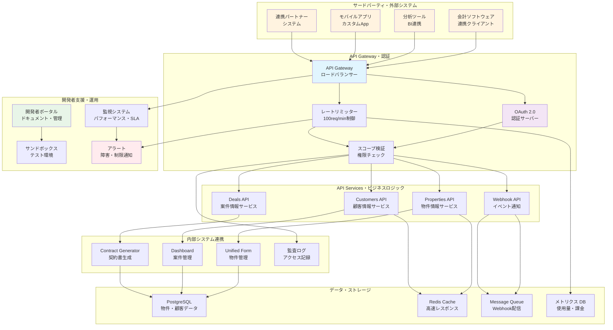
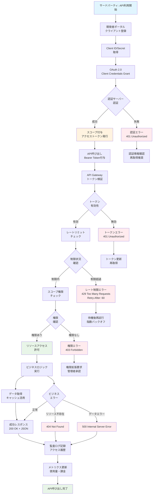
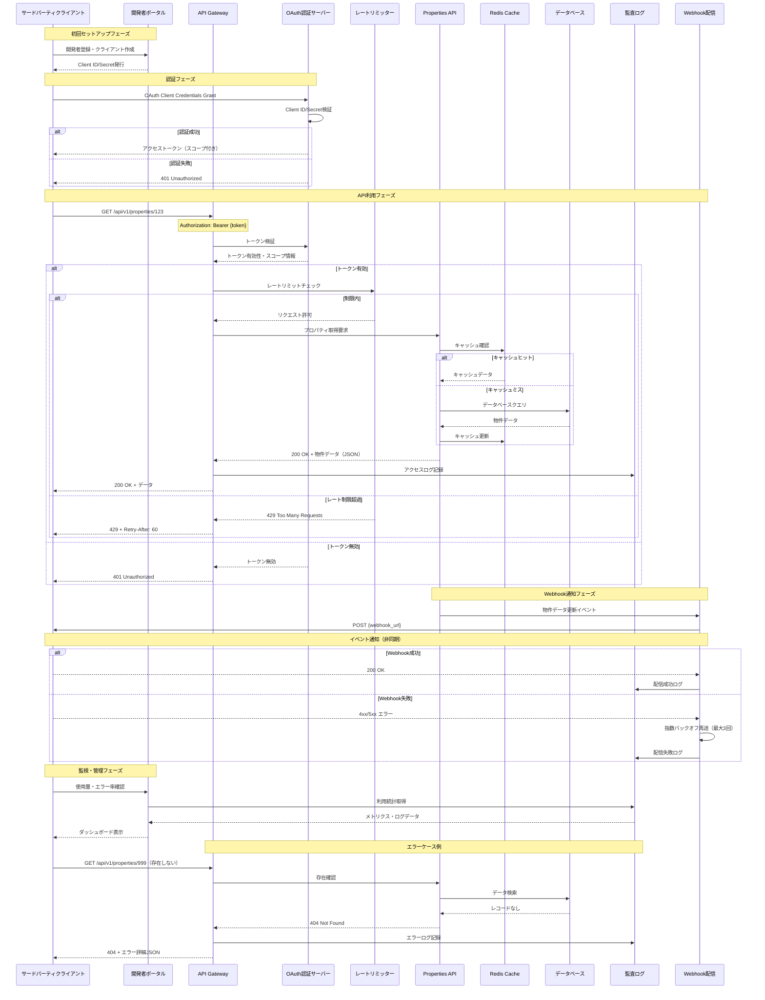

### **機能仕様書 v1.2**

**機能ID:** `API-001`
**機能名:** `外部連携用 公開API`

| Ver | 日付 | 作成 / 変更者 | 変更概要 |
|-----|------|---------------|----------|
| 1.0 | 2025-06-30 | システム管理者 | 初版作成 |
| 1.1 | 2025-06-30 | システム管理者 | OAuth 2.0認証、スコープ詳細化 |
| 1.2 | 2025-06-30 | システム管理者 | バージョン管理追加、Retry-Afterヘッダー仕様明確化 |

#### **1. 概要（Overview）**

本システムのデータを、外部のサードパーティ製アプリケーションや顧客の自社システムからプログラムを通じて安全に利用するための、標準的なアプリケーション・プログラミング・インターフェース（API）群。これにより、会計ソフトとの連携、高度な分析ツールへのデータ出力、公式連携パートナーとのシステム間連携など、本システムの活用範囲を大きく広げることを目的とする。本仕様書は、個別のエンドポイントではなく、公開API全体の設計方針と共通仕様を定める。

#### **2. 開発者ゴール（Developer Story）**

**サードパーティ開発者として、** 私は **標準的で分かりやすいAPI仕様と、充実したドキュメント、試しやすいテスト環境が欲しい。** それによって、**自分が開発するアプリケーションとこの不動産システムとの連携機能を、迅速かつ効率的に構築したい。**

#### **3. API共通仕様**

- `[ ]` **【設計思想】** APIは、REST (REpresentational State Transfer) の原則に準拠して設計される。
  - `[ ]` リソースはURIで表現される（例: `/api/v1/properties/{property_id}`）。
  - `[ ]` 操作はHTTPメソッド（`GET`, `POST`, `PUT`, `DELETE`）で表現される。
  - `[ ]` データ交換形式はJSONを標準とする。
- `[ ]` **【認証】** APIへのアクセスは、OAuth 2.0プロトコルによる認証を必須とする。
- `[ ]` **【バージョニング】** APIは後方互換性を損なう変更に備え、URLにバージョン番号を含める（例: `/api/v1/...`）。仕様変更時には、最低90日間の移行期間を設け、旧バージョンも並行して提供する。
- `[ ]` **【エラーハンドリング】** エラー発生時は、標準的なHTTPステータスコード（例: `400`, `401`, `404`, `500`）と共に、エラーの詳細情報（エラーコード、メッセージ）を含むJSONをレスポンスボディとして返す。
- `[ ]` **【レートリミット】** システムの安定性を保つため、クライアントごとに単位時間あたりのAPIコール数を制限する。**デフォルト値は「通常100リクエスト/分、バースト（短期集中）300リクエスト/分」を上限とする。** 制限を超えた場合は、ステータスコード `429 Too Many Requests` と、以下の詳細仕様で `Retry-After` ヘッダーを返す：
  - `[ ]` **Retry-After値計算:** レートリミット復旧までの秒数（整数）。通常制限の場合は60秒、バースト制限の場合は20秒を返す。
  - `[ ]` **レスポンス例:** `Retry-After: 60` （60秒後に再試行可能）
  - `[ ]` **エラーレスポンスボディ例:**
    ```json
    {
      "error": "rate_limit_exceeded",
      "message": "API call rate limit exceeded. Try again later.",
      "retry_after": 60,
      "limit": 100,
      "reset_time": "2025-06-30T10:15:00Z"
    }
    ```
- `[ ]` **【ページネーション】** 大量データを返す可能性があるリソース（物件一覧など）は、カーソルベースまたはオフセットベースのページネーションを実装する。

#### **4. 認証と認可**

- `[ ]` **【認証方式】** APIへのアクセスは、**OAuth 2.0**のClient Credentials Grantフローで発行されたアクセストークンを必須とする。
- `[ ]` トークンは、HTTPリクエストの`Authorization`ヘッダーに`Bearer`トークンとして付与する。
- `[ ]` **【スコープベースの認可】** 発行されるトークンには、実行可能な操作を制限する**スコープ**が付与される。クライアントは、許可されたスコープの範囲内でのみAPIを呼び出すことができる。
  - **スコープの例:**
    - `properties:read`: 物件情報の読み取り
    - `properties:write`: 物件情報の作成・更新
    - `contacts:read`: 顧客情報の読み取り
    - `contacts:write`: 顧客情報の作成・更新

#### **4.1. システム構成図**

##### **4.1.1. 公開API全体アーキテクチャ図**



##### **4.1.2. 認証・認可フローチャート**



##### **4.1.3. API利用・レスポンス・エラー処理シーケンス図**



#### **5. 提供されるリソースとロードマップ**

- **v1.1で提供する主なリソース（読み取り専用）:**
  - **物件情報 (`/properties`):** 物件の基本情報、価格、ステータスなどの取得。
  - **顧客情報 (`/customers`):** 案件に紐づく顧客情報の取得。
  - **案件情報 (`/deals`):** 売買契約の進捗状況や契約情報の取得。

- **v1.2以降のロードマップ案:**
  - **書き込みAPIの解禁:** `PATCH`, `PUT` メソッドをサポートし、外部システムからのデータ更新を可能にする。
  - **Webhook機能:** Unified Formの物件情報が更新された際など、特定のイベント発生時に指定されたURLへ通知を送信する機能を追加する。

##### **v1.1 (MVP)**

- **リソース:**
  - `[ ]` `GET /api/v1/properties/{id}`: 特定の物件情報を取得
- **Webhook（将来の拡張）:**
  - `[ ]` 物件情報が更新された際に、指定されたURLに通知を送信するWebhook機能を提供する。
  - `[ ]` **再送ポリシー:** Webhookの送信に失敗した場合（HTTPステータスコードが2xx以外）、**指数バックオフ**アルゴリズムを用いて最大**3回**まで再送する。3回失敗した後は、開発者コンソールで失敗履歴を確認できる。

##### **v1.2 (Post-MVP)**

- **リソース:**
  - `[ ]` `GET /api/v1/properties/{id}`: 特定の物件情報を取得

#### **6. 開発者向けサポート**

- `[ ]` **【開発者ポータル】** APIの利用方法、認証手順、利用規約などを掲載した開発者向けポータルサイトを提供する。
- `[ ]` **【APIドキュメンテーション】** 全てのエンドポイント、リクエストパラメータ、レスポンス形式などを網羅した、OpenAPI (Swagger) 仕様に基づくインタラクティブなAPIリファレンスを提供する。
- `[ ]` **【サンドボックス環境】** 開発者が本番データに影響を与えることなく、APIの動作を自由に試せるサンドボックス（テスト）環境を提供する。サンドボックス環境用のAPIキーを発行できる。
- `[ ]` **【SDK】** 主要なプログラミング言語（Python, Node.jsなど）向けに、APIを容易に利用するためのソフトウェア開発キット（SDK）を将来的には提供する。

#### **7. セキュリティ要件**

- 全てのリクエストとレスポンスは、TLS 1.2以上で暗号化される。
- 顧客データへのアクセスは、認可されたスコープ（例: `properties.read`, `customers.read`）に厳密に制限される。
- 全てのAPIコールは、誰が、いつ、どのリソースにアクセスしたかを記録する監査ログの対象となる。 

#### **8. RC版（Release Candidate）要件**

**目標**: 企業級・高性能 公開APIプラットフォーム

##### **8.1. API機能・網羅性拡張**
- `[ ]` **完全CRUD対応**: 全リソースでの作成・読取・更新・削除操作提供
- `[ ]` **リアルタイムAPI**: WebSocket・Server-Sent Events での即座データ配信
- `[ ]` **バッチAPI**: 大量データの一括処理・効率的データ転送
- `[ ]` **GraphQL対応**: REST APIと並行してGraphQLエンドポイント提供

##### **8.2. パフォーマンス・スケーラビリティ**
- `[ ]` **応答時間最適化**: 95パーセンタイルで200ms以内（データベースアクセス含む）
- `[ ]` **高可用性**: 99.99%の稼働率（年間ダウンタイム52分以内）
- `[ ]` **オートスケーリング**: 負荷に応じた自動スケール・容量最適化
- `[ ]` **CDN統合**: 静的データの全世界配信・レイテンシ最小化

##### **8.3. セキュリティ・認証強化**
- `[ ]` **OAuth 2.0 PKCE**: モバイルアプリ向け高セキュリティ認証
- `[ ]` **JWT トークン**: 署名付きトークンによる改ざん防止・オフライン検証
- `[ ]` **細粒度アクセス制御**: フィールドレベルでの詳細権限管理
- `[ ]` **API キー管理**: 動的ローテーション・使用量制御・異常検知

##### **8.4. 開発者体験・エコシステム**
- `[ ]` **完全自動化SDK**: 10言語以上での公式SDK・自動生成・更新
- `[ ]` **インタラクティブドキュメント**: ライブテスト・コード生成・即座実行
- `[ ]` **開発者ダッシュボード**: 使用量監視・エラー追跡・パフォーマンス分析
- `[ ]` **サンドボックス強化**: 本番同等環境・完全テストデータセット

##### **8.5. 監視・運用基盤**
- `[ ]` **リアルタイム監視**: API健全性・エラー率・レスポンス時間の即座監視
- `[ ]` **予測的スケーリング**: 機械学習による負荷予測・事前スケール
- `[ ]` **自動障害回復**: ヘルスチェック・自動フェイルオーバー・ロードバランシング
- `[ ]` **SLA監視**: 顧客別SLA追跡・違反時の自動アラート・補償

##### **8.6. ビジネス・収益化機能**
- `[ ]` **使用量計測**: リクエスト数・データ転送量・機能別課金計測
- `[ ]` **レート制限管理**: 顧客プランに応じた動的制限・アップグレード誘導
- `[ ]` **API マーケットプレース**: パートナー API の統合・収益分配
- `[ ]` **分析・インサイト**: API利用パターン分析・ビジネス意思決定支援

##### **8.7. Webhook・イベント駆動**
- `[ ]` **イベントストリーミング**: Apache Kafka での高可用性イベント配信
- `[ ]` **Webhook 信頼性**: 保証配信・重複排除・順序保証・リトライ戦略
- `[ ]` **カスタムイベント**: 顧客定義イベント・フィルタリング・ルーティング
- `[ ]` **リアルタイム通知**: プッシュ通知・メール・SMS 統合配信

##### **8.8. 成功基準**
- **応答時間**: 95パーセンタイルで200ms以内
- **稼働率**: 99.99%以上（月間ダウンタイム4分以内）
- **開発者満足度**: 4.8/5.0以上（開発者エクスペリエンス評価）
- **API採用率**: 25%以上の既存顧客によるAPI利用 