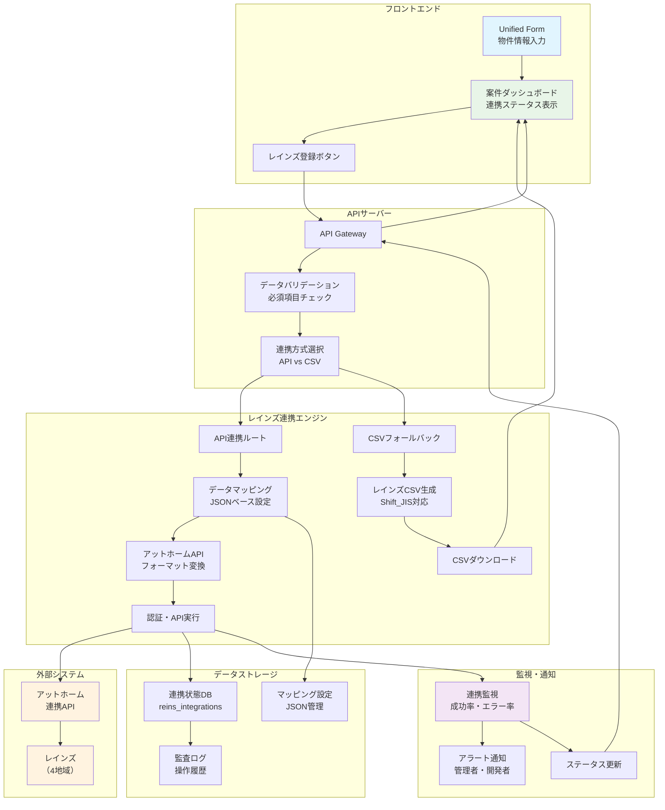
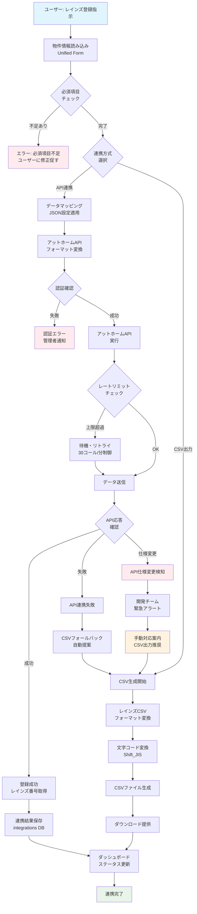
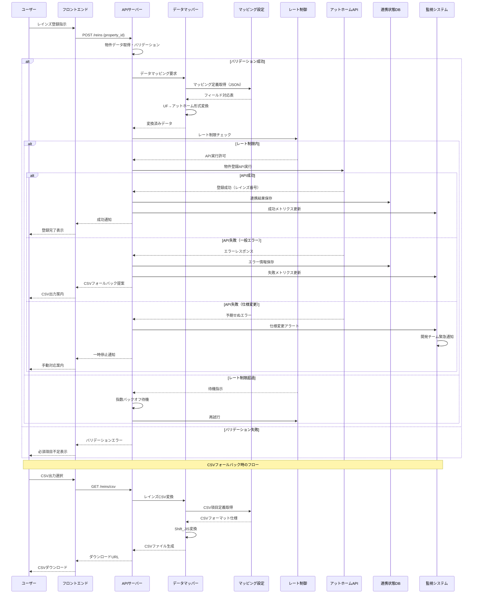

### **機能仕様書 v1.2**

**機能ID:** `CON-001`
**機能名:** `レインズ連携（アットホーム経由）`

| Ver | 日付 | 作成 / 変更者 | 変更概要 |
|-----|------|---------------|----------|
| 1.0 | 2025-06-30 | システム管理者 | 初版作成 |
| 1.1 | 2025-06-30 | システム管理者 | API連携機能詳細化 |
| 1.2 | 2025-06-30 | システム管理者 | バージョン管理追加、API更新頻度明確化 |

#### **1. 概要（Overview）**

`Unified Form`(UF-001)で一元管理されている物件情報を、不動産流通標準情報システム（レインズ）へ登録するための連携機能。レインズへの直接API連携が提供されていないため、アットホーム社が提供する連携APIを介した登録を主とし、APIが利用できない場合や連携に失敗した場合のフォールバックとして、レインズ指定の共通CSVフォーマットを生成・ダウンロードする機能も提供する。

**注記：** レインズのデータ更新頻度は毎営業日であり、本システムからの連携もこの頻度に合わせて実行される。

#### **2. ユーザーゴール（User Story）**

**`broker_agent`（仲介担当者）ロールを持つユーザーとして、** 私は **システムに入力した物件情報を、ワンクリックでレインズに登録したい。** それによって、**レインズのサイトで同じ情報を再入力する手間を完全になくし、登録義務を迅速に果たしたい。**

#### **3. 受入基準（Acceptance Criteria）**

- `[ ]` **【API連携】** `Unified Form`画面の「レインズへ登録」ボタンをクリックすると、アットホーム経由でのAPI連携ジョブがバックグラウンドで開始される。
- `[ ]` `Unified Form`の項目が、レインズの項目体系に合わせて正しくマッピングされ、データが送信される。
- `[ ]` API連携の実行ステータス（同期中、成功、失敗）が、案件ダッシュボード(DSH-001)上で確認できる。
- `[ ]` 連携成功後、レインズ上の登録番号や最終更新日時が本システム内に保存・表示される。
- `[ ]` **【CSVフォールバック】** API連携が失敗した場合、またはユーザーが手動操作を選択した場合、レインズ指定の共通データ形式（CSV）に準拠したファイルがダウンロードできる。
- `[ ]` **【データマッピング】** 本システムの項目とレインズの項目とのマッピング定義は、JSONファイルとして管理され、軽微な変更に迅速に対応できる。
- `[ ]` ユーザーは、連携前に、レインズ登録に必須な項目がすべて入力されているかどうかのチェック結果を確認できる。

#### **4. UIデザインとUXフロー**

- **4.1. 画面デザイン:**
  - 主に`Unified Form`画面や案件ダッシュボード上のアクションボタンとして実装。
  - **[Figmaモックアップへのリンク（※作成後、ここにURLを記載）]**
- **4.2. ユーザーフロー図（API連携）:**
  1. `Unified Form`画面で「保存して同期」をクリック、または案件ダッシュボードで「レインズへ登録」をクリック。
  2. システムが必須項目をバリデーション。
  3. 問題なければ、バックグラウンドでAPI連携ジョブが開始され、UI上では「同期中」と表示される。
  4. 完了後、ステータスが「成功」または「失敗」に更新される。
- **4.3. ユーザーフロー図（CSVダウンロード）:**
  1. API連携に失敗した場合、通知やダッシュボードに「CSVダウンロード」ボタンが表示される。
  2. ユーザーがボタンをクリックすると、レインズ取込用のCSVファイルが生成され、ダウンロードが開始される。

#### **5. システム要件（バックエンド）**

- **5.1. APIエンドポイント:**
  - `POST /api/v1/properties/{property_id}/integrations/reins` (レインズ連携ジョブの起動)
  - `GET /api/v1/properties/{property_id}/integrations/reins/csv` (レインズ用CSVの生成・取得)
- **5.2. データ処理フロー（API連携）:**
  1. 連携ジョブが起動されると、`properties`テーブルから物件情報を取得。
  2. 外部管理されたマッピング定義（JSON）に基づき、物件情報をアットホーム連携APIのリクエスト形式に変換する。
  3. アットホーム社のAPIエンドポイントに対して、変換したデータを送信する。
  4. APIからのレスポンスを解析し、成功した場合はレインズ登録番号などを`integrations`テーブル等に保存する。失敗した場合はエラー内容をログに記録する。
  5. ジョブの最終ステータスを更新し、ユーザーに通知する。
- **5.3. データ処理フロー（CSV生成）:**
  1. CSV生成リクエストを受け取ると、`properties`テーブルから物件情報を取得。
  2. レインズの公式CSV仕様書に基づき、データを整形・変換する。
  3. 文字コード（Shift_JISなど）や改行コードを仕様に合わせて設定し、CSVファイルを生成してレスポンスとして返す。
- **5.4. 認証:**
  - アットホーム社APIとの連携に必要な認証情報（APIキーなど）は、暗号化して安全に管理する。

#### **6. エラーハンドリング**

| エラーケース | ユーザーへの表示（フロントエンド） | システムの挙動（バックエンド） |
| :--- | :--- | :--- |
| **連携APIの仕様変更** | 「レインズ連携に失敗しました。システム管理者が対応中です。お急ぎの場合はCSVをダウンロードしてご対応ください。」 | APIからの予期せぬエラーレスポンスを検知し、開発者にアラートを送信。ユーザーにはCSVダウンロードを促す。 |
| **アットホームの認証情報エラー** | 「レインズ連携用の認証情報が無効です。管理者にご確認ください。」 | 認証失敗を検知した場合、ジョブを中断し、`tenant_admin`（企業管理者）ロールを持つユーザーに通知を発行する。 |
| **レインズ登録必須項目の不足** | 「レインズへの登録に必要な[項目名]が未入力です。物件情報を更新してください。」 | 連携ジョブ開始前のバリデーションでエラーを検知し、処理を中断。ユーザーに修正を促す。 |

#### **7. データモデル（案）**

レインズ連携の状態を管理するため、以下のテーブルを想定する。

**テーブル名:** `reins_integrations`

| カラム名 | データ型 | 説明 |
| :--- | :--- | :--- |
| `id` | `UUID` | 主キー |
| `property_id` | `UUID` | `properties`テーブルへの外部キー |
| `status` | `VARCHAR` | 同期ステータス（例: `pending`, `syncing`, `success`, `failed`） |
| `reins_property_id` | `VARCHAR` | 連携成功時に取得するレインズの物件登録番号 |
| `last_synced_at` | `TIMESTAMP` | 最終同期日時 |
| `error_message` | `TEXT` | 失敗時のエラーメッセージ |
| `created_at` | `TIMESTAMP` | レコード作成日時 |
| `updated_at` | `TIMESTAMP` | レコード更新日時 |

#### **7.1. システム構成図**

##### **7.1.1. レインズ・アットホーム連携システム構成図**

##### **7.1.2. 物件登録・同期フローチャート**

##### **7.1.3. データ変換・マッピングシーケンス図**

#### **8. テスト要件**

- **8.1. CSVフォールバック機能のテスト:**
  - `[ ]` **【文字コード】** 生成されるCSVファイルの文字コードがShift_JISであることを確認する。
  - `[ ]` **【文字化け（エッジケース）】** 半角カタカナ、①や㈱などの機種依存文字、サロゲートペア（絵文字など）を含むデータが、CSV生成時に文字化けしないことを確認するテストケースを追加する。
  - `[ ]` **【フォーマット】** 生成されたCSVが、レインズの公式フォーマット仕様に準拠していることを確認する。

#### **8.2. 非機能要件**

- **パフォーマンス:**
  - `[ ]` ユーザーが「レインズ登録」を指示してから、バックグラウンドでの処理が完了するまでの時間は、通常時で5分以内とする。
- **信頼性:**
  - `[ ]` アットホームAPI連携の可用性は、99.0%以上を目指す。
  - `[ ]` **【レートリミット】** アットホームAPIの利用規約に基づき、APIコールは**1000コール/日、30コール/分**を上限とし、これを超えないようにシステム側で制御する。
  - `[ ]` **【SLA】** 万が一、レインズのCSV仕様変更により本機能が利用できなくなった場合、**72営業時間以内**にパッチを適用し、機能を復旧させることを目標とする。

#### **9\. 監査ログ**

- レインズへのデータ連携（成功・失敗）、CSVダウンロード、マッピング設定の変更など、本機能に関するすべての重要な操作は、操作者（`AUTH-001`で定義されたユーザーID）や日時、操作内容がわかるように監査ログに記録する。 

#### **10. RC版（Release Candidate）要件**

**目標**: 高信頼性レインズ連携システム・業界標準対応

##### **10.1. 連携精度・信頼性向上**
- `[ ]` **データ同期精度**: レインズ登録成功率99.5%以上
- `[ ]` **マッピング精度向上**: 自動マッピング正確率95%以上（専門家検証）
- `[ ]` **データ整合性検証**: 登録前後のデータ一致性100%保証
- `[ ]` **重複登録防止**: レインズ登録番号との突合による重複防止機構

##### **10.2. パフォーマンス・スケーラビリティ**
- `[ ]` **応答時間短縮**: 登録完了まで2分以内（95パーセンタイル）
- `[ ]` **バッチ処理対応**: 100件以上の一括レインズ登録機能
- `[ ]` **リアルタイム同期**: データ変更時の自動レインズ更新機構
- `[ ]` **API最適化**: アットホームAPI利用効率向上（1000コール/日→80%活用）

##### **10.3. フェイルセーフ・災害対策**
- `[ ]` **API障害対応**: アットホームAPI停止時の自動CSVフォールバック
- `[ ]` **データバックアップ**: 登録前データの完全バックアップ・復旧機構
- `[ ]` **マッピング保護**: 設定変更時の自動バックアップ・ロールバック機能
- `[ ]` **多重チェック**: 登録データの段階的検証システム

##### **10.4. 業界対応・拡張性**
- `[ ]` **新レインズ仕様対応**: 2024年度レインズシステム更新への完全対応
- `[ ]` **地域レインズ連携**: 東日本・西日本・中部・近畿レインズ全対応
- `[ ]` **カスタムマッピング**: 企業固有のデータ項目対応・カスタマイズ機能
- `[ ]` **API v2対応**: アットホーム次世代API対応準備

##### **10.5. 運用・監視強化**
- `[ ]` **連携監視ダッシュボード**: リアルタイム連携状況・エラー率監視
- `[ ]` **自動障害復旧**: 一時的障害からの自動リトライ・エラー通知
- `[ ]` **利用状況分析**: API vs CSV利用パターン・最適化提案
- `[ ]` **コンプライアンス監査**: レインズ登録義務の充足率・法的適合性確認

##### **10.6. 成功基準**
- **登録成功率**: 99.5%以上（API・CSVフォールバック含む）
- **応答時間**: 95パーセンタイルで2分以内
- **稼働率**: 99.8%以上（フォールバック機構含む）
- **業界適合性**: レインズ仕様変更への24時間以内対応 