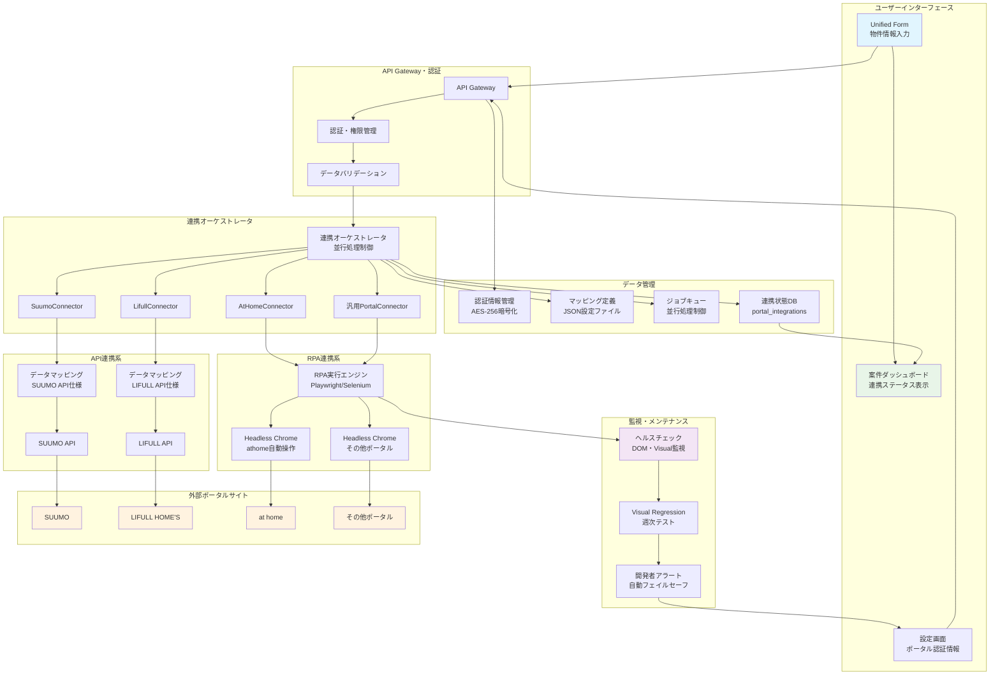
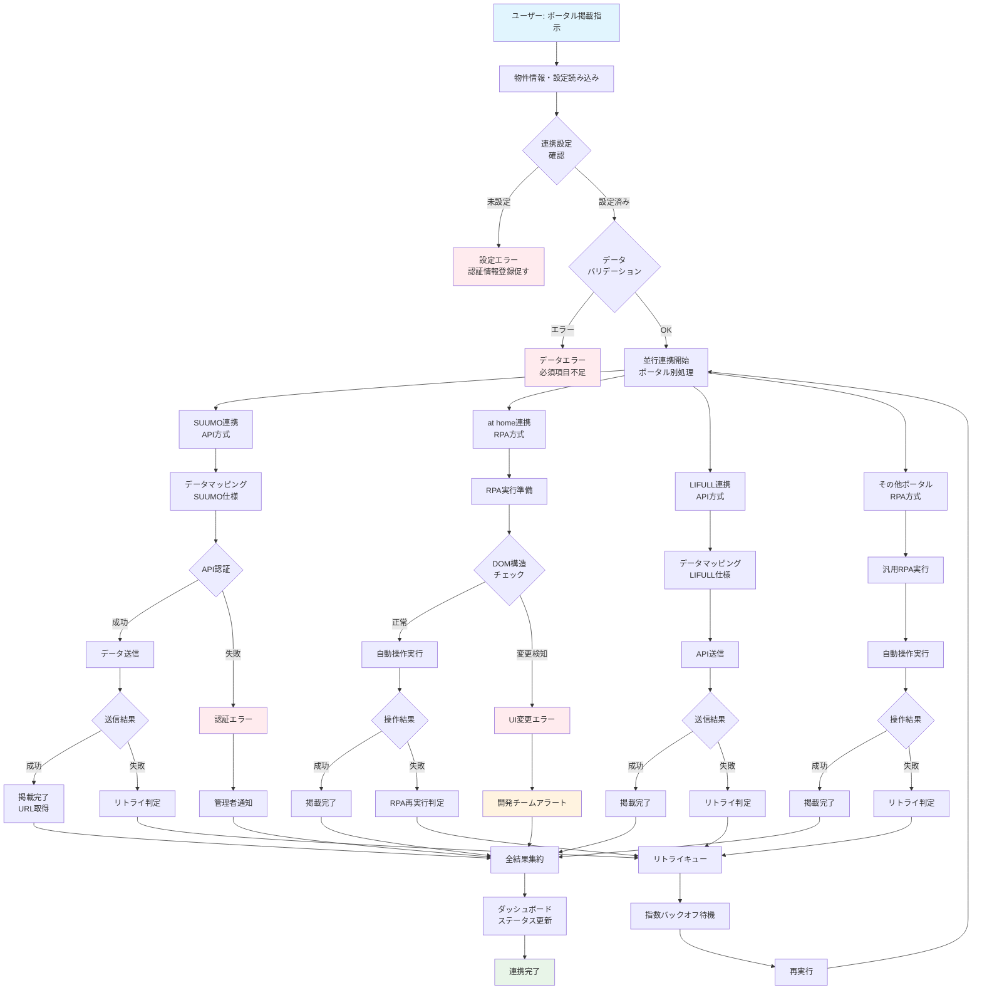
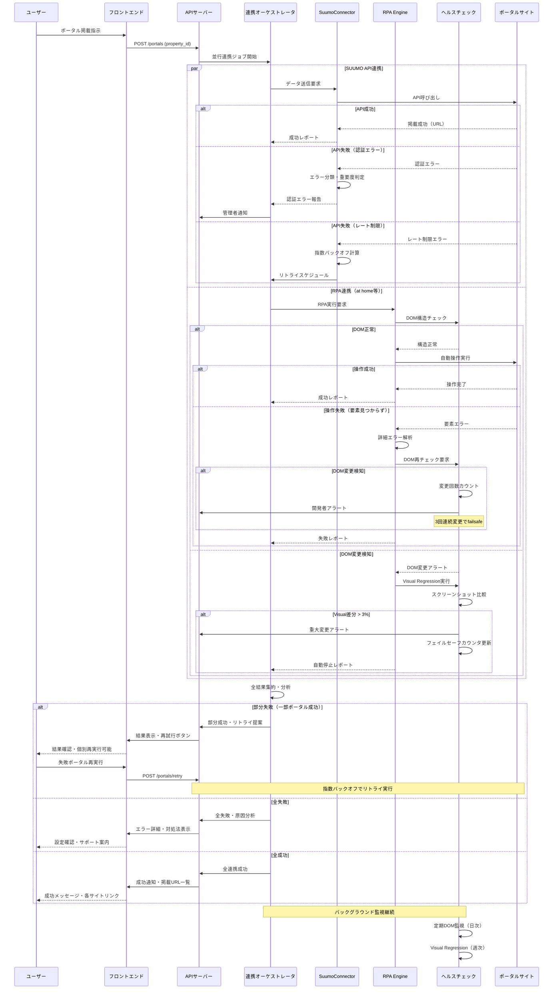

### **機能仕様書 v1.1**

**機能ID:** `CON-002`
**機能名:** `不動産ポータルサイト連携`

#### **1. 概要（Overview）**

`Unified Form`(UF-001)で管理する物件情報を、SUUMOやat homeといった複数の主要不動産ポータルサイトへ一括で掲載・更新するための連携機能。ポータルサイトごとに異なる連携方法（公開API、RPAなど）を吸収し、ユーザーは一度の操作で複数の媒体への情報展開が可能となる。これにより、広告掲載業務の効率を大幅に向上させる。

#### **2. ユーザーゴール（User Story）**

**`broker_agent`（仲介担当者）ロールを持つユーザーとして、** 私は **一度物件情報を入力するだけで、主要なポータルサイトすべてに広告を掲載したい。** それによって、**各サイトの管理画面にログインして同じ情報を何度も入力する反復作業から解放されたい。**

#### **3. 受入基準（Acceptance Criteria）**

- `[ ]` **【連携先設定】** `tenant_admin`（企業管理者）ロールを持つユーザーは、システム設定画面で連携したいポータルサイト（例：SUUMO, at home）を選択し、各サイトのログイン情報（ID/パスワード、APIキー等）を登録・管理できる。
- `[ ]` **【一括登録】** `Unified Form`画面の「ポータルサイトへ掲載」ボタンをクリックすると、設定済みの全ポータルサイトへの連携ジョブがバックグラウンドで開始される。
- `[ ]` 各ポータルサイトの項目仕様に合わせて、`Unified Form`の情報が正しくマッピングされてデータが送信される。
- `[ ]` **【ステータス管理】** 案件ダッシュボード(DSH-001)や案件詳細画面で、ポータルサイトごとに連携ステータス（未連携、連携中、成功、失敗）が一覧で確認できる。
- `[ ]` 連携成功後、各ポータルサイト上の掲載URLや最終更新日時が本システム内に保存・表示される。
- `[ ]` 連携に失敗したポータルサイトについては、エラー内容が表示され、個別に再実行を試みることができる。

#### **4. UIデザインとUXフロー**

- **4.1. 画面デザイン:**
  - **連携設定画面:** 連携可能なポータルサイトのリストと、それぞれの認証情報を入力するフォーム。
  - **Unified Form/ダッシュボード:** 各案件に、連携先ポータルサイトのアイコンとステータスを表示するエリア。
  - **[Figmaモックアップへのリンク（※作成後、ここにURLを記載）]**
- **4.2. ユーザーフロー図:**
  1. （初回設定）ユーザーは設定画面で、利用するポータルサイトを選択し、ログイン情報を入力・保存する。
  2. `Unified Form`画面で物件情報を入力後、「保存して同期」または「ポータルサイトへ掲載」ボタンをクリック。
  3. バックグラウンドで、設定済みの各ポータルサイトへの連携ジョブが並行して実行される。
  4. ユーザーはダッシュボードで、各サイトへの連携が成功したか、失敗したかを確認する。

#### **5. システム要件（バックエンド）**

- **5.1. APIエンドポイント:**
  - `GET /api/v1/integrations/portals` (対応ポータルサイト一覧の取得)
  - `PUT /api/v1/integrations/settings` (ユーザーのポータル連携設定の保存)
  - `POST /api/v1/properties/{property_id}/integrations/portals` (全ポータルへの連携ジョブ起動)
- **5.2. 連携処理の抽象化:**
  - 各ポータルサイトとの連携ロジックを、共通のインターフェース（例：`PortalConnector`）を持つ個別のクラス（例：`SuumoConnector`, `AtHomeConnector`）として実装する（Adapterパターン）。
  - `SuumoConnector`はAPIを、`AtHomeConnector`はRPAを内部で使用するなど、具体的な実装は各クラス内にカプセル化する。
- **5.3. データマッピング定義:**
  - 各ポータルサイトの項目と`Unified Form`の項目とのマッピング定義は、ポータルサイトごとにバージョン管理されたJSONファイルとして外部で管理する。
- **5.4. 認証情報の管理:**
  - ユーザーが入力した各ポータルサイトの認証情報は、AES-256などで暗号化し、セキュアなストレージ（Google Cloud Secrets Managerなど）に保管する。
- **5.5. RPAの安定稼働:**
  - RPAで連携するサイトについては、定期的に画面のDOM構造の変更がないかをチェックするヘルスチェック機能を実装し、変更があった場合は開発者にアラートを通知する。 **（詳細は後述の「監視とフェイルセーフ」を参照）**

#### **5.6. システム構成図**

##### **5.6.1. 複数ポータル連携システム構成図**

##### **5.6.2. RPA・API連携フローチャート**

##### **5.6.3. エラー処理・リトライシーケンス図**

#### **6. 画像アップロード仕様**

- `[ ]` 本システムから各ポータルサイトへ連携する画像の仕様は、以下の通りとする。
- `[ ]` **【画像要件】** 原則としてJPEG形式、長辺1200px以上を推奨する。
- `[ ]` **【アップロード上限】** 各サイトの制限に基づき、上限を超える枚数の画像は連携されない。

| 連携先サイト | 最大枚数 | 1枚あたりの最大容量 |
| :--- | :--- | :--- |
| SUUMO | 30枚 | 10MB |
| at home | 20枚 | 5MB |
| LIFULL HOME'S | 20枚 | 8MB |
| （その他） | 15枚 | 5MB |

#### **7. エラーハンドリング**

| エラーケース | ユーザーへの表示（フロントエンド） | システムの挙動（バックエンド） |
| :--- | :--- | :--- |
| **特定サイトの連携失敗** | ダッシュボード上で該当サイトのステータスを「失敗」と表示。「詳細」クリックでエラー内容（例：「SUUMOの掲載画像の枚数が上限を超えています」）を表示し、「再試行」ボタンを提示。 | 失敗したジョブのエラー内容をログに記録し、ステータスを更新。他のサイトへの連携は継続する。 |
| **認証情報のエラー** | 「[ポータル名]の認証情報が無効です。設定画面で更新してください。」 | 認証失敗を検知した場合、該当サイトの連携ジョブを中断し、`tenant_admin`ロールを持つユーザーに再設定を促す通知を発行する。 |
| **ポータルサイトの仕様変更（RPA）** | 「[ポータル名]のシステム仕様が変更されたため、連携に失敗しました。管理者が対応中です。」 | ヘルスチェックまたは実行時エラーで仕様変更を検知。開発者にアラートを送信し、該当の連携機能を一時的に停止する。 |

#### **8. 監視とフェイルセーフ**

RPAを利用するConnectorの安定性を確保するため、多層的な監視と自動停止（フェイルセーフ）機構を導入する。

- `[ ]` **【DOM差分監視】** 従来通り、日次で対象ページの主要なDOMセレクタの構造を監視し、変更を検知した場合はアラートを発行する。
- `[ ]` **【Visual Regressionテスト】** 上記に加え、**週次**でHeadless Chromeを用いたE2EのVisual Regressionテストを実行する。
  - `[ ]` テスト実行時に正常系のスクリーンショットを撮影し、事前に保存されたベースライン画像と比較する。
  - `[ ]` 画像間の視覚的な差分が、設定したしきい値（**例: 3%**）を超えた場合、UIの大幅な変更があったとみなし、アラートを発行する。
- `[ ]` **【自動フェイルセーフ】** 上記の監視で**3回連続**して重大な変更（DOM差分 or Visual差分）が検知された場合、影響を受ける`Connector`のステータスを自動的に`disabled`（無効）に変更し、ジョブが実行されないようにする。これにより、予期せぬエラーの連鎖を防ぐ。
  - `[ ]` ユーザーには、UI上で「現在メンテナンス中のため、このポータルサイトとは連携できません」といったメッセージを表示する。
  - `[ ]` 開発者が問題を修正し、`super_admin`（最高管理者）が手動でステータスを`enabled`に戻すまで、連携は停止される。 

#### **9. RC版（Release Candidate）要件**

**目標**: 全主要ポータルサイト対応・高安定性連携システム

##### **9.1. ポータル対応・網羅性拡張**
- `[ ]` **主要ポータル完全対応**: SUUMO、athome、LIFULL HOME'S、ニフティ不動産、マイナビ賃貸等
- `[ ]` **連携成功率向上**: 全ポータル合計で97%以上の連携成功率
- `[ ]` **新ポータル追加機能**: プラグイン方式での新ポータル対応（設定ベース）
- `[ ]` **API/RPA最適配分**: 各ポータルで最適な連携方式の自動選択

##### **9.2. パフォーマンス・並行処理**
- `[ ]` **並行連携最適化**: 全ポータル同時連携でも5分以内完了
- `[ ]` **画像アップロード高速化**: 大容量画像の自動圧縮・最適化
- `[ ]` **バッチ処理対応**: 複数物件の一括ポータル連携機能
- `[ ]` **キューイング最適化**: 連携ジョブの優先度制御・負荷分散

##### **9.3. AI・自動化強化**
- `[ ]` **自動カテゴリ判定**: 物件情報からの最適ポータル自動選択
- `[ ]` **AI画像最適化**: ポータル別の画像要件に応じた自動リサイズ・加工
- `[ ]` **インテリジェント・リトライ**: 失敗原因分析による最適なリトライ戦略
- `[ ]` **マッピング学習**: ユーザー修正パターンの学習・自動マッピング改善

##### **9.4. 監視・安定性向上**
- `[ ]` **Visual Regression強化**: 3%→1%のしきい値でより精密な変更検知
- `[ ]` **予防的監視**: ポータルサイト変更の事前検知・アラート
- `[ ]` **自動復旧機構**: サイト仕様変更時の自動パッチ適用システム
- `[ ]` **稼働率保証**: 99.5%以上の連携可用性（メンテナンス時間除く）

##### **9.5. セキュリティ・プライバシー**
- `[ ]` **認証情報完全保護**: ゼロトラスト・多層暗号化
- `[ ]` **連携ログ暗号化**: 全ポータル連携ログのE2E暗号化
- `[ ]` **個人情報マスキング**: ログ内PII自動検知・匿名化
- `[ ]` **アクセス制御強化**: 連携機能への詳細権限管理

##### **9.6. 運用・ビジネス支援**
- `[ ]` **連携効果分析**: ポータル別成約率・反響率のトラッキング
- `[ ]` **コスト最適化**: 連携コスト vs 効果の自動分析・最適化提案
- `[ ]` **マーケティング連携**: 反響データの自動CRM取り込み
- `[ ]` **レポート自動化**: 週次・月次の連携実績レポート自動生成

##### **9.7. 成功基準**
- **連携成功率**: 97%以上（全ポータル平均）
- **応答時間**: 全ポータル同時連携5分以内
- **稼働率**: 99.5%以上（単体ポータル連携可用性）
- **自動化率**: ユーザー操作の90%自動化達成 