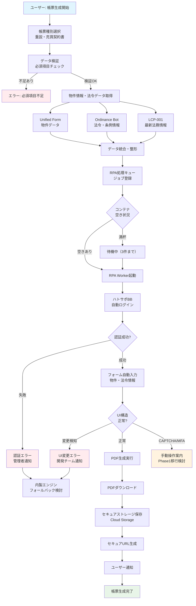
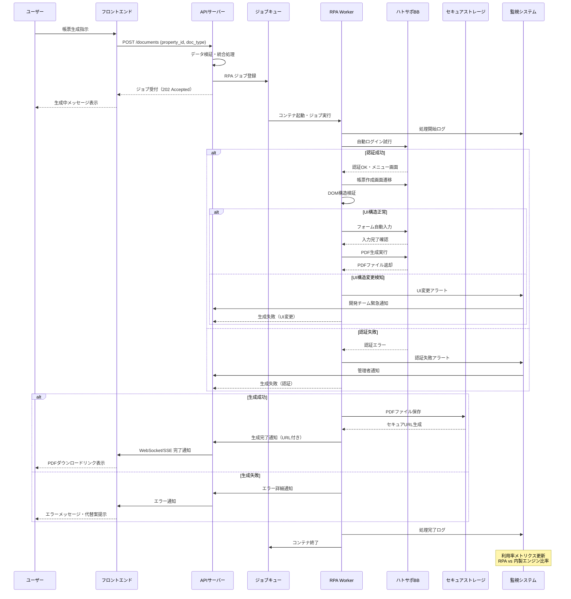
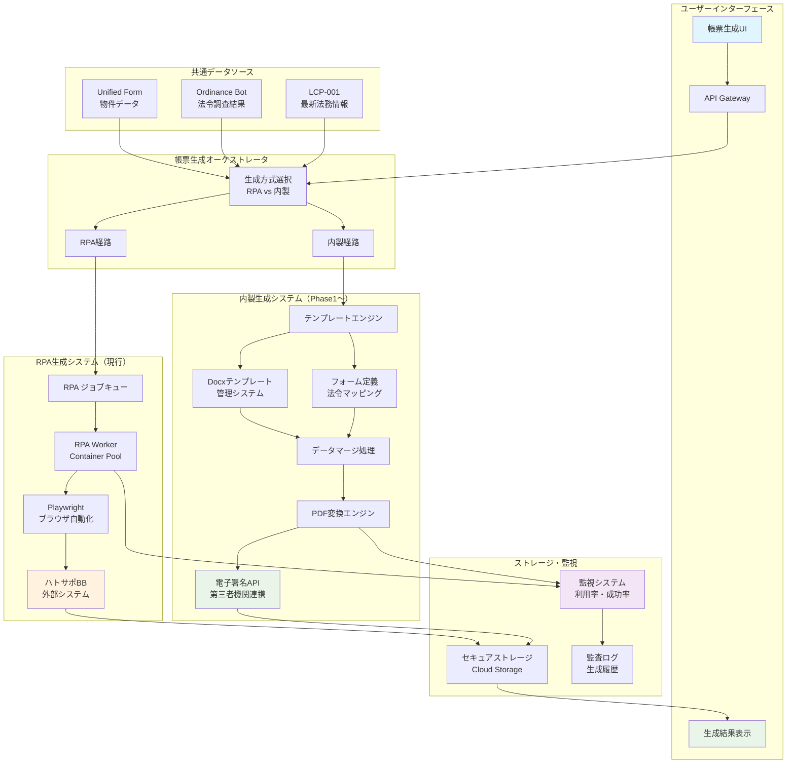

### **機能仕様書 v1.1**

**機能ID:** `CTR-001`
**機能名:** `契約書・重説の自動生成（ハトサポ連携）`

#### **1. 概要（Overview）**

`Unified Form`(UF-001)に入力された物件情報と、`法令CI/CDパイプライン`(LCP-001)によって常に最新状態に保たれる法務情報に基づき、重要事項説明書および売買契約書を自動生成する機能。MVP/β版では、RPA技術を用いてハトサポBBを自動操作し、「協会ロゴ付き」の信頼性の高い帳票を生成することを主目的とする。

#### **2. ユーザーゴール（User Story）**

**`broker_agent`（仲介担当者）または`legal_staff`（法務・契約担当）ロールを持つユーザーとして、** 私は **ボタン一つで、法的に準拠した最新の契約書や重要事項説明書を生成したい。** それによって、**書類作成の時間を95%削減し、法令違反のリスクをゼロに近づけたい。**

#### **3. 受入基準（Acceptance Criteria）**

- `[ ]` `Unified Form`のデータが、生成される帳票の該当項目に正確に反映される。
- `[ ]` `Ordinance Bot`(OB-001)による調査結果（法令・条例）が、重要事項説明書の所定の欄に自動で挿入される。
- `[ ]` ユーザーが帳票生成を指示すると、バックグラウンドでRPAがハトサポBBを自動操作し、協会ロゴ付きのPDFを生成・取得できる。
- `[ ]` 生成処理中は、ユーザーに進捗状況（例：「ハトサポに接続中...」「PDFを生成中...」）がフィードバックされる。
- `[ ]` **【性能】** 帳票生成指示から3分以内に、PDFのダウンロードが完了する。
- `[ ]` ハトサポBB連携機能の利用回数が、監査ログとして記録される。（将来の利用率分析のため）
- `[ ]` RPAによる自動操作が失敗した場合、ユーザーにエラーが通知され、手動での操作を促すメッセージが表示される。
- `[ ]` 【テスト】主要な契約種別（例：土地建物売買、区分所有売買、共有名義）のテストケースがE2Eテストで自動化されている。
- `[ ]` ユーザーが生成ボタンを押してから、PDFがダウンロード可能になるまでの時間は、通常時で3分以内とする。

#### **4. UIデザインとUXフロー**

- **4.1. 画面デザイン:**
  - 本機能は主に案件ダッシュボードや物件詳細画面上のアクションボタンとして実装される。
  - **[Figmaモックアップへのリンク（※作成後、ここにURLを記載）]**
- **4.2. ユーザーフロー図:**
  1. 案件詳細画面にて、「契約書を作成」ボタンをクリック。
  2. モーダルウィンドウで「重要事項説明書」「売買契約書」などの帳票種別を選択。
  3. 「生成を開始」ボタンをクリック。
  4. バックグラウンドでRPAが動作し、処理が完了するとダウンロードリンクが通知される。

#### **5. システム要件（バックエンド）**

- **5.1. APIエンドポイント:**
  - `POST /api/v1/properties/{property_id}/documents` (帳票生成ジョブの起動)
  - `GET /api/v1/properties/{property_id}/documents/{job_id}` (ジョブステータスの確認)
- **5.2. データ処理フロー:**
  1. フロントエンドから帳票生成リクエストを受領。
  2. `properties`テーブル等から必要な情報を取得。
  3. RPA Workerにハトサポ自動操作ジョブを非同期で依頼。
  4. RPA WorkerはPlaywright等を用いて、ハトサポBBにログインし、フォームにデータを入力、PDFを生成・ダウンロードする。
  5. ダウンロードしたPDFをS3等のストレージに保存し、ユーザーがアクセスできるセキュアなURLを生成する。
  6. 処理ステータスをデータベースに記録し、ユーザーに通知する。
  7. **【利用率計測】** 帳票生成総数に対するRPA実行数の割合を計測するメトリクスを実装する。

#### **5.3. システム構成図**

##### **5.3.1. 契約書生成処理フローチャート**

##### **5.3.2. ハトサポ連携シーケンス図**

##### **5.3.3. テンプレート管理システム構成図**

#### **6. エラーハンドリング**

| エラーケース | ユーザーへの表示（フロントエンド） | システムの挙動（バックエンド） |
| :--- | :--- | :--- |
| **ハトサポの画面仕様変更によるRPA停止** | 「ハトサポのシステム仕様が変更されたため、自動生成に失敗しました。システム管理者にお問い合わせください。」 | 失敗を検知し、即座に開発チームおよび`super_admin`へアラートを通知。ジョブを失敗ステータスにし、手動でのCSVアップロード機能へ誘導する（フェイルセーフ）。 |
| **ハトサポの認証情報エラー** | 「ハトサポBBの認証情報が無効です。管理者にご確認の上、設定を更新してください。」 | 認証失敗を検知し、ジョブを中断。`tenant_admin`ロールを持つユーザーに再設定を促す通知を発行する。 |
| **データ不整合（必須項目不足）** | 「[項目名]が未入力のため、帳票を生成できません。物件情報を更新してください。」 | RPAジョブ開始前のバリデーションでエラーを検知し、APIはステータスコード422を返す。 |

#### **7. 将来の展望（Phase-out Plan）**

現在のRPA（ハトサポ）依存は、外部システムの仕様変更リスクを内包するため、段階的に内製帳票エンジンへ移行する計画（Phase-out）を以下に定める。

- `[ ]` **【MVP (v1.1)】: RPAによるPDF生成**
  - 現在の仕様。ハトサポBBの自動操作により、協会ロゴ付きのPDFを生成する。信頼性を確保しつつ、迅速な市場投入を実現。

- `[ ]` **【Phase 1 (v1.2)】: 内製Docxテンプレートエンジン（β版）**
  - `Unified Form`のデータを、システム内で管理するWord（Docx）テンプレートに差し込み、帳票を生成する機能を実装する。
  - この段階では協会ロゴは含まれないが、RPAが停止した際の強力なバックアップ手段となる。

- `[ ]` **【Phase 2 (v2.0)】: 第三者電子署名連携と完全内製化**
  - 内製エンジンで生成した帳票に対し、信頼できる第三者機関の電子署名を付与するAPIと連携する。
  - これにより、協会ロゴに相当する法的信頼性を担保し、RPAへの依存を完全に解消する。
  - 将来的には、生成された電子契約書に連動する製造物責任（PL）保険との連携も視野に入れる。

#### **8\. リスクと対応策**

| リスク | 対応策 |
| :--- | :--- |
| **ハトサポのUI変更** | 監視スクリプトで定期的にDOM構造をチェックし、変更を検知した場合はアラートを発報。迅速にRPAスクリプトを修正する。 |
| **ハトサポの仕様変更（ログイン方法など）** | 連携の失敗を検知した場合、システムは自動的に機能を一時停止し、`super_admin`（最高管理者）に通知する。 |
| **ハトサポ側のCAPTCHA/MFA導入** | **[対応方針]** CAPTCHAやMFAが導入された場合、現状のRPAによる自動操作は困難となる。このリスクが顕在化した場合、Phase1で計画している**内製Docxテンプレートエンジンへの移行を前倒しで実施**する。それまでの暫定対策として、ユーザーに手動での操作を促すUIに変更する。 |

- `[ ]` **【コンテナ管理】**
  - `[ ]` **同時実行数:** RPA実行用のコンテナは、システム全体で**同時に5つ**まで起動できる。
  - `[ ]` **スケーリング:** 待機中のジョブが3件を超えた場合、新しいコンテナを起動する（上限5）。コンテナが10分間アイドル状態だった場合、そのコンテナは破棄される。 

#### **9. RC版（Release Candidate）要件**

**目標**: 商用レベルでの高信頼性契約書生成システム・脱ハトサポ依存

##### **9.1. 生成精度・品質向上**
- `[ ]` **帳票生成成功率**: 99%以上（RPA・内製エンジン合計）
- `[ ]` **データ転記精度**: 100%正確性（自動検証機構実装）
- `[ ]` **帳票種別拡張**: 15種類以上の契約書・重説パターン対応
- `[ ]` **法令最新性保証**: LCP-001連携による法改正の即座反映

##### **9.2. Phase-out計画加速**
- `[ ]` **内製Docxエンジン完成**: ハトサポ依存度50%以下に削減
- `[ ]` **電子署名連携**: 第三者認証機関との電子署名API統合
- `[ ]` **協会ロゴ代替**: 法的信頼性担保の代替手段確立
- `[ ]` **完全内製化準備**: v2.0での脱ハトサポ完全移行準備完了

##### **9.3. パフォーマンス・安定性**
- `[ ]` **生成時間短縮**: 帳票生成完了まで90秒以内（95パーセンタイル）
- `[ ]` **並行処理拡張**: 20件以上の同時帳票生成対応
- `[ ]` **RPA安定性向上**: ハトサポUI変更への自動対応機構
- `[ ]` **フェイルセーフ強化**: RPA失敗時の内製エンジン自動切替

##### **9.4. セキュリティ・コンプライアンス**
- `[ ]` **帳票アクセス制御**: 生成済み帳票の厳格な権限管理
- `[ ]` **電子署名監査**: 署名プロセスの完全監査ログ
- `[ ]` **PII保護強化**: 契約書内個人情報の暗号化・匿名化オプション
- `[ ]` **法的有効性検証**: 生成帳票の法的要件充足度自動チェック

##### **9.5. 運用・監視強化**
- `[ ]` **RPA監視システム**: ハトサポ連携状況のリアルタイム監視
- `[ ]` **自動障害復旧**: 一時的障害からの自動リトライ・切替機構
- `[ ]` **利用状況分析**: RPA vs 内製エンジンの利用パターン分析
- `[ ]` **コスト最適化**: ハトサポライセンス費用とシステム開発費の最適バランス

##### **9.6. 成功基準**
- **生成成功率**: 99%以上（全帳票種別平均）
- **応答時間**: 95パーセンタイルで90秒以内  
- **脱依存進捗**: ハトサポ依存度50%以下達成
- **法的適合性**: 生成帳票の法的要件充足率100% 