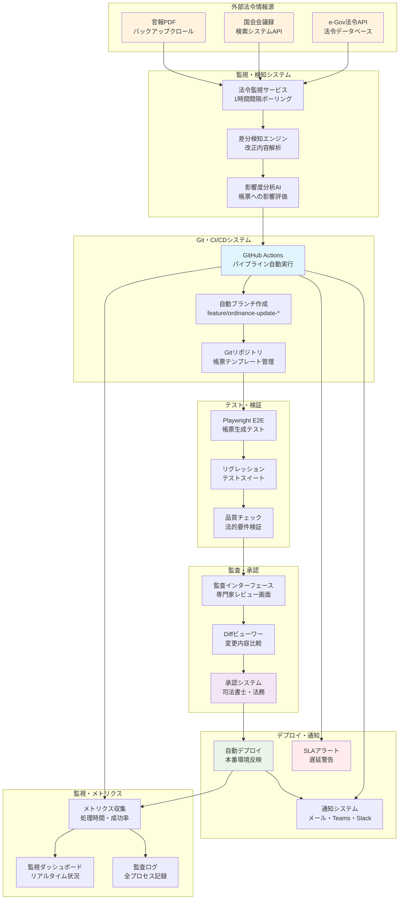
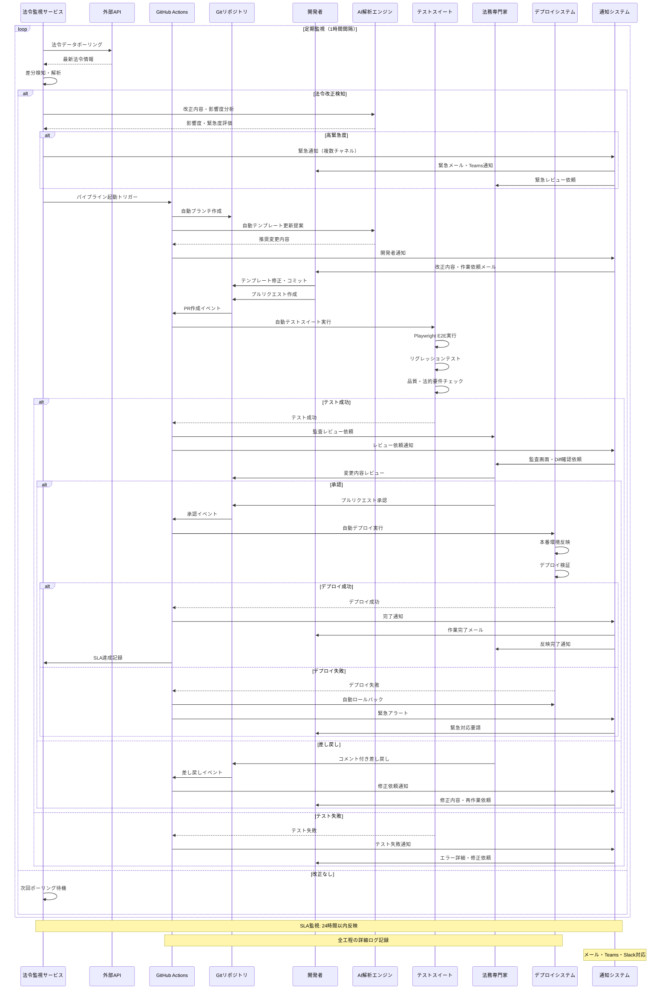

### **機能仕様書 v1.1**

**機能ID:** `LCP-001`
**機能名:** `法令CI-CDパイプライン（バックエンド）`

#### **1. 概要（Overview）**

不動産取引に関連する法改正を自動的に検知し、システムの帳票テンプレート（構成情報）へ迅速かつ正確に反映させるための継続的インテグレーション/デリバリーパイプライン。本機能はシステムの「信頼性」を担保する中核であり、SLA（24時間以内の改正反映）の達成を目的とする。これはユーザーが直接操作する機能ではなく、バックエンドで自律的に動作するプロセスである。

#### **2. システムゴール（System Goals）**

- **`dev_ops`（開発・運用担当者）として、** **法改正情報を自動で検知し、帳票テンプレートへの反映、テスト、監査、デプロイまでの一連のプロセスを自動化したい。** それによって、**手動による見落としや反映遅延のリスクを排除し、常に法的に準拠したシステムを維持したい。**
- **事業責任者として、** **「24時間以内の改正反映」というSLAを顧客に保証したい。** それによって、**「協会ロゴ」に匹敵、あるいはそれ以上の「プロセスの信頼性」をサービスの強みとしたい。**

#### **3. 受入基準（Acceptance Criteria）**

- `[ ]` **【検知】** e-Gov法令APIおよび国会会議録検索システムのAPIを定期的にポーリングし、宅建業法などの関連法令の改正情報を1時間以内に検知できる。
- `[ ]` **【ブランチ作成】** 法改正が検知されると、帳票テンプレートの構成情報（JSON等）が格納されたGitリポジトリに、自動で新しい開発ブランチが作成される。
- `[ ]` **【開発者通知】** 開発ブランチが作成されると同時に、担当開発者チームに**メール通知**で改正内容の概要と共に通知が送信される。緊急度に応じて複数チャネル（メール、Teams、Slack等）による通知も選択可能とする。
- `[ ]` **【テスト】** 開発者がテンプレートを修正し、プルリクエストを作成すると、Playwright等を用いた帳票生成のE2Eテストが自動実行され、デグレが発生していないことを確認できる。
- `[ ]` **【監査】** テストをパスしたプルリクエストは、`legal_staff`（法務・契約担当）または`external_partner`（外部協力者/司法書士）ロールを持つユーザーのレビュー待ち状態となる。対象ユーザーは専用の監査画面で変更内容の適法性を確認し、承認（Approve）できる。
- `[ ]` **【デプロイ】** 承認された変更は、自動的に本番環境へマージ＆デプロイされる。
- `[ ]` **【SLA監視】** 法改正検知から本番デプロイまでの所要時間が計測され、SLA（24時間）を超過しそうな場合は、関係者に警告アラートが発せられる。

#### **4. アーキテクチャと処理フロー**

- **4.1. 技術スタック:**
  - **ソース管理:** Git (GitOpsアプローチ)
  - **CI/CDエンジン:** GitHub Actions
  - **テストフレームワーク:** Playwright
  - **通知:** メール（SMTP）+ 複数チャネル対応（Teams、Slack等）
- **4.2. パイプラインとGit戦略:**
  - **ブランチ戦略:** 法改正を検知すると、`feature/ordinance-update-{法令ID}-{改正日}`のような命名規則で自動的にブランチが作成される。
  - **マージ戦略:**
    - `[ ]` 開発ブランチから`main`ブランチへのマージは、**Squash and Merge**を必須とする。これにより、mainブランチのコミット履歴をクリーンに保つ。
    - `[ ]` マージ時にコンフリクトが発生した場合、パイプラインは自動マージを中止し、担当開発者に手動での解決を要求する通知（メール）を送信する。
  - **パイプラインフロー図:**
    1. **[監視]** → `e-Gov/国会APIポーリング`
    2. **[検知]** → `法改正情報を検知`
    3. **[準備]** → `GitHub Actionsが発火し、開発ブランチを自動作成`
    4. **[通知]** → `メールで開発者に通知`
    5. **[開発]** → `開発者がテンプレート構成情報を修正し、プルリクエストを作成`
    6. **[テスト]** → `GitHub ActionsがE2Eテストを自動実行`
    7. **[監査]** → `テスト成功後、GitHub上で司法書士にレビュー依頼`
    8. **[承認]** → `司法書士が変更点をレビューし、承認`
    9. **[デプロイ]** → `GitHub Actionsが本番環境へ自動デプロイ`
    10. **[完了]** → `パイプライン完了をメールに通知`

#### **5. 監査インターフェース要件**

- `legal_staff`または`external_partner`ロールを持つユーザー向けのシンプルなWebインターフェースを提供する。
- GitHubアカウントと連携し、担当するレビュー依頼（プルリクエスト）を一覧表示する。
- 変更前と変更後の帳票サンプルを画面上で比較できる（Diffビューワー）。
- 「承認」「差し戻し（コメント付き）」のアクションを行える。

#### **6. リスク管理とフォールバック**

| リスクシナリオ | 主な対策 |
| :--- | :--- |
| **API仕様変更による改正検知の失敗** | ・2系統のAPI（e-Gov, 国会）で冗長化。 ・官報PDFのバックアップクロールによる三重監視。 ・差分検知ロジックの異常を監視し、失敗が続く場合はアラートを発報。 |
| **SLA/SLO遅延** | ・法改正検知から本番デプロイまでの**SLO（Service Level Objective）**を**「90パーセンタイルで12時間以内、99パーセンタイルで24時間以内」**と定める。 ・パイプラインの各ステップの所要時間を計測し、ボトルネックを特定。 ・遅延発生時は、関係者にエスカレーションアラートを送信。 ・万が一デプロイが間に合わない場合は、影響を受ける帳票に「現在法改正対応中です。最新でない可能性があります」という警告文を自動で付記する（暫定警告行）。 |
| **司法書士のレビュー遅延** | ・レビュー依頼後、一定時間（例：8時間）応答がない場合、リマインダーをメールで自動通知。 ・複数の提携先を用意し、リソースを分散する。 |
| **CI/CDエンジンの同時実行上限** | ・GitHub Actionsのプランによって同時実行ジョブ数に上限があるため（例: Teamプランでは60並列）、複数の法改正が同時に発生した場合、パイプラインの開始がキューイングされ遅延する可能性がある。 ・Enterpriseプランへの移行や、セルフホストランナーの活用を将来的に検討する。 |

#### **6.1. システム構成図**

##### **6.1.1. 法令監視・CI/CDパイプライン全体構成図**

##### **6.1.2. 法令変更検知・自動更新フローチャート**

```mermaid
flowchart TD
    START[法令監視開始<br/>1時間間隔] --> POLL[複数API並行ポーリング]
    
    POLL --> EGOV_CHECK[e-Gov API<br/>法令データ取得]
    POLL --> KOKKAI_CHECK[国会API<br/>会議録検索]
    POLL --> KANPO_CHECK[官報PDF<br/>クロール実行]
    
    EGOV_CHECK --> DIFF_ANALYSIS[差分検知解析<br/>改正内容抽出]
    KOKKAI_CHECK --> DIFF_ANALYSIS
    KANPO_CHECK --> DIFF_ANALYSIS
    
    DIFF_ANALYSIS --> CHANGE_DETECT{法令改正<br/>検知？}
    CHANGE_DETECT -->|検知なし| WAIT[次回ポーリング待機]
    CHANGE_DETECT -->|改正検知| IMPACT_AI[AI影響度分析<br/>帳票への影響評価]
    
    IMPACT_AI --> PRIORITY{緊急度<br/>判定}
    PRIORITY -->|高緊急度| URGENT_NOTIFY[緊急通知<br/>複数チャネル]
    PRIORITY -->|通常| BRANCH_CREATE[自動ブランチ作成]
    URGENT_NOTIFY --> BRANCH_CREATE
    
    BRANCH_CREATE --> TEMPLATE_AI[AI自動テンプレート<br/>更新提案]
    TEMPLATE_AI --> DEV_NOTIFY[開発者通知<br/>メール送信]
    DEV_NOTIFY --> DEV_WORK[開発者による<br/>テンプレート修正]
    
    DEV_WORK --> PR_CREATE[プルリクエスト<br/>作成]
    PR_CREATE --> AUTO_TEST[自動テストスイート<br/>実行]
    
    AUTO_TEST --> E2E_TEST[Playwright E2E<br/>帳票生成テスト]
    E2E_TEST --> REGRESSION_TEST[リグレッション<br/>テスト実行]
    REGRESSION_TEST --> QUALITY_CHECK[品質チェック<br/>法的要件検証]
    
    QUALITY_CHECK --> TEST_RESULT{テスト<br/>結果}
    TEST_RESULT -->|失敗| TEST_FAIL[テスト失敗通知<br/>開発者修正要求]
    TEST_FAIL --> DEV_WORK
    
    TEST_RESULT -->|成功| AUDIT_REQUEST[監査レビュー<br/>依頼]
    AUDIT_REQUEST --> LEGAL_REVIEW[法務専門家<br/>レビュー]
    
    LEGAL_REVIEW --> REVIEW_RESULT{監査<br/>結果}
    REVIEW_RESULT -->|差し戻し| FEEDBACK[コメント付き<br/>差し戻し]
    FEEDBACK --> DEV_WORK
    
    REVIEW_RESULT -->|承認| AUTO_DEPLOY[自動デプロイ<br/>本番環境]
    AUTO_DEPLOY --> DEPLOY_VERIFY[デプロイ検証<br/>正常性確認]
    
    DEPLOY_VERIFY --> DEPLOY_SUCCESS{デプロイ<br/>成功？}
    DEPLOY_SUCCESS -->|失敗| ROLLBACK[自動ロールバック<br/>緊急対応]
    DEPLOY_SUCCESS -->|成功| COMPLETE_NOTIFY[完了通知<br/>全関係者]
    
    ROLLBACK --> EMERGENCY[緊急対応<br/>手動介入]
    COMPLETE_NOTIFY --> SLA_CHECK[SLA達成確認<br/>24時間以内]
    SLA_CHECK --> METRICS_UPDATE[メトリクス更新<br/>監査ログ記録]
    METRICS_UPDATE --> WAIT
    
    EMERGENCY --> WAIT
    
    style START fill:#e1f5fe
    style COMPLETE_NOTIFY fill:#e8f5e8
    style URGENT_NOTIFY fill:#ffebee
    style TEST_FAIL fill:#ffebee
    style ROLLBACK fill:#ffebee
    style EMERGENCY fill:#ffebee
    style TEMPLATE_AI fill:#fff3e0
    style IMPACT_AI fill:#fff3e0
```

##### **6.1.3. パイプライン実行・通知シーケンス図**

#### **7. セキュリティ要件**

- `[ ]` **【認証（OIDC）】**
  - GitHub Actionsからクラウドプロバイダー（Google Cloud, Azure, GCP等）のリソースへアクセスする際は、静的なアクセスキーを直接使用せず、**OIDC (OpenID Connect) 認証**を利用して一時的なアクセストークンを取得することを必須とする。
- `[ ]` **【シークレット管理】**
  - OIDCで対応できないサードパーティのAPIキーなど、やむを得ずGitHub Secretsに保存する認証情報は最小限に留める。
  - Secretsに保存された認証情報は、**四半期に一度**の棚卸しと、定期的な**ローテーション**（更新）を義務付ける。

#### **8. RC版（Release Candidate）要件**

**目標**: 商用運用レベルの法令対応自動化システム・信頼性保証

##### **8.1. 検知精度・網羅性向上**
- `[ ]` **検知精度向上**: 法令改正の検知率99.5%以上（複数ソース統合）
- `[ ]` **リアルタイム監視**: 30分間隔での法令改正チェック・即座検知
- `[ ]` **影響度分析**: AI による改正内容の帳票への影響度自動分析
- `[ ]` **多法令対応**: 宅建業法以外の関連法令（民法、借地借家法等）も網羅

##### **8.2. パイプライン高速化・安定性**
- `[ ]` **処理時間短縮**: 検知から本番デプロイまで6時間以内（90パーセンタイル）
- `[ ]` **並列処理拡張**: 複数法令改正の同時対応・パイプライン並列実行
- `[ ]` **自動復旧機構**: パイプライン障害からの自動リトライ・フェイルオーバー
- `[ ]` **ゼロダウンタイム**: 本番環境への無停止デプロイメント

##### **8.3. AI・機械学習活用**
- `[ ]` **自動テンプレート生成**: AI による改正内容からの帳票テンプレート自動更新
- `[ ]` **法的適合性チェック**: 機械学習による更新内容の法的整合性検証
- `[ ]` **自動テストケース生成**: 改正内容に応じたE2Eテストの自動生成
- `[ ]` **影響範囲予測**: 過去データ学習による改正影響の事前予測

##### **8.4. 監査・品質保証強化**
- `[ ]` **多段階レビュー**: 開発者→AI検証→法務専門家の3段階承認システム
- `[ ]` **自動品質チェック**: 生成帳票の法的要件充足度自動検証
- `[ ]` **変更履歴トレース**: 全改正プロセスの完全監査ログ・追跡可能性
- `[ ]` **外部専門家連携**: 司法書士・行政書士との連携レビューシステム

##### **8.5. 運用・監視基盤**
- `[ ]` **リアルタイム監視**: パイプライン全工程のリアルタイム状況監視
- `[ ]` **SLA監視強化**: 処理時間・成功率の詳細メトリクス・アラート
- `[ ]` **予防的保守**: 潜在的な障害要因の事前検知・対処
- `[ ]` **災害復旧計画**: パイプライン障害時の緊急対応手順・バックアップ運用

##### **8.6. セキュリティ・コンプライアンス**
- `[ ]` **完全暗号化**: 法令データの E2E 暗号化・アクセス制御
- `[ ]` **監査ログ強化**: 全操作の完全記録・改ざん検知機構
- `[ ]` **アクセス制御**: 段階的権限管理・最小権限原則の徹底
- `[ ]` **法的証跡保全**: 法的証拠として使用可能なログ管理

##### **8.7. 成功基準**
- **検知精度**: 法令改正99.5%以上の自動検知
- **処理時間**: 90パーセンタイルで6時間以内完了
- **稼働率**: 99.9%以上（年間ダウンタイム8.76時間以内）
- **SLA達成率**: 24時間以内反映の95%以上達成 