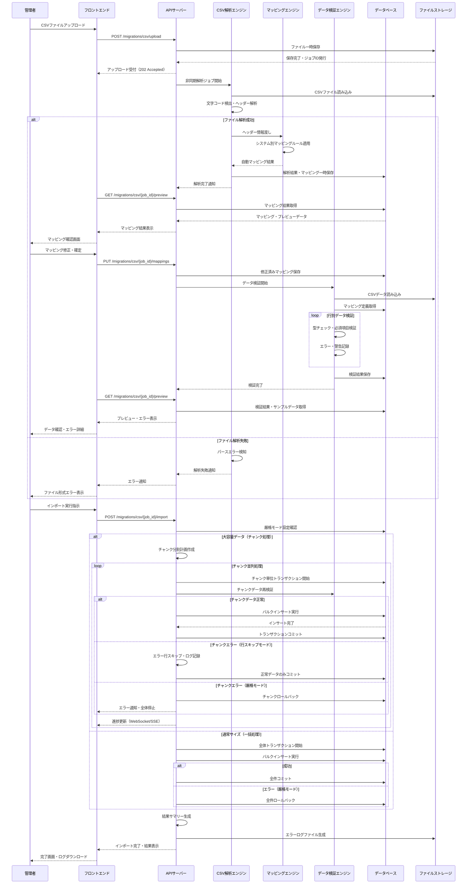
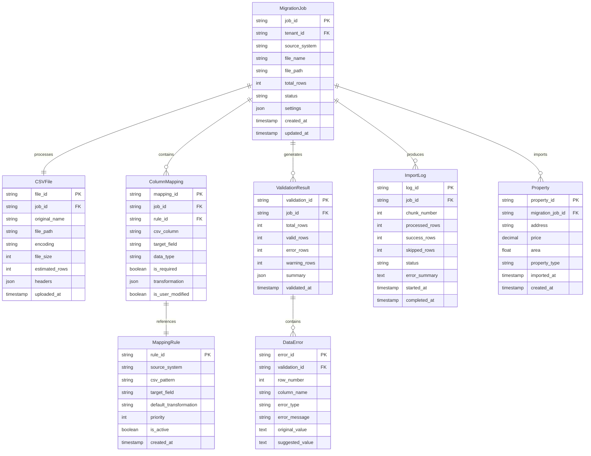

### **機能仕様書 v1.2**

**機能ID:** `MIG-001`
**機能名:** `データ移行ウィザード（CSVインポート）`

| Ver | 日付 | 作成 / 変更者 | 変更概要 |
|-----|------|---------------|----------|
| 1.0 | 2025-06-30 | システム管理者 | 初版作成 |
| 1.1 | 2025-06-30 | システム管理者 | エラーハンドリング詳細化 |
| 1.2 | 2025-06-30 | システム管理者 | バージョン管理追加、大容量CSV処理対応 |

#### **1. 概要（Overview）**

新規顧客が本システムを導入する際に、既存の不動産業務システム（ハトサポBB、売買革命などを想定）からエクスポートした案件データ（CSV形式）を一括で本システムに取り込むための機能。ウィザード形式のUIを通じて、ユーザーが直感的にデータ移行を完了できることを目的とし、システム乗り換えの障壁を低減する。

#### **2. ユーザーゴール（User Story）**

**`tenant_admin`（企業管理者）ロールを持つユーザーとして、** 私は **今使っているシステムから出力したCSVファイルをアップロードするだけで、過去の案件データを簡単に新しいシステムへ移行したい。** それによって、**データ再入力の手間なく、スムーズに新システムの利用を開始したい。**

#### **3. 受入基準（Acceptance Criteria）**

- `[ ]` **【ファイル選択】** ユーザーは、移行元のシステム（例：「ハトサポBB」「売買革命」「その他」）を選択し、対応するCSVファイルをアップロードできる。
- `[ ]` **【ヘッダーマッピング】** アップロードされたCSVのヘッダー行をシステムが自動的に解析する。
- `[ ]` **【プレビューと修正】** CSVの各列が本システムのどの項目に対応するかを自動でマッピングし、その結果をユーザーにプレビュー表示する。ユーザーは、自動マッピングが不正確な場合に、プルダウン等で正しい項目を選択し直せる。
- `[ ]` **【データ検証】** インポート実行前に、データの簡易的な検証（必須項目の有無、データ形式のチェック等）が行われ、エラーや警告がある場合はプレビュー画面で該当箇所がハイライトされる。
- `[ ]` **【インポート実行】** ユーザーが「インポートを実行」ボタンをクリックすると、バックグラウンドで処理が開始される。
- `[ ]` インポート処理の進捗（処理した行数、エラー件数など）が画面に表示される。
- `[ ]` 処理完了後、インポート結果のサマリー（成功件数、失敗件数）が表示され、エラーがあった場合はその内容を記載したログファイルをダウンロードできる。
- `[ ]` インポートされたデータは、案件ダッシュボード(DSH-001)で確認できる。

#### **4. UIデザインとUXフロー**

- **4.1. 画面デザイン:**
  - ウィザードは複数のステップで構成する。
    1.  **Step 1: ファイルアップロード:** 移行元システムの選択とファイルアップロード。
    2.  **Step 2: カラムマッピング:** CSVの列とシステム項目の対応付け。
    3.  **Step 3: データプレビューと検証:** 取り込むデータの確認とエラー箇所の表示。
    4.  **Step 4: インポート実行と結果確認:** 進捗表示と完了報告。
  - **[Figmaモックアップへのリンク（※作成後、ここにURLを記載）]**
- **4.2. ユーザーフロー図:**
  1. 設定画面などから「データ移行」メニューを選択。
  2. ウィザードのStep 1で、システムを選択しCSVファイルをアップロード。
  3. Step 2で、カラムのマッピングを確認・修正する。
  4. Step 3で、取り込まれるデータのプレビューとエラーを確認する。
  5. Step 4で、インポートを実行し、結果を確認する。

#### **5. システム要件（バックエンド）**

- **5.1. APIエンドポイント:**
  - `POST /api/v1/migrations/csv/upload` (CSVファイルをアップロードし、解析ジョブを開始)
  - `GET /api/v1/migrations/csv/{job_id}/preview` (解析結果とプレビューデータを取得)
  - `PUT /api/v1/migrations/csv/{job_id}/mappings` (ユーザーが修正したマッピング情報を更新)
  - `POST /api/v1/migrations/csv/{job_id}/import` (インポート処理を実行)
- **5.2. データ処理フロー:**
  1. アップロードされたCSVファイルを一時ストレージに保存。
  2. 非同期ジョブでCSVをパースし、ヘッダーと各行のデータを解析。
  3. 選択された移行元システムに応じて、事前定義されたマッピングルールを適用し、自動マッピングを行う。
  4. ユーザーによるマッピング修正を受け付け、最終的なマッピング定義を保存。
  5. インポート実行時、マッピング定義に従ってCSVの各行を読み込み、本システムの`properties`テーブル等の形式に変換してデータベースに挿入する。
  6. 大量データのインポートを考慮し、処理はバルクインサート（一括登録）で行い、トランザクション管理を徹底する。
- **5.3. マッピング定義管理:**
  - 各移行元システム用のデフォルトマッピングルールは、JSONファイル等で外部管理し、対応システムの追加・変更に柔軟に対応できるようにする。

#### **5.4. システム構成図**

##### **5.4.1. データ移行処理フローチャート**

```mermaid
flowchart TD
    START[管理者: データ移行開始] --> WIZARD[移行ウィザード画面]
    
    subgraph "Step 1: ファイルアップロード"
        WIZARD --> SYSTEM[移行元システム選択<br/>ハトサポBB/売買革命/その他]
        SYSTEM --> UPLOAD[CSVファイルアップロード]
        UPLOAD --> SIZE_CHECK{ファイルサイズ<br/>チェック}
        SIZE_CHECK -->|100MB以下| PARSE_START[CSV解析開始]
        SIZE_CHECK -->|100MB超| CHUNK_SPLIT[チャンク分割提案<br/>10,000行/50MB単位]
        CHUNK_SPLIT --> PARSE_START
    end
    
    subgraph "Step 2: カラムマッピング"
        PARSE_START --> PARSE[ヘッダー解析<br/>文字コード検証]
        PARSE --> AUTO_MAP[自動マッピング実行<br/>システム別ルール適用]
        AUTO_MAP --> MAP_PREVIEW[マッピング結果表示]
        MAP_PREVIEW --> USER_MAP{ユーザー<br/>マッピング修正}
        USER_MAP -->|修正あり| MAP_UPDATE[マッピング定義更新]
        USER_MAP -->|修正なし| MAP_VALIDATE[必須項目チェック]
        MAP_UPDATE --> MAP_VALIDATE
        MAP_VALIDATE -->|エラーあり| MAP_ERROR[マッピングエラー表示]
        MAP_ERROR --> MAP_PREVIEW
        MAP_VALIDATE -->|OK| DATA_VALIDATE
    end
    
    subgraph "Step 3: データ検証・プレビュー"
        DATA_VALIDATE[データ検証実行<br/>型・必須項目チェック]
        DATA_VALIDATE --> SAMPLE[サンプルデータ表示<br/>先頭100件プレビュー]
        SAMPLE --> ERROR_CHECK{バリデーション<br/>エラー確認}
        ERROR_CHECK -->|エラーあり| ERROR_DETAIL[エラー詳細表示<br/>行番号・内容]
        ERROR_CHECK -->|エラーなし| IMPORT_READY[インポート準備完了]
        ERROR_DETAIL --> MODE_SELECT{処理モード<br/>選択}
        MODE_SELECT -->|行スキップ| IMPORT_READY
        MODE_SELECT -->|厳格モード| ERROR_FIX[エラー修正要求]
        ERROR_FIX --> DATA_VALIDATE
    end
    
    subgraph "Step 4: インポート実行"
        IMPORT_READY --> IMPORT_START[インポート実行開始]
        IMPORT_START --> CHUNK_PROCESS{チャンク処理<br/>判定}
        CHUNK_PROCESS -->|単一ファイル| BATCH_INSERT[バルクインサート実行]
        CHUNK_PROCESS -->|チャンク分割| PARALLEL_PROCESS[並列チャンク処理<br/>最大3並列]
        
        PARALLEL_PROCESS --> CHUNK_INSERT[チャンク単位インサート]
        CHUNK_INSERT --> PROGRESS[進捗更新<br/>チャンク単位]
        PROGRESS --> CHUNK_DONE{チャンク<br/>完了}
        CHUNK_DONE -->|継続| CHUNK_INSERT
        CHUNK_DONE -->|全完了| RESULT_SUMMARY
        
        BATCH_INSERT --> TRANSACTION{トランザクション<br/>処理}
        TRANSACTION -->|成功| COMMIT[コミット実行]
        TRANSACTION -->|エラー| ROLLBACK_CHECK{厳格モード<br/>確認}
        ROLLBACK_CHECK -->|行スキップ| ERROR_LOG[エラーログ記録<br/>処理継続]
        ROLLBACK_CHECK -->|厳格モード| ROLLBACK[全件ロールバック]
        
        COMMIT --> RESULT_SUMMARY[結果サマリー生成]
        ERROR_LOG --> RESULT_SUMMARY
        ROLLBACK --> RESULT_SUMMARY
    end
    
    RESULT_SUMMARY --> DOWNLOAD_LOG[エラーログ<br/>ダウンロード提供]
    DOWNLOAD_LOG --> DASHBOARD[案件ダッシュボード<br/>データ確認案内]
    DASHBOARD --> COMPLETE[移行完了]
    
    style START fill:#e1f5fe
    style COMPLETE fill:#e8f5e8
    style MAP_ERROR fill:#ffebee
    style ERROR_DETAIL fill:#ffebee
    style ROLLBACK fill:#ffebee
    style CHUNK_SPLIT fill:#fff3e0
```

##### **5.4.2. CSV解析・変換・検証シーケンス図**

##### **5.4.3. データ構造・マッピング関係図**

#### **6. エラーハンドリング**

| エラーケース | ユーザーへの表示（フロントエンド） | システムの挙動（バックエンド） |
| :--- | :--- | :--- |
| **サポート外のCSV形式** | 「ファイルの形式が正しくありません。文字コードがUTF-8であるか、ファイルが破損していないか確認してください。」 | パースエラーを検知し、処理を中断。ユーザーにファイル形式の確認を促す。 |
| **必須項目がマッピングされていない** | 「必須項目である[項目名]がマッピングされていません。CSVの列を割り当ててください。」 | マッピング定義の検証でエラーを検知し、インポート実行をブロックする。 |
| **データ行の不整合（例：日付形式が不正）** | プレビュー画面で該当のセルを赤くハイライトし、「日付の形式が正しくありません」といったエラーメッセージを表示。 | 行ごとのバリデーションでエラーを検知し、エラー内容と行番号を記録。インポート結果ログに詳細を出力する。処理の継続・中断は後述のガイドラインに従う。 |

#### **7. インポート処理のガイドライン**

インポート実行時にデータ不整合（必須項目の欠落など）が発見された場合の挙動は、ユーザー体験の複雑化を避けるため、以下のガイドラインに従う。

- `[ ]` **【デフォルトの挙動: 行スキップ】**
  - 標準では、エラーが発見された行のインポートは**スキップ**され、処理は次の行へ継続される。
  - スキップされた行の行番号とエラー内容は、最終的な結果レポートに記録され、ユーザーは後から確認・修正できる。
  - これにより、一部のエラーのために、正常なデータまでインポートが妨げられることを防ぐ。

- `[ ]` **【管理者向けオプション: 全件ロールバック】**
  - `tenant_admin`（企業管理者）ロールを持つユーザーは、データ移行ウィザードの設定画面で「**厳格モード**」を有効にできる。
  - このモードが有効な場合、一件でもエラーが発見された時点で、インポート処理全体が**トランザクションごとロールバック**され、データベースへの変更は一切コミットされない。
  - データの完全性を最優先したい場合にこのオプションを使用する。

- `[ ]` **【ファイルサイズと大容量処理】**
  - **標準制限:** アップロード可能なCSVファイルの最大サイズは**100MB**とする。
  - **大容量CSV対応（100MB超）:** 100MB超のファイルは以下のチャンク処理方式で対応：
    1. **ファイル分割要求:** システムがファイルサイズを検知し、自動的に分割を提案
    2. **チャンク単位処理:** 10,000行または50MBを1チャンクとして分割処理
    3. **進捗管理:** チャンク単位での進捗表示（例：チャンク3/8処理中）
    4. **一時停止・再開:** 処理中断時は次のチャンクから再開可能
    5. **部分失敗対応:** 特定チャンクが失敗しても他チャンクの処理は継続
- `[ ]` **【処理容量制限】**
  - **1チャンクあたり最大行数:** 10,000行
  - **同時処理チャンク数:** 最大3チャンク（メモリ使用量制御のため）
  - **総処理可能データ量:** 1回の移行で最大100万行まで対応
- `[ ]` **【タイムアウト制御】**
  - **チャンク処理タイムアウト:** 1チャンクあたり最大30分
  - **全体処理タイムアウト:** 最大6時間（大容量データの移行時間を考慮）
  - **タイムアウト時の挙動:** 処理済みチャンクはコミット、未処理分は次回再開対象

---

#### **8. RC版（Release Candidate）要件**

**目標**: 大容量データ対応・高精度データ移行システム

##### **8.1. 移行精度・検証強化**
- `[ ]` **移行成功率向上**: 大容量データ（100万行）での99%以上移行成功率
- `[ ]` **AI自動マッピング**: 機械学習による高精度列マッピング（95%正確率）
- `[ ]` **データ品質向上**: 移行前後データの自動整合性検証・矛盾検知
- `[ ]` **業界標準対応**: 15種類以上の不動産システムフォーマット対応

##### **8.2. パフォーマンス・大容量処理**
- `[ ]` **処理速度向上**: 10万行/10分の高速処理（従来比3倍高速化）
- `[ ]` **メモリ最適化**: 1GB以上のCSVファイル対応・メモリ効率化
- `[ ]` **並列処理拡張**: 複数チャンクの並列処理（最大5並列）
- `[ ]` **ストリーミング処理**: 大容量ファイルのストリーミング解析対応

##### **8.3. エラー処理・復旧機能**
- `[ ]` **インテリジェント・エラー修正**: AI による自動データクレンジング
- `[ ]` **段階的ロールバック**: 部分失敗時の細かい粒度でのロールバック
- `[ ]` **エラー予測**: 移行前の潜在的問題事前検知・警告システム
- `[ ]` **自動再試行**: 一時的エラーからの賢いリトライ戦略

##### **8.4. ユーザビリティ・運用性**
- `[ ]` **リアルタイム進捗**: チャンク単位での詳細進捗・ETA表示
- `[ ]` **移行履歴管理**: 過去移行の完全履歴・差分更新対応
- `[ ]` **テンプレート管理**: 企業固有マッピングテンプレートの保存・共有
- `[ ]` **プレビュー強化**: 移行前の詳細データサンプル確認（1000件表示）

##### **8.5. セキュリティ・監査**
- `[ ]` **移行データ暗号化**: 一時保存データの完全暗号化
- `[ ]` **アクセス制御**: 移行操作の詳細権限管理・承認フロー
- `[ ]` **監査ログ完全記録**: 全移行プロセスの追跡可能なログ管理
- `[ ]` **個人情報保護**: PII自動検知・マスキング・匿名化オプション

##### **8.6. システム統合・拡張性**
- `[ ]` **API連携**: 外部システムからの自動移行API提供
- `[ ]` **リアルタイム同期**: 既存システムとの差分同期・双方向連携
- `[ ]` **カスタムフィールド**: 企業固有項目の柔軟なマッピング対応
- `[ ]` **移行スケジューリング**: 定期的な増分移行・自動実行機能

##### **8.7. 成功基準**
- **移行成功率**: 99%以上（100万行規模のデータ）
- **処理時間**: 10万行を10分以内で完了
- **エラー回復率**: 90%以上のエラー自動修正・復旧
- **ユーザー満足度**: 移行作業の95%自動化達成 