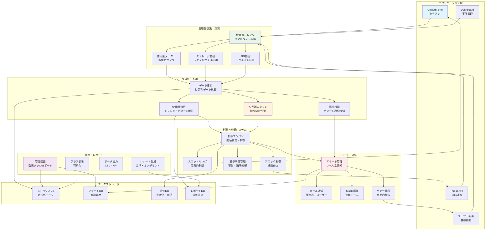
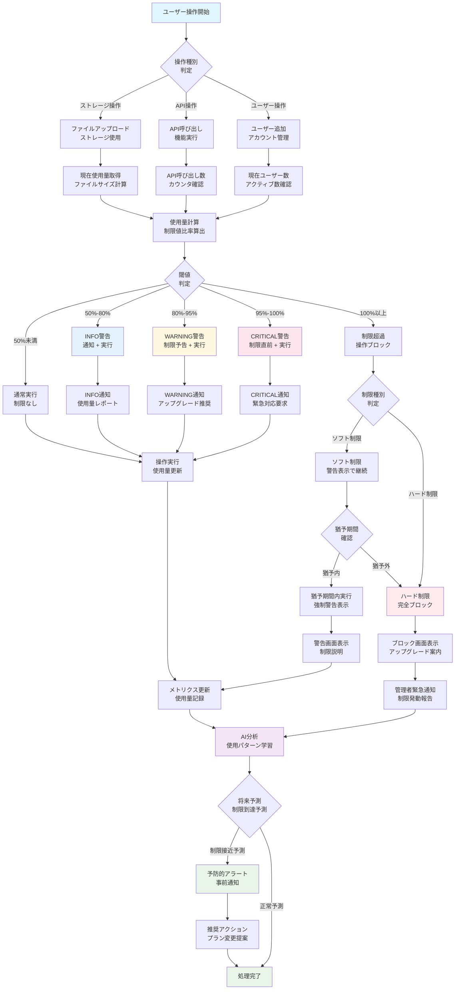
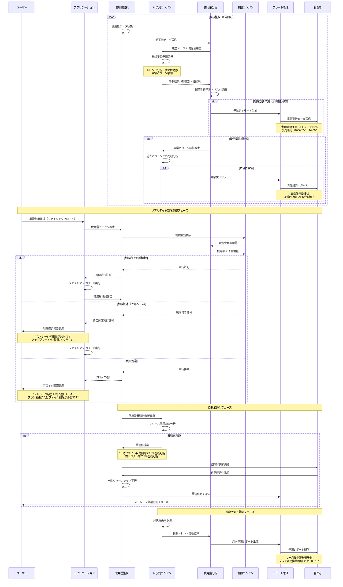

# 機能仕様書 MON-001: 使用量監視・制限機能

## バージョン管理

| Ver | 日付 | 作成 / 変更者 | 変更概要 |
|-----|------|---------------|----------|
| 1.0 | 2025-06-30 | システム設計チーム | 初版作成 |

## 1. 機能概要

### 1.1 機能の目的
システムリソースの使用量を監視し、プラン制限に応じた制御を行う機能。システム保護、公平な利用環境確保、適切な課金基盤を提供する。

### 1.2 対象ユーザー
- **システム管理者**: 全体監視・制限値設定・異常検知
- **テナント管理者**: 自社使用量確認・アラート受信
- **運用担当者**: 監視ダッシュボード・パフォーマンス分析

### 1.3 主要機能
- リアルタイム使用量監視
- プラン制限値の強制適用
- 使用量アラート・通知
- 使用量分析・レポート
- システム保護機能

## 2. 機能要件

### 2.1 リアルタイム監視（α版重要機能）

#### 2.1.1 監視対象リソース
**基本リソース**:
```yaml
ユーザー関連:
  アクティブユーザー数:
    - 現在ログイン中: リアルタイム
    - 月内アクティブ: 日次集計
    - 総登録ユーザー数: リアルタイム
  
  同時接続数:
    - Webセッション数
    - API接続数
    - WebSocket接続数

ストレージ使用量:
  データベース:
    - テーブル別使用量
    - インデックス使用量
    - ログ使用量
  
  ファイルストレージ:
    - 画像ファイル: MB/件数
    - PDF文書: MB/件数
    - 一時ファイル: 自動削除対象

API使用量:
  内部API:
    - エンドポイント別呼び出し数
    - 認証API: 制限対象外
    - CRUD操作: プラン制限対象
  
  外部API:
    - レインズAPI: 回数制限
    - AI査定API: 回数・コスト制限
    - OCR API: 回数・データ量制限
```

#### 2.1.2 監視方式
**リアルタイム収集**:
```yaml
データ収集:
  収集間隔: 30秒（高頻度リソース）
  集計間隔: 5分（中間集計）
  永続化間隔: 1時間（長期保存）

データソース:
  アプリケーションメトリクス:
    - アプリケーションログ
    - API呼び出しカウンター
    - セッション管理システム
  
  インフラメトリクス:
    - データベース統計
    - ファイルシステム使用量
    - Redis使用量

制限チェック:
  チェック頻度: API呼び出し時（同期）
  制限適用: 即座実行
  アラート送信: 閾値到達時
```

### 2.2 制限値管理・適用

#### 2.2.1 プラン別制限値（α版）
**Free Plan制限**:
```yaml
基本制限:
  ユーザー数: 3名（招待中含む）
  ストレージ: 1GB
  物件登録: 50件
  API呼び出し: 1,000回/月

機能制限:
  AI査定: 3回/月
  OCR処理: 10回/月
  レインズ連携: 利用不可
  外部API: 利用不可

同時接続制限:
  Webセッション: 5セッション/テナント
  API接続: 10接続/分
  長時間処理: 3並列まで
```

#### 2.2.2 制限適用方式
**段階的制限**:
```yaml
警告段階（80%到達）:
  通知のみ:
    - メール通知（管理者）
    - 管理画面バナー表示
    - 使用量グラフに警告表示
  
  推奨アクション:
    - プランアップグレード案内
    - 不要データ削除提案
    - 使用量最適化提案

注意段階（95%到達）:
  機能制限準備:
    - 緊急通知（メール・Slack）
    - 制限予告バナー
    - 制限回避方法の案内
  
  自動対応:
    - 一時ファイル自動削除
    - 古いログ自動圧縮
    - 非アクティブセッション切断

制限段階（100%到達）:
  機能制限適用:
    - 新規作成操作ブロック
    - ファイルアップロード停止
    - 制限対象API呼び出し拒否
  
  継続可能操作:
    - データ閲覧・ダウンロード
    - 基本認証機能
    - 削除・クリーンアップ操作

α版特別対応:
  制限緩和:
    - 制限到達でも完全停止しない
    - 警告表示のみ（UXレビュー優先）
    - データ収集・分析継続
```

### 2.3 アラート・通知システム

#### 2.3.1 アラート設定
**アラートレベル**:
```yaml
INFO（情報）:
  - 使用量50%到達
  - 月次レポート生成
  - 新機能利用開始

WARNING（警告）:
  - 使用量80%到達
  - 異常な使用パターン検知
  - API制限接近

CRITICAL（重要）:
  - 使用量95%到達
  - システム負荷高騰
  - 制限適用直前

EMERGENCY（緊急）:
  - 制限値到達・機能停止
  - システム障害
  - セキュリティアラート
```

#### 2.3.2 通知方法
**通知チャネル**:
```yaml
メール通知:
  対象者:
    - テナント管理者（自社分のみ）
    - システム管理者（全体）
    - 運用チーム（システム関連）
  
  通知内容:
    - アラートレベル・対象リソース
    - 現在の使用量・制限値
    - 推奨対応策
    - 詳細確認URL

管理画面通知:
  バナー表示:
    - ページ上部固定表示
    - アラートレベル別色分け
    - クリックで詳細表示
  
  ダッシュボード:
    - 使用量メーター更新
    - アラート件数表示
    - 最新アラート一覧

Slack通知（運用チーム）:
  - システム管理者向け
  - 重要度CRITICAL以上
  - 障害・異常検知時
```

### 2.4 使用量分析・レポート

#### 2.4.1 使用量データ分析
**分析項目**:
```yaml
トレンド分析:
  - 日別・週別・月別使用量推移
  - 成長率・季節性分析
  - 機能別利用パターン
  - ピーク時間帯分析

比較分析:
  - テナント間比較
  - プラン別平均使用量
  - 業界ベンチマーク
  - 同規模企業比較

予測分析:
  - 使用量増加予測
  - 制限到達予測
  - プラン変更タイミング予測
  - システム拡張必要性予測
```

#### 2.4.2 レポート生成
**定期レポート**:
```yaml
日次レポート:
  - 使用量サマリー
  - アラート発生状況
  - 異常検知結果
  - システム負荷状況

週次レポート:
  - 使用量トレンド
  - テナント別ランキング
  - 制限接近テナント
  - パフォーマンス分析

月次レポート:
  - 全体使用量統計
  - プラン変更推奨リスト
  - システム拡張計画
  - コスト分析・最適化提案
```

#### **2.5. システム構成図**

##### **2.5.1. 監視・アラートシステム構成図**



##### **2.5.2. リソース使用量監視フローチャート**



##### **2.5.3. AI予測・自動制御シーケンス図**



## 3. API仕様

### 3.1 使用量取得API

#### 3.1.1 現在使用量取得
```http
GET /api/v1/monitoring/usage/current?tenant_id={tenant_id}
Authorization: Bearer {token}

Response 200:
{
  "tenant_id": "550e8400-e29b-41d4-a716-446655440000",
  "plan": "free",
  "period": {
    "start": "2025-06-01T00:00:00Z",
    "end": "2025-06-30T23:59:59Z"
  },
  "usage": {
    "users": {
      "current": 2,
      "limit": 3,
      "usage_rate": 0.67,
      "status": "normal"
    },
    "storage_gb": {
      "current": 0.75,
      "limit": 1.0,
      "usage_rate": 0.75,
      "status": "normal"
    },
    "api_calls": {
      "current": 450,
      "limit": 1000,
      "usage_rate": 0.45,
      "status": "normal"
    },
    "ai_appraisal": {
      "current": 1,
      "limit": 3,
      "usage_rate": 0.33,
      "status": "normal"
    }
  },
  "alerts": [
    {
      "resource": "storage_gb",
      "level": "info",
      "message": "ストレージ使用量が50%を超えました",
      "created_at": "2025-06-30T10:00:00Z"
    }
  ]
}
```

### 3.2 制限チェックAPI

#### 3.2.1 操作前制限確認
```http
POST /api/v1/monitoring/check-limit
Authorization: Bearer {service_token}
Content-Type: application/json

{
  "tenant_id": "550e8400-e29b-41d4-a716-446655440000",
  "resource_type": "api_calls",
  "requested_amount": 1,
  "operation": "property_create"
}

Response 200:
{
  "allowed": true,
  "current_usage": 450,
  "limit": 1000,
  "remaining": 550,
  "warning": null
}

Response 429:
{
  "allowed": false,
  "current_usage": 1000,
  "limit": 1000,
  "remaining": 0,
  "error": "limit_exceeded",
  "message": "月間API制限に達しています",
  "reset_at": "2025-07-01T00:00:00Z",
  "suggested_actions": [
    "プランをアップグレードする",
    "来月まで待つ",
    "不要なデータを削除する"
  ]
}
```

### 3.3 使用量記録API

#### 3.3.1 使用量記録（内部API）
```http
POST /api/v1/monitoring/record-usage
Authorization: Bearer {service_token}
Content-Type: application/json

{
  "tenant_id": "550e8400-e29b-41d4-a716-446655440000",
  "resource_type": "storage_gb",
  "amount": 0.05,
  "operation": "file_upload",
  "metadata": {
    "file_type": "image",
    "file_size": 52428800,
    "operation_id": "upload_123"
  }
}

Response 200:
{
  "recorded": true,
  "new_total": 0.80,
  "limit": 1.0,
  "usage_rate": 0.80,
  "alerts_triggered": [
    {
      "level": "warning",
      "message": "ストレージ使用量が80%に達しました"
    }
  ]
}
```

## 4. データベース設計

### 4.1 使用量記録テーブル
```sql
-- リアルタイム使用量テーブル
CREATE TABLE monitoring.current_usage (
    tenant_id UUID PRIMARY KEY REFERENCES tenants(id),
    users_count INTEGER DEFAULT 0,
    storage_bytes BIGINT DEFAULT 0,
    api_calls_month INTEGER DEFAULT 0,
    ai_appraisal_month INTEGER DEFAULT 0,
    ocr_count_month INTEGER DEFAULT 0,
    
    -- 制限値（プランから取得、個別設定可能）
    users_limit INTEGER NOT NULL,
    storage_limit_bytes BIGINT NOT NULL,
    api_calls_limit INTEGER NOT NULL,
    
    -- 期間情報
    period_start DATE NOT NULL,
    period_end DATE NOT NULL,
    
    updated_at TIMESTAMP DEFAULT NOW()
);

-- 使用量履歴テーブル
CREATE TABLE monitoring.usage_history (
    id UUID PRIMARY KEY DEFAULT gen_random_uuid(),
    tenant_id UUID REFERENCES tenants(id),
    resource_type VARCHAR(50) NOT NULL,
    amount DECIMAL(15,6) NOT NULL,
    
    -- 操作情報
    operation VARCHAR(100),
    user_id UUID,
    session_id VARCHAR(100),
    
    -- メタデータ
    metadata JSONB DEFAULT '{}',
    recorded_at TIMESTAMP DEFAULT NOW(),
    
    -- 分析用インデックス
    INDEX idx_usage_tenant_time (tenant_id, recorded_at),
    INDEX idx_usage_resource_time (resource_type, recorded_at)
);

-- アラート履歴テーブル
CREATE TABLE monitoring.alert_history (
    id UUID PRIMARY KEY DEFAULT gen_random_uuid(),
    tenant_id UUID REFERENCES tenants(id),
    resource_type VARCHAR(50) NOT NULL,
    alert_level alert_level NOT NULL,
    
    usage_value DECIMAL(15,6) NOT NULL,
    limit_value DECIMAL(15,6) NOT NULL,
    usage_rate DECIMAL(5,4) NOT NULL,
    
    message TEXT NOT NULL,
    notified BOOLEAN DEFAULT false,
    acknowledged BOOLEAN DEFAULT false,
    
    created_at TIMESTAMP DEFAULT NOW(),
    resolved_at TIMESTAMP NULL
);

CREATE TYPE alert_level AS ENUM ('info', 'warning', 'critical', 'emergency');

-- 制限違反ログテーブル
CREATE TABLE monitoring.limit_violations (
    id UUID PRIMARY KEY DEFAULT gen_random_uuid(),
    tenant_id UUID REFERENCES tenants(id),
    resource_type VARCHAR(50) NOT NULL,
    
    requested_amount DECIMAL(15,6) NOT NULL,
    current_usage DECIMAL(15,6) NOT NULL,
    limit_value DECIMAL(15,6) NOT NULL,
    
    operation VARCHAR(100),
    blocked BOOLEAN NOT NULL,
    
    -- アクセス情報
    user_id UUID,
    ip_address INET,
    user_agent TEXT,
    
    occurred_at TIMESTAMP DEFAULT NOW()
);

-- インデックス
CREATE INDEX idx_current_usage_tenant ON monitoring.current_usage(tenant_id);
CREATE INDEX idx_usage_history_tenant_period ON monitoring.usage_history(tenant_id, recorded_at);
CREATE INDEX idx_alerts_unresolved ON monitoring.alert_history(tenant_id, resolved_at) WHERE resolved_at IS NULL;
CREATE INDEX idx_violations_tenant_time ON monitoring.limit_violations(tenant_id, occurred_at);
```

## 5. UI・UX設計

### 5.1 使用量ダッシュボード

#### 5.1.1 メイン画面構成
```yaml
ヘッダーエリア:
  - 現在のプラン表示
  - 次回リセット日
  - 緊急アラート表示
  - プラン変更ボタン

使用量メーターエリア:
  円形プログレスバー:
    - 中央: 使用率（%）
    - 色分け: 緑→黄→橙→赤
    - アニメーション: カウントアップ
  
  詳細情報:
    - 現在値/制限値
    - 残り容量・回数
    - 推定到達日
    - 前月比較

リソース別詳細:
  - タブ形式切り替え
  - 使用量グラフ（時系列）
  - 機能別内訳
  - 推奨アクション
```

#### 5.1.2 アラート表示
```yaml
バナーアラート:
  警告レベル:
    - 黄色背景
    - 「注意」アイコン
    - クリックで詳細展開
  
  重要レベル:
    - オレンジ背景
    - 「重要」アイコン
    - 自動詳細展開
  
  緊急レベル:
    - 赤色背景
    - 「緊急」アイコン
    - 画面上部固定
    - 確認ボタン必須

モーダルアラート:
  制限到達時:
    - 制限理由の説明
    - 解決方法の提示
    - プランアップグレード案内
    - 今後の対策案内
```

### 5.2 管理者監視画面

#### 5.2.1 システム監視ダッシュボード
```yaml
全体概要:
  - アクティブテナント数
  - 総使用量サマリー
  - アラート発生状況
  - システム負荷状況

アラート管理:
  - 未解決アラート一覧
  - アラートレベル別集計
  - 頻発するアラート分析
  - アラート対応状況

テナント監視:
  - 使用量上位テナント
  - 制限接近テナント
  - 異常パターンテナント
  - 新規警告テナント
```

## 6. エラーハンドリング・制限値

### 6.1 制限適用エラー
```yaml
使用量制限エラー:
  ユーザー数制限:
    - エラーコード: MON_USER_LIMIT
    - HTTP: 429 Too Many Requests
    - メッセージ: "ユーザー数制限（{limit}名）に達しています"
    - 対策: 既存ユーザー削除 or プラン変更
  
  ストレージ制限:
    - エラーコード: MON_STORAGE_LIMIT
    - HTTP: 413 Payload Too Large
    - メッセージ: "ストレージ容量制限に達しています"
    - 対策: ファイル削除 or プラン変更
  
  API制限:
    - エラーコード: MON_API_LIMIT
    - HTTP: 429 Too Many Requests
    - Header: Retry-After（リセット時刻）
    - メッセージ: "API制限に達しています"

α版特別処理:
  制限緩和:
    - 制限超過でも完全ブロックしない
    - 警告表示のみ
    - UXレビュー継続
    - β版での厳密制限を予告
```

### 6.2 システム保護制限
```yaml
異常使用検知:
  短時間大量アクセス:
    - 1分間に通常の10倍以上のAPI呼び出し
    - 自動的に5分間の制限適用
    - 管理者への緊急通知
  
  異常ファイルアップロード:
    - 1時間で制限値の50%以上の増加
    - ファイルアップロード一時停止
    - ウイルス・マルウェアスキャン実行

DoS攻撃対策:
  - IP別制限（100req/min）
  - User-Agent別制限
  - 地理的異常アクセス制限
  - 自動ブラックリスト登録
```

## 7. テスト要件

### 7.1 機能テスト
```yaml
使用量監視テスト:
  - 正確な使用量カウント
  - リアルタイム更新確認
  - 制限値チェック精度
  - アラート発火確認

制限適用テスト:
  - 段階的制限の動作
  - 制限解除の動作
  - α版緩和措置の確認
  - エラーメッセージの確認

通知テスト:
  - メール通知の配信
  - 管理画面通知表示
  - アラートレベル別動作
  - 通知内容の正確性
```

### 7.2 負荷テスト
```yaml
高負荷監視テスト:
  - 大量テナント監視
  - 高頻度使用量更新
  - 同時制限チェック
  - アラート大量発生

パフォーマンステスト:
  - 制限チェック応答時間
  - 使用量取得応答時間
  - ダッシュボード表示速度
  - データベース負荷確認
```

## 8. 運用・保守

### 8.1 監視・運用
```yaml
システム監視:
  - 監視システム自体の可用性
  - 使用量データの整合性
  - アラート配信の成功率
  - 制限適用の正確性

運用作業:
  - 日次: 異常パターン確認
  - 週次: 使用量トレンド分析
  - 月次: 制限値調整検討
  - 四半期: システム拡張計画見直し
```

### 8.2 データ管理
```yaml
データ保持ポリシー:
  - リアルタイムデータ: 7日間
  - 日次集計データ: 2年間
  - 月次集計データ: 5年間
  - アラート履歴: 3年間

パフォーマンス最適化:
  - 古いデータの自動アーカイブ
  - インデックス最適化
  - パーティショニング
  - クエリ性能監視
```

---

## 付録A: 関連ドキュメント
- `SUB-001`: サブスクリプション管理機能（プラン制限値）
- `TNT-001`: テナント管理機能（テナント情報）
- `ADM-001`: システム管理機能（管理者監視）

## 付録B: 用語集
- **使用量監視**: リソース利用状況のリアルタイム追跡
- **制限適用**: プラン制限値の強制実行
- **アラート**: 使用量警告・通知機能
- **システム保護**: 異常使用・攻撃からの自動防御 

---

## 9. RC版（Release Candidate）要件

**目標**: 商用レベル・高精度使用量監視システム・AI活用最適化

### 9.1. 監視精度・リアルタイム性向上
- `[ ]` **秒レベル監視**: 重要リソースの1秒間隔リアルタイム監視
- `[ ]` **99.99%精度**: 使用量計測の超高精度・誤差率0.01%以下
- `[ ]` **分散監視**: マルチリージョン・エッジでの分散監視体制
- `[ ]` **ゼロ遅延アラート**: 閾値到達から0.1秒以内のアラート発火

### 9.2. AI・機械学習活用
- `[ ]` **使用量予測**: 7日後までの使用量AI予測・早期警告
- `[ ]` **異常検知**: 統計的手法による不正使用・攻撃の自動検知
- `[ ]` **最適化提案**: ユーザー使用パターン分析による効率化提案
- `[ ]` **コスト最適化**: プラン変更・リソース調整の AI 推奨

### 9.3. 動的制限・柔軟制御
- `[ ]` **動的制限調整**: 使用パターンに応じた制限値の自動最適化
- `[ ]` **グレースフル制限**: 段階的制限適用・ユーザー体験への配慮
- `[ ]` **一時的制限緩和**: 緊急時・特別期間での制限一時解除
- `[ ]` **カスタム制限**: 企業固有の制限値・ルール設定機能

### 9.4. 高可用性・パフォーマンス
- `[ ]` **99.99%稼働率**: 監視システム自体の超高可用性
- `[ ]` **水平スケーリング**: 100万テナント規模での監視対応
- `[ ]` **低遅延処理**: 制限チェック0.1秒以内・システム影響最小化
- `[ ]` **障害時継続**: 部分障害でも監視・制限機能の継続動作

### 9.5. セキュリティ・監査強化
- `[ ]` **改ざん検知**: 使用量データの完全性保証・改ざん検知
- `[ ]` **監査証跡**: 全制限適用・解除の完全監査ログ・法的証跡
- `[ ]` **アクセス制御**: 監視データへの厳格なアクセス権限管理
- `[ ]` **プライバシー保護**: 個人情報を含まない使用量監視の実現

### 9.6. ビジネス・収益最適化
- `[ ]` **収益分析**: 使用量ベースの収益最適化・価格戦略支援
- `[ ]` **顧客インサイト**: 利用パターン分析による顧客理解深化
- `[ ]` **チャーン予測**: 使用量減少による解約リスク早期検知
- `[ ]` **アップセル支援**: 制限接近ユーザーへの適切なプラン提案

### 9.7. 統合・エコシステム
- `[ ]` **外部システム連携**: 課金システム・CRM・BI ツール統合
- `[ ]` **API 完全化**: 使用量データの外部システム提供 API
- `[ ]` **クラウド連携**: Google Cloud・GCP・Azure のネイティブ監視連携
- `[ ]` **サードパーティ**: Datadog・New Relic 等監視ツール統合

### 9.8. 運用・自動化
- `[ ]` **運用自動化**: 制限値調整・アラート対応の完全自動化
- `[ ]` **自己修復**: 監視システム障害の自動検知・復旧
- `[ ]` **容量計画**: 使用量トレンドによる自動容量計画・拡張提案
- `[ ]` **ヘルスチェック**: 監視システム自体の健全性常時監視

### 9.9. 成功基準
- **監視精度**: 99.99%以上の使用量計測精度
- **応答時間**: 制限チェック0.1秒以内
- **稼働率**: 99.99%以上（監視システム自体）
- **予測精度**: 7日後使用量予測の95%適中率 