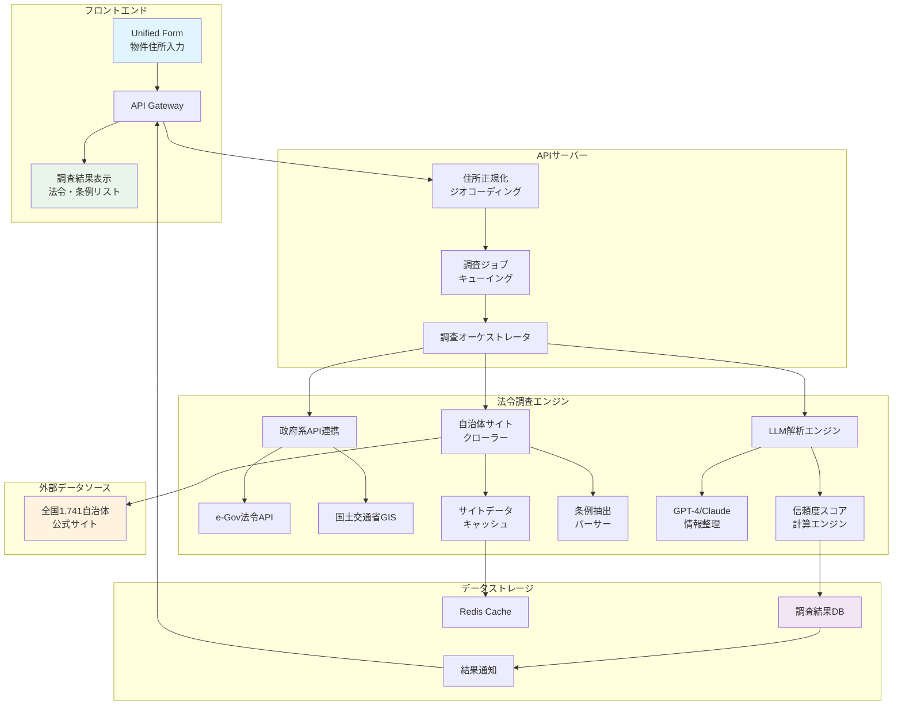
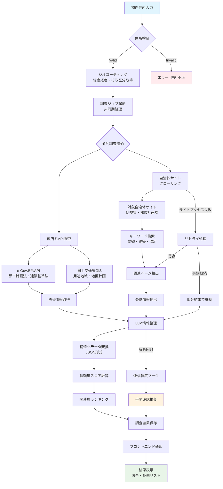
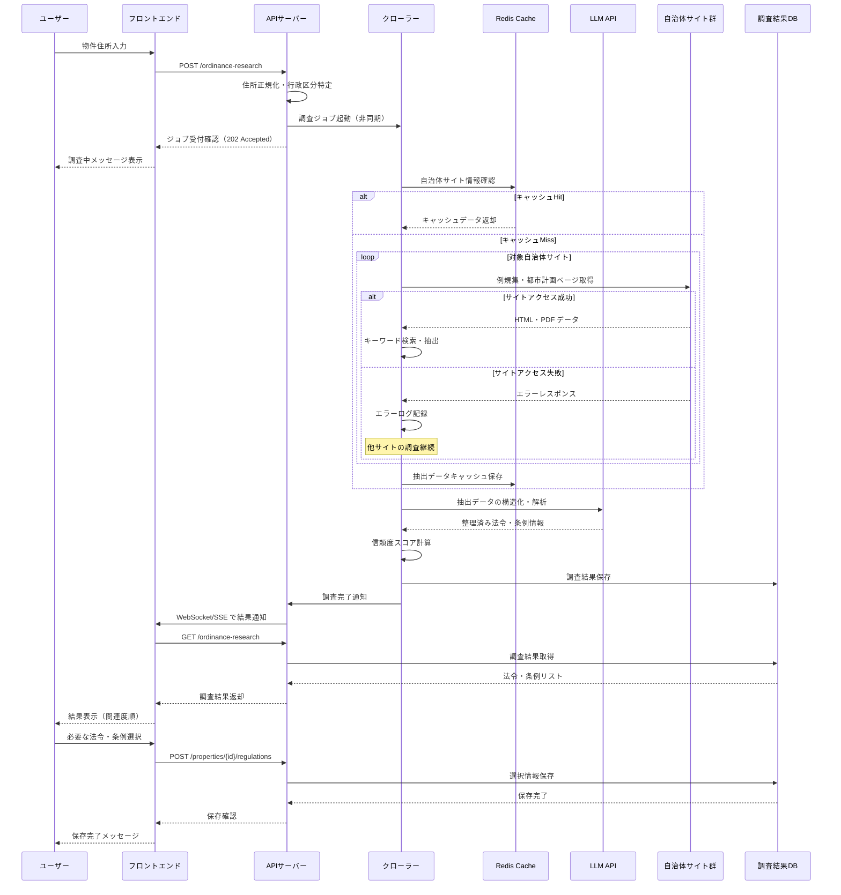

### **機能仕様書 v1.1**

**機能ID:** `OB-001`
**機能名:** `Ordinance Bot（法令・条例リサーチ）`

#### **1. 概要（Overview）**

物件の住所情報を基に、適用される可能性のある国の法令（都市計画法、建築基準法など）や、地方自治体ごとに定められた独自の条例（景観条例、建築協定、地区計画など）をAIが自動的に調査・抽出し、リストアップする機能。本機能は、重要事項説明書の作成にかかる調査時間を劇的に削減し、調査漏れのリスクを低減することを目的とする。

#### **2. ユーザーゴール（User Story）**

**`broker_agent`（仲介担当者）または `legal_staff`（法務・契約担当）として、** 私は **物件の住所を入力するだけで、適用される関連法規や条例を網羅的に把握したい。** それによって、**特に不慣れな地域の物件調査にかかる時間を90%以上削減し、正確な重要事項説明書を作成したい。**

#### **3. 受入基準（Acceptance Criteria）**

- `[ ]` ユーザーが`Unified Form`(UF-001)に物件住所を入力すると、本機能が自動的にバックグラウンドで実行される。
- `[ ]` 調査対象の管轄自治体（都道府県、市区町村）が住所から正しく特定される。
- `[ ]` 国の主要な不動産関連法令（都市計画法、建築基準法など）に関する情報がe-Gov法令API等から取得され、適用区分（例：市街化区域、第一種住居地域）が表示される。
- `[ ]` 管轄自治体のウェブサイトを対象に、関連条例（例：「景観条例」「建築協定」「まちづくり条例」等のキーワード）がクロールされ、該当する条例名と条文へのリンクがリストアップされる。
- `[ ]` **【調査結果の表示】** 調査結果は、以下の要素を含めてUIに表示される。
  - `[ ]` **関連度ランキング:** 関連性が高いと判断された条例や条文のリスト。
  - `[ ]` **サマリー:** AI（LLM）が生成した、調査対象物件への影響の要約。
  - `[ ]` **根拠条文:** サマリーの根拠となった条例の条文。**引用箇所は、条・項・号までを明記し、該当部分のテキストをハイライト表示する。**
  - `[ ]` **信頼度スコア:** 各情報の信頼度をパーセンテージで表示。
  - `[ ]` **情報ソース:** 参照した例規集やWebサイトへの外部リンク。
- `[ ]` **【信頼度スコアの算出】**
  - `[ ]` 信頼度スコアは、以下の要素を基に簡易的な計算式で算出する。
  - **スコア = (情報ソースの重み * 0.6) + (言及頻度の正規化スコア * 0.4)**
    - **情報ソースの重み:**
      - `1.0`: 自治体の公式例規集・GISデータ
      - `0.7`: 自治体の公式サイト（例規集以外）
      - `0.5`: その他の公的機関サイト
      - `0.2`: 上記以外のWebサイト
    - **言及頻度:** 調査キーワードが情報ソース内で出現する頻度。
- `[ ]` 調査結果は、案件詳細画面の専用セクションに表示され、ユーザーが確認・選択できる。
- `[ ]` ユーザーが選択した法令・条例の情報は、`契約書・重説の自動生成`(CTR-001)機能利用時に、重要事項説明書の該当項目へ自動的に反映される。
- `[ ]` **【性能】** 住所入力後、5分以内に調査結果の第一報が画面に表示される。

#### **4. UIデザインとUXフロー**

- **4.1. 画面デザイン:**
  - 案件詳細画面内に「法令・条例リサーチ結果」セクションを設ける。
  - **[Figmaモックアップへのリンク（※作成後、ここにURLを記載）]**
- **4.2. ユーザーフロー図:**
  1. ユーザーが`Unified Form`に住所を入力・保存する。
  2. バックグラウンドでOrdinance Botが起動し、調査を開始。UI上では「調査中...」と表示される。
  3. 調査が完了すると、結果がリスト形式で表示される。
  4. ユーザーはリストを確認し、重要事項説明書に含めるべき項目にチェックを入れる。
  5. 「保存」ボタンを押すと、選択内容が物件データとして保存される。

#### **5. システム要件（バックエンド）**

- **5.1. APIエンドポイント:**
  - `POST /api/v1/properties/{property_id}/ordinance-research` (調査ジョブの起動)
  - `GET /api/v1/properties/{property_id}/ordinance-research` (調査結果の取得)
- **5.2. データ処理フロー:**
  1. `Unified Form`からの住所更新をトリガーに、非同期で調査ジョブを開始する。
  2. **住所正規化:** 入力された住所をジオコーディングAPI等で正規化し、正確な緯度経度と行政区分コードを取得する。
  3. **法令データベース連携:** e-Gov法令APIや国土交通省のGISデータを参照し、都市計画区域などの基本情報を取得する。
  4. **自治体サイトクロール:**
     - 事前に定義された対象自治体リストに基づき、各自治体のウェブサイト（例規集、都市計画課ページなど）をクローリングする。
     - 「景観」「建築」「協定」などのキーワードでページを検索し、関連情報を抽出する。
  5. **LLMによる情報整理:** 抽出したテキスト情報を大規模言語モデル（LLM）に入力し、条例名、概要、関連部署などを構造化データ（JSON）として整形・要約する。同時に、情報の信頼度を判定させる。
  6. 調査結果をデータベースに保存し、フロントエンドに通知する。
- **5.3. クローリング戦略:**
  - 各自治体サイトへの過度な負荷を避けるため、一度取得した情報は一定期間キャッシュする。
  - クローラの巡回スケジュールは夜間バッチ等で実行し、ユーザーアクションへの即時応答性を確保する。

#### **6. エラーハンドリング**

| エラーケース | ユーザーへの表示（フロントエンド） | システムの挙動（バックエンド） |
| :--- | :--- | :--- |
| **住所情報が不完全・不正** | 「住所情報が不正確なため、調査を開始できません。正確な住所を入力してください。」 | ジオコーディングに失敗した場合、ジョブを開始せず、APIはステータスコード422を返す。 |
| **自治体サイトへのアクセス失敗** | 「[自治体名]のサイトに一時的にアクセスできませんでした。一部の情報が不足している可能性があります。」 | エラーをログに記録し、取得できた情報のみで結果を返す。失敗したサイトへは時間をおいてリトライする。 |
| **情報抽出が著しく困難な場合** | 「AIによる自動調査が困難でした。お手数ですが、[自治体名]のウェブサイトを直接ご確認ください。[リンク]」 | LLMが著しく低い信頼度スコアを返した場合、自動調査の限界をユーザーに明示し、手動確認を促す。 | 

#### **7. 技術スタック**

- **データ収集:** Python (Scrapy, Beautiful Soup)

#### **7.1. システム構成図**

##### **7.1.1. 法令調査システム構成図**

##### **7.1.2. 調査・監視・通知フローチャート**

##### **7.1.3. 自治体サイト連携シーケンス図**

---

#### **8. RC版（Release Candidate）要件**

**目標**: 網羅的・高精度な法令調査システムの商用化対応

##### **8.1. 調査精度・網羅性向上**
- `[ ]` **調査精度向上**: 主要法令・条例の検知率95%以上（専門家検証）
- `[ ]` **信頼度算出改善**: より精密な信頼度スコア算出アルゴリズム実装
- `[ ]` **対象自治体拡張**: 全国1,741自治体の90%以上をカバー
- `[ ]` **法令データベース強化**: e-Gov API以外の複数ソース統合

##### **8.2. パフォーマンス・リアルタイム性**
- `[ ]` **調査時間短縮**: 調査完了まで2分以内（99パーセンタイル）
- `[ ]` **並行処理拡張**: 100件以上の同時調査ジョブ処理対応
- `[ ]` **キャッシュシステム**: 地域別法令データの効率的キャッシュ管理
- `[ ]` **リアルタイム更新**: 法令改正時の即座データ更新機構

##### **8.3. AI・機械学習強化**
- `[ ]` **法令解釈AI**: 条文の物件への具体的影響度AIアセスメント
- `[ ]` **自然言語処理向上**: 法務専門用語の高精度解析エンジン
- `[ ]` **パターン学習**: 類似物件での法令適用パターン学習・活用
- `[ ]` **専門家連携**: 司法書士・行政書士による品質監修システム

##### **8.4. セキュリティ・監査対応**
- `[ ]` **調査ログ完全記録**: 全法令調査プロセスの監査ログ保持
- `[ ]` **データソース検証**: 参照情報源の信頼性検証・定期監査
- `[ ]` **アクセス制御強化**: 機微な法令情報へのアクセス権限管理
- `[ ]` **情報更新通知**: 関連法令改正時の自動アラート・影響分析

##### **8.5. 運用・保守性向上**
- `[ ]` **自治体サイト監視**: サイト構造変更の自動検知・アダプタ調整
- `[ ]` **クローリング最適化**: 各自治体への負荷分散・適切なアクセス間隔
- `[ ]` **エラー自動復旧**: 一時的アクセス障害からの自動リトライ機構
- `[ ]` **運用ダッシュボード**: 調査成功率・エラー率のリアルタイム監視

##### **8.6. 成功基準**
- **調査精度**: 主要法令95%以上の検知率
- **応答時間**: 95パーセンタイルで2分以内
- **稼働率**: 99.7%以上（外部サイト依存含む）
- **専門家評価**: 法務専門家による適切性評価85%以上