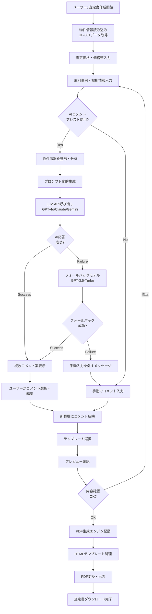
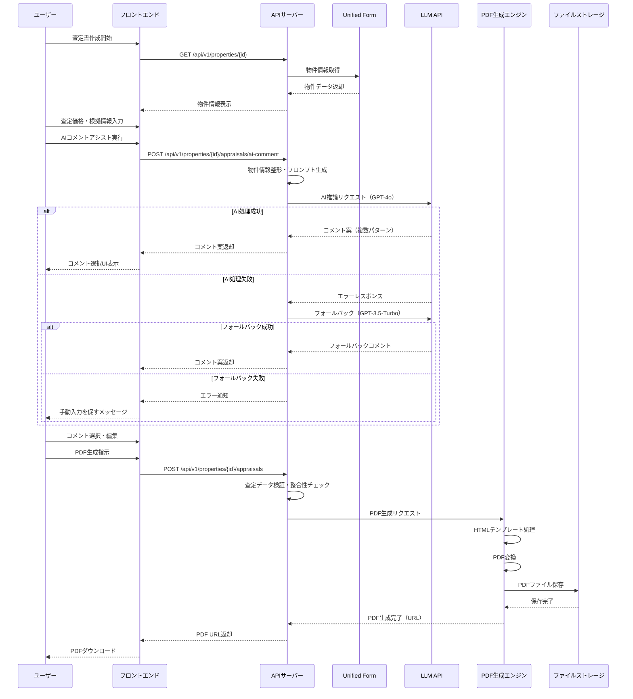
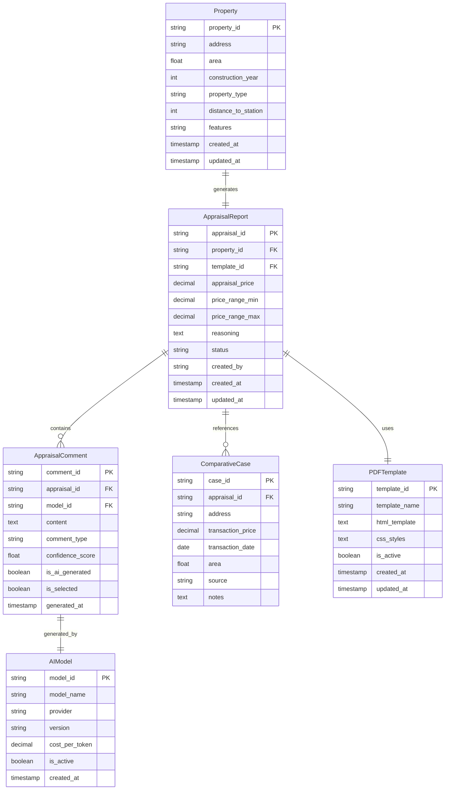

### **機能仕様書 v1.2**

**機能ID:** `REP-002`
**機能名:** `査定書の生成`

| Ver | 日付 | 作成 / 変更者 | 変更概要 |
|-----|------|---------------|----------|
| 1.0 | 2025-06-30 | システム管理者 | 初版作成 |
| 1.1 | 2025-06-30 | システム管理者 | AIコメントアシスト機能追加 |
| 1.2 | 2025-06-30 | システム管理者 | バージョン管理追加、AI推論コスト最新化 |

#### **1. 概要（Overview）**

`Unified Form`(UF-001)に入力された物件情報や、ユーザーが入力した周辺相場情報などを基に、不動産の売却価格を提案するための査定書をPDF形式で生成する機能。特に、AIが物件の特徴を分析し、査定の根拠となる所見コメントを自動で提案する「AIコメントアシスト」機能を搭載し、説得力のある資料作成を支援する。

#### **2. ユーザーゴール（User Story）**

**`broker_agent`（仲介担当者）として、** 私は **物件情報や査定価格を入力するだけで、プロフェッショナルな見た目の査定書を簡単に作成したい。** それによって、**査定価格の根拠を分かりやすく提示し、売主様からの信頼を獲得したい。**

#### **3. 受入基準（Acceptance Criteria）**

- `[ ]` `Unified Form`の物件情報（住所、面積、築年数など）が、査定書の該当項目に自動で反映される。
- `[ ]` ユーザーは、査定価格（例：「3,500万円」）と、その価格帯（例：「3,400万円〜3,600万円」）を入力できる。
- `[ ]` ユーザーは、査定の根拠となる近隣の取引事例や公示地価などを手動で入力できる。
- `[ ]` **【AIコメントアシスト】** 入力された物件情報を基に、AIが「強み」「弱み」を分析し、査定書の所見欄に記載するコメント案を複数パターン生成・提示する。
  - 例：「駅徒歩5分という好立地は、大きなセールスポイントです。」
  - 例：「築年数は経過していますが、リフォーム履歴があるため室内は綺麗です。」
- `[ ]` ユーザーは、AIが提案したコメントを選択、または自由に編集して査定書に反映できる。
- `[ ]` `REP-001`と同様に、複数のデザインテンプレートから査定書のフォーマットを選択できる。
- `[ ]` 仕上がりイメージを画面上でプレビューでき、高品質なPDFとして出力できる。

#### **4. UIデザインとUXフロー**

- **4.1. 画面デザイン:**
  - `REP-001`の物件概要書エディタと類似した、左側にコントロールパネル、右側にプレビューを配置した構成。
  - コントロールパネル内に「AIコメントアシスト」ボタンを配置。クリックすると、モーダルウィンドウで複数のコメント案が表示される。
  - **[Figmaモックアップへのリンク（※作成後、ここにURLを記載）]**
- **4.2. ユーザーフロー図:**
  1. 案件詳細画面にて、「査定書を作成」ボタンをクリック。
  2. 査定書作成画面に遷移し、テンプレートを選択。
  3. 査定価格や取引事例など、必要な情報を入力する。
  4. 「AIにコメント案を作成させる」ボタンをクリック。
  5. 表示されたコメント案から好みのものを選択し、所見欄に反映させる。
  6. プレビューで全体を確認し、「PDFを生成」ボタンでファイルを出力する。

#### **5. システム要件（バックエンド）**

- **5.1. APIエンドポイント:**
  - `POST /api/v1/properties/{property_id}/appraisals` (査定書PDFの生成)
  - `POST /api/v1/properties/{property_id}/appraisals/ai-comment` (AIコメントの生成)
- **5.2. AIコメント生成ロジック:**
  - `ai-comment` APIがコールされると、バックエンドは物件情報（所在地、駅距離、面積、築年数、部屋タイプなど）を整形する。
  - 整形したデータを基に、プロンプトを動的に生成する。（例：「以下の物件情報の長所と短所を基に、不動産査定書の所見コメントを3パターン作成してください。{物件情報}」）
  - 大規模言語モデル（LLM）のAPIにプロンプトを送信し、返ってきたコメント案をフロントエンドに返す。
  - `[x]` **コスト制御:**
    - **リクエスト上限:** 本APIの呼び出しは、**1物件につき1日3回まで**に制限する。
    - **トークン量制限:** LLMへの入力（プロンプト）と出力（生成コメント）の合計トークン数に上限（例: **4096トークン**）を設け、意図しない大量消費を防ぐ。
- **5.3. PDF生成エンジン:**
  - `REP-001`と共通のPDF生成モジュールを利用する。HTMLテンプレートとデータを組み合わせ、PDFに変換する。
- **5.4. 将来的な拡張:**
  - 将来的には、外部の不動産価格データベースと連携し、近隣の取引事例や想定成約価格を自動で取得・表示する機能の追加を検討する。

#### **5.5. システム構成図**

##### **5.5.1. AI査定処理フローチャート**

##### **5.5.2. 査定システム・外部API連携シーケンス図**

##### **5.5.3. 査定データ構造図**

#### **6. エラーハンドリング**

| エラーケース | ユーザーへの表示（フロントエンド） | システムの挙動（バックエンド） |
| :--- | :--- | :--- |
| **査定価格が未入力** | 「査定価格が入力されていません。PDFを生成するには価格の入力が必要です。」 | フロントエンドでバリデーションを行い、PDF生成ボタンを非活性化する。 |
| **AIコメント生成の失敗** | 「AIコメントの生成に失敗しました。サーバーが混み合っている可能性があります。」 | LLMのAPIエラーを検知し、まずはより安価で高速なフォールバックモデル（例: GPT-3.5-Turbo）でリトライを実行する。 フォールバックにも失敗した場合、エラーステータス（503など）を返し、ユーザーには手動での入力を促す。 |
| **PDF生成エンジンのエラー** | 「PDFの生成中にエラーが発生しました。時間をおいて再度お試しください。」 | エラーをログに記録し、APIはエラーステータス（500）を返す。 |

#### **7. ガイドラインとデータ管理**

- `[ ]` **【AI生成コンテンツの明示】**
  - AIコメントアシスト機能を利用して査定書にコメントを挿入した場合、そのコメントの末尾には**「※このコメントはAIによって自動生成された参考情報です。」**という注釈を、識別可能なフォントスタイル（例: 斜体、グレー文字）で自動的に付与する。
  - これにより、情報の出自を明確にし、透明性を確保する。
- `[ ]` **【ログ管理と個人情報保護】**
  - AI（LLM）とのAPI連携におけるリクエスト（プロンプト）とレスポンスは、サービス改善および不正利用監視の目的でログとして記録する。
  - ログに含まれる物件住所や個人名などの個人情報（PII）は、**マスキング処理を施した上で保存**する。
  - ログの保持期間は**90日間**とし、期間を過ぎたデータは自動的に削除される。
- `[ ]` **【コスト制御】** AIによるコメント生成機能は、以下の利用制限を設ける。
  - `[ ]` **回数制限:** 1ユーザーあたり、**月間100回**まで利用可能。
  - `[ ]` **トークン量:** 1回の生成で消費するトークン（入力＋出力）の上限を**2000トークン**に制限する。
  - `[ ]` **コスト試算（2025年6月時点）:**
    - 使用予定モデル: GPT-4o（$5.00/1M input tokens、$15.00/1M output tokens）
    - 想定消費量: 入力500トークン + 出力500トークン = 1000トークン/回
    - 1回あたりコスト: (500×$5.00 + 500×$15.00)/1M = $0.01 = 約1.5円
    - 月間上限コスト/ユーザー: 100回 × 1.5円 = 150円
    - フォールバック用GPT-3.5-Turbo: $0.50/1M tokens（入力・出力同額）で更にコスト削減可能
- `[ ]` 全ての必須項目が入力されるまで、PDF生成ボタンは非活性状態である。
- `[ ]` 「PDF生成」ボタンをクリック後、15秒以内に査定書PDFがダウンロードされる。

#### **8. RC版（Release Candidate）要件**

**目標**: AIアシスト機能を活用した高精度・高品質査定書システム

##### **8.1. AI精度・品質向上**
- `[ ]` **コメント品質向上**: AIコメントの適切性評価90%以上（専門家レビュー）
- `[ ]` **マルチモデル対応**: GPT-4o、Claude、Gemini等の複数LLMでのA/Bテスト
- `[ ]` **専門知識強化**: 不動産業界特化のプロンプトエンジニアリング最適化
- `[ ]` **学習データ拡充**: ユーザーフィードバックによる継続的品質改善

##### **8.2. パフォーマンス・スケーラビリティ**  
- `[ ]` **AI応答時間短縮**: コメント生成10秒以内（95パーセンタイル）
- `[ ]` **同時処理拡張**: 50件以上の同時AI処理対応
- `[ ]` **キャッシュ最適化**: 類似物件パターンでのコメント再利用機構
- `[ ]` **PDF生成最適化**: 査定書PDF生成8秒以内（複雑レイアウト含む）

##### **8.3. セキュリティ・コンプライアンス**
- `[ ]` **AI生成判別**: 機械学習による人工知識と専門知識の明確な区別表示
- `[ ]` **個人情報保護**: AI処理ログの完全マスキング・E2E暗号化
- `[ ]` **査定根拠監査**: 査定価格算出プロセスの完全トレーサビリティ
- `[ ]` **専門家監修**: 不動産鑑定士による定期的なAIコメント品質監査

##### **8.4. 機能拡張・連携強化**
- `[ ]` **外部データ連携**: 不動産価格データベース（REINS等）からの自動相場取得
- `[ ]` **市場分析強化**: 地域特性・市場トレンドを反映したAI分析機能
- `[ ]` **査定履歴分析**: 過去査定データの傾向分析・精度改善フィードバック
- `[ ]` **カスタムテンプレート**: 企業固有の査定書フォーマット対応

##### **8.5. 成功基準**
- **AI品質**: 専門家評価90%以上の適切性
- **応答時間**: AI生成10秒以内、PDF生成8秒以内
- **精度向上**: 査定価格と成約価格の乖離率15%以内
- **ユーザー満足度**: 4.5/5.0以上（AI機能特化評価） 