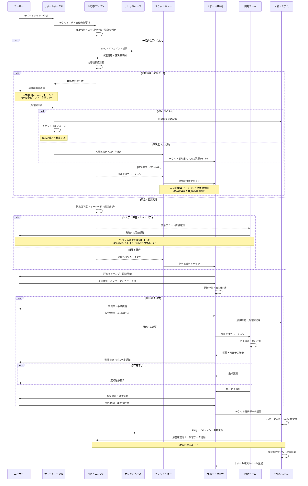

# 機能仕様書 SUP-001: サポート・問い合わせ管理機能

## バージョン管理

| Ver | 日付 | 作成 / 変更者 | 変更概要 |
|-----|------|---------------|----------|
| 1.0 | 2025-06-30 | システム設計チーム | 初版作成 |

## 1. 機能概要

### 1.1 機能の目的
ユーザーからの問い合わせを受付・管理し、効率的なサポート業務を実現する機能。α版でのUXレビューユーザーをサポートし、システム改善のフィードバックを収集する。

### 1.2 対象ユーザー
- **一般ユーザー**: 問い合わせ投稿・回答確認・FAQ閲覧
- **サポート担当**: チケット対応・FAQ管理・回答作成
- **システム管理者**: サポート統計・パフォーマンス監視
- **開発チーム**: α版フィードバック分析・改善検討

### 1.3 主要機能
- 問い合わせフォーム・チケット管理
- FAQ・ヘルプドキュメント
- チケット対応ワークフロー
- ユーザーフィードバック収集（α版重要）
- サポート統計・分析

## 2. 機能要件

### 2.1 問い合わせ受付（α版重要機能）

#### 2.1.1 問い合わせフォーム
**フォーム設計**:
```yaml
α版特別フォーム項目:
  基本情報:
    - 件名: 1-100文字、必須
    - カテゴリ: 選択式（バグ報告/機能要望/使用方法/その他）
    - 緊急度: 選択式（低/中/高）
    - 所属テナント: 自動取得（ログイン情報から）
  
  詳細情報:
    - 問題の詳細: 2000文字以内、必須
    - 再現手順: 1000文字以内、バグ報告時必須
    - 期待する動作: 500文字以内、任意
    - 実際の動作: 500文字以内、バグ報告時推奨
  
  添付情報:
    - スクリーンショット: 最大5枚、各5MB以内
    - ログファイル: テキスト/JSON、最大10MB
    - ブラウザ情報: 自動取得（User-Agent）
    - 操作環境: OS/ブラウザ/画面解像度

UXレビュー専用項目:
  - 使いやすさ評価: 1-5点評価
  - 機能への満足度: 1-5点評価
  - 改善提案: 自由記述、1000文字以内
  - 他社ツールとの比較: 任意記述
```

#### 2.1.2 自動分類・優先度設定
**自動処理**:
```yaml
チケット分類:
  バグ報告:
    - キーワード検知（エラー、動かない、表示されない等）
    - 優先度自動設定（高：システム停止、中：機能不具合、低：表示崩れ）
    - 開発チーム自動アサイン
  
  機能要望:
    - 新機能要求の識別
    - 優先度設定（中：既存機能改善、低：新規機能）
    - プロダクトチーム自動アサイン
  
  操作方法:
    - FAQ該当項目の自動提案
    - 優先度設定（低：一般的質問）
    - サポートチーム自動アサイン

α版特別処理:
  UXフィードバック:
    - 優先度自動設定（高：UI/UX改善）
    - デザインチーム自動通知
    - フィードバック統計への自動集計
```

### 2.2 チケット管理システム

#### 2.2.1 チケットライフサイクル
**状態遷移**:
```yaml
チケット状態:
  OPEN: 新規受付状態
    → 自動確認メール送信
    → 担当者アサイン
    → IN_PROGRESS への遷移
  
  IN_PROGRESS: 対応中
    → 調査・検証・回答作成
    → ユーザーへの進捗連絡
    → PENDING_USER または RESOLVED への遷移
  
  PENDING_USER: ユーザー回答待ち
    → 追加情報要求後の状態
    → ユーザー応答で IN_PROGRESS へ戻る
    → 7日間未応答で AUTO_CLOSED
  
  RESOLVED: 解決済み
    → 回答完了状態
    → ユーザー満足度調査送信
    → 24時間後に CLOSED
  
  CLOSED: 完了
    → 最終状態
    → 統計・分析対象
    → 再オープン可能（30日間）

α版特別ルール:
  - 全チケット高優先度で対応
  - 24時間以内初回応答SLA
  - フィードバックは即座にプロダクトチーム共有
```

#### 2.2.2 担当者アサイン
**自動アサイン**:
```yaml
チーム別アサイン:
  サポートチーム:
    - 一般操作方法
    - アカウント関連
    - 基本的な機能説明
  
  開発チーム:
    - バグ報告
    - 技術的問題
    - API関連問い合わせ
  
  プロダクトチーム:
    - 機能要望
    - UXフィードバック
    - ビジネス要件相談
  
  システム管理:
    - アカウント作成・削除
    - 権限関連
    - データ移行関連

負荷分散:
  - チーム内での作業量均等分散
  - 専門性による優先アサイン
  - 緊急度による即座対応体制
```

### 2.3 FAQ・ヘルプシステム

#### 2.3.1 FAQ管理
**FAQ構成**:
```yaml
α版重要FAQ:
  システム利用開始:
    - アカウント作成方法
    - 初期設定手順
    - 基本操作ガイド
    - ユーザー招待方法
  
  主要機能:
    - 物件登録・編集
    - 概要書生成
    - AI査定機能
    - データ移行方法
  
  制限・プラン:
    - Freeプラン制限内容
    - 使用量確認方法
    - β版プラン情報
    - アップグレード予約
  
  トラブルシューティング:
    - ログインできない
    - ファイルアップロードエラー
    - 表示が崩れる
    - 動作が重い

FAQ自動提案:
  - 問い合わせ内容からのキーワード抽出
  - 関連FAQ自動表示
  - 解決率の測定・改善
```

#### 2.3.2 ヘルプドキュメント
**ドキュメント体系**:
```yaml
ユーザーガイド:
  - 概要・特徴
  - クイックスタートガイド
  - 機能別詳細ガイド
  - ベストプラクティス
  
API ドキュメント:
  - 認証方法
  - エンドポイント一覧
  - サンプルコード
  - エラーコード説明

α版専用ガイド:
  - α版の目的・制限事項
  - フィードバック方法
  - 既知の問題・制限
  - β版への移行計画
```

### 2.4 フィードバック収集（α版重要機能）

#### 2.4.1 システム満足度調査
**調査項目**:
```yaml
基本満足度:
  全体満足度: 1-5点評価
  - 非常に満足（5）
  - 満足（4）
  - 普通（3）
  - 不満（2）
  - 非常に不満（1）

機能別評価:
  物件管理: 1-5点評価
  概要書生成: 1-5点評価
  AI査定: 1-5点評価
  データ移行: 1-5点評価
  UI/UX全般: 1-5点評価

改善要望:
  - 最も改善してほしい機能
  - 追加してほしい機能
  - 使いにくい箇所の詳細
  - 競合他社との比較意見
```

#### 2.4.2 フィードバック分析
**分析指標**:
```yaml
定量分析:
  - 満足度平均点
  - 機能別満足度ランキング
  - 改善要望頻度分析
  - チケット解決時間

定性分析:
  - フリーコメント内容分析
  - 改善提案の分類・優先度付け
  - 競合比較での強み・弱み
  - ユーザー行動パターン分析

レポート生成:
  - 週次フィードバックサマリー
  - 月次改善優先度リスト
  - β版機能要求一覧
  - ユーザー満足度トレンド
```

#### **2.5. システム構成図**

##### **2.5.1. サポートチケット管理フローチャート**

```mermaid
flowchart TD
    START[ユーザー: 問い合わせ開始] --> CONTACT_TYPE{問い合わせ<br/>方法選択}
    
    CONTACT_TYPE -->|ヘルプセンター| HELP_CENTER[ヘルプセンター<br/>FAQ検索]
    CONTACT_TYPE -->|チケット作成| TICKET_FORM[サポートチケット<br/>作成フォーム]
    CONTACT_TYPE -->|メール| EMAIL_CONTACT[メール送信<br/>自動チケット変換]
    
    HELP_CENTER --> FAQ_SEARCH[FAQ検索<br/>キーワードマッチ]
    FAQ_SEARCH --> FAQ_FOUND{FAQ<br/>見つかった?}
    FAQ_FOUND -->|Yes| FAQ_HELPFUL{役に立った?}
    FAQ_FOUND -->|No| TICKET_FORM
    FAQ_HELPFUL -->|Yes| SELF_RESOLVE[自己解決<br/>満足度記録]
    FAQ_HELPFUL -->|No| TICKET_FORM
    
    TICKET_FORM --> FORM_FILL[フォーム入力<br/>詳細情報記入]
    EMAIL_CONTACT --> EMAIL_PARSE[メール解析<br/>構造化データ抽出]
    
    FORM_FILL --> AUTO_CLASSIFY[自動分類<br/>AI カテゴリ判定]
    EMAIL_PARSE --> AUTO_CLASSIFY
    
    AUTO_CLASSIFY --> PRIORITY_SET{優先度<br/>自動判定}
    PRIORITY_SET -->|緊急| URGENT_ALERT[緊急アラート<br/>即座エスカレーション]
    PRIORITY_SET -->|高| HIGH_PRIORITY[高優先度<br/>2時間以内対応]
    PRIORITY_SET -->|中| MEDIUM_PRIORITY[中優先度<br/>8時間以内対応]
    PRIORITY_SET -->|低| LOW_PRIORITY[低優先度<br/>24時間以内対応]
    
    URGENT_ALERT --> SPECIALIST_ASSIGN[専門家直接アサイン<br/>開発・運用チーム]
    HIGH_PRIORITY --> TEAM_ASSIGN[チームアサイン<br/>経験者優先]
    MEDIUM_PRIORITY --> QUEUE_ASSIGN[キュー割り当て<br/>負荷分散]
    LOW_PRIORITY --> AI_AUTO_RESPONSE[AI自動応答<br/>第一応答]
    
    AI_AUTO_RESPONSE --> AI_CONFIDENCE{AI応答<br/>信頼度}
    AI_CONFIDENCE -->|高信頼度| AUTO_RESOLVE[自動解決提案<br/>ユーザー確認]
    AI_CONFIDENCE -->|低信頼度| HUMAN_HANDOFF[人間担当者<br/>引き継ぎ]
    
    AUTO_RESOLVE --> USER_SATISFACTION{ユーザー<br/>満足?}
    USER_SATISFACTION -->|満足| TICKET_CLOSE[チケットクローズ<br/>満足度記録]
    USER_SATISFACTION -->|不満足| HUMAN_HANDOFF
    
    SPECIALIST_ASSIGN --> INVESTIGATION[詳細調査<br/>問題分析]
    TEAM_ASSIGN --> INVESTIGATION
    HUMAN_HANDOFF --> INVESTIGATION
    
    INVESTIGATION --> SOLUTION_TYPE{解決方法<br/>判定}
    SOLUTION_TYPE -->|即座解決| IMMEDIATE_FIX[即座修正<br/>回答提供]
    SOLUTION_TYPE -->|開発必要| DEV_ESCALATION[開発チーム<br/>エスカレーション]
    SOLUTION_TYPE -->|外部依存| EXTERNAL_SUPPORT[外部サポート<br/>協力会社連携]
    
    IMMEDIATE_FIX --> RESPONSE_SEND[回答送信<br/>解決策提供]
    DEV_ESCALATION --> BUG_TRACKING[バグトラッキング<br/>開発チケット作成]
    EXTERNAL_SUPPORT --> VENDOR_CONTACT[ベンダー連絡<br/>進捗追跡]
    
    BUG_TRACKING --> DEV_PROGRESS[開発進捗<br/>定期アップデート]
    VENDOR_CONTACT --> EXT_PROGRESS[外部進捗<br/>ユーザー報告]
    
    RESPONSE_SEND --> USER_FEEDBACK{ユーザー<br/>フィードバック}
    DEV_PROGRESS --> USER_FEEDBACK
    EXT_PROGRESS --> USER_FEEDBACK
    
    USER_FEEDBACK -->|解決| TICKET_CLOSE
    USER_FEEDBACK -->|追加質問| FOLLOWUP[追加対応<br/>継続サポート]
    FOLLOWUP --> INVESTIGATION
    
    TICKET_CLOSE --> ANALYSIS[チケット分析<br/>カテゴリ・時間記録]
    SELF_RESOLVE --> ANALYSIS
    
    ANALYSIS --> IMPROVEMENT[サービス改善<br/>FAQ更新・プロセス最適化]
    IMPROVEMENT --> END[サポート完了]
    
    style START fill:#e1f5fe
    style END fill:#e8f5e8
    style URGENT_ALERT fill:#ffebee
    style AI_AUTO_RESPONSE fill:#fff3e0
    style TICKET_CLOSE fill:#e8f5e8
    style DEV_ESCALATION fill:#f3e5f5
    style SELF_RESOLVE fill:#e8f5e8
```



##### **2.5.2. AI自動応答・エスカレーションシーケンス図**



##### **2.5.3. 問い合わせ分類・処理システム構成図**

```mermaid
graph TB
    subgraph "ユーザー接点"
        USER[ユーザー]
        HELP_UI[ヘルプセンター<br/>FAQ・ガイド]
        TICKET_UI[チケット作成<br/>問い合わせフォーム]
        EMAIL[メール問い合わせ<br/>support@]
    end
    
    subgraph "AI・自動化層"
        NLP[自然言語処理<br/>文意理解・分類]
        CLASSIFY[自動分類<br/>カテゴリ・優先度判定]
        AUTO_RESP[AI自動応答<br/>FAQ マッチング]
        SENTIMENT[感情分析<br/>緊急度・満足度判定]
    end
    
    subgraph "ナレッジ・検索"
        FAQ_DB[FAQデータベース<br/>質問・回答管理]
        DOC_DB[ドキュメントDB<br/>ガイド・マニュアル]
        SEARCH[検索エンジン<br/>Elasticsearch]
        SUGGEST[関連記事提案<br/>レコメンデーション]
    end
    
    subgraph "チケット管理"
        TICKET_MGR[チケット管理<br/>ライフサイクル制御]
        QUEUE[チケットキュー<br/>優先度・負荷分散]
        ASSIGN[自動アサイン<br/>スキル・負荷ベース]
        SLA[SLA監視<br/>応答時間・解決時間]
    end
    
    subgraph "サポートチーム"
        L1[Tier1サポート<br/>一般問い合わせ]
        L2[Tier2サポート<br/>技術的問題]
        L3[Tier3サポート<br/>開発・専門家]
        SPECIALIST[専門家<br/>法令・業務専門]
    end
    
    subgraph "統合・連携"
        BUG_TRACK[バグトラッキング<br/>Jira・GitHub Issues]
        CRM[顧客管理<br/>ユーザー情報・履歴]
        ANALYTICS[分析システム<br/>満足度・パフォーマンス]
        NOTIFICATION[通知システム<br/>メール・Slack・Teams]
    end
    
    subgraph "データ・レポート"
        TICKET_DB[チケットDB<br/>履歴・ステータス]
        METRICS_DB[メトリクスDB<br/>KPI・満足度]
        FEEDBACK_DB[フィードバックDB<br/>改善提案・評価]
        REPORT[レポート生成<br/>週次・月次分析]
    end
    
    USER --> HELP_UI
    USER --> TICKET_UI
    USER --> EMAIL
    
    HELP_UI --> SEARCH
    TICKET_UI --> NLP
    EMAIL --> NLP
    
    NLP --> CLASSIFY
    NLP --> SENTIMENT
    CLASSIFY --> AUTO_RESP
    SENTIMENT --> QUEUE
    
    AUTO_RESP --> FAQ_DB
    AUTO_RESP --> DOC_DB
    SEARCH --> FAQ_DB
    SEARCH --> DOC_DB
    FAQ_DB --> SUGGEST
    
    CLASSIFY --> TICKET_MGR
    TICKET_MGR --> QUEUE
    QUEUE --> ASSIGN
    ASSIGN --> SLA
    
    ASSIGN --> L1
    ASSIGN --> L2
    ASSIGN --> L3
    ASSIGN --> SPECIALIST
    
    L1 --> CRM
    L2 --> BUG_TRACK
    L3 --> BUG_TRACK
    SPECIALIST --> CRM
    
    TICKET_MGR --> TICKET_DB
    SLA --> METRICS_DB
    AUTO_RESP --> ANALYTICS
    L1 --> NOTIFICATION
    L2 --> NOTIFICATION
    
    ANALYTICS --> FEEDBACK_DB
    ANALYTICS --> REPORT
    NOTIFICATION --> USER
    
    style USER fill:#e1f5fe
    style AUTO_RESP fill:#fff3e0
    style L1 fill:#e8f5e8
    style ANALYTICS fill:#f3e5f5
    style SLA fill:#ffebee
```

## 3. API仕様

### 3.1 チケット管理API

#### 3.1.1 チケット作成
```http
POST /api/v1/support/tickets
Authorization: Bearer {user_token}
Content-Type: multipart/form-data

{
  "subject": "物件一覧画面でエラーが発生します",
  "category": "bug_report",
  "priority": "medium",
  "description": "物件一覧ページにアクセスすると、500エラーが表示され画面が真っ白になります。",
  "steps_to_reproduce": "1. ログイン後、物件一覧をクリック\n2. エラー画面が表示される",
  "expected_behavior": "物件一覧が表示される",
  "actual_behavior": "500エラーが表示される",
  "browser_info": "Chrome 91.0.4472.124",
  "ux_rating": 2,
  "satisfaction_rating": 2,
  "improvement_suggestion": "エラー発生時にもう少し分かりやすいメッセージを表示してほしい"
}

Response 201:
{
  "ticket": {
    "id": "TKT-20250630-001",
    "subject": "物件一覧画面でエラーが発生します",
    "status": "open",
    "priority": "medium",
    "category": "bug_report",
    "created_at": "2025-06-30T10:30:00Z",
    "estimated_response_time": "2025-06-30T18:30:00Z"
  },
  "auto_suggestions": [
    {
      "type": "faq",
      "title": "画面にエラーが表示される場合",
      "url": "/faq/error-handling"
    }
  ],
  "confirmation": {
    "message": "お問い合わせを受付いたしました。24時間以内にご回答いたします。",
    "ticket_url": "/support/tickets/TKT-20250630-001"
  }
}
```

#### 3.1.2 チケット一覧取得
```http
GET /api/v1/support/tickets?status=open&page=1&limit=20
Authorization: Bearer {user_token}

Response 200:
{
  "tickets": [
    {
      "id": "TKT-20250630-001",
      "subject": "物件一覧画面でエラーが発生します",
      "status": "in_progress",
      "priority": "medium",
      "category": "bug_report",
      "created_at": "2025-06-30T10:30:00Z",
      "updated_at": "2025-06-30T11:00:00Z",
      "assigned_to": "サポートチーム",
      "last_response": "調査中です。詳細な情報をお送りください。"
    }
  ],
  "pagination": {
    "page": 1,
    "limit": 20,
    "total": 1,
    "total_pages": 1
  }
}
```

### 3.2 FAQ API

#### 3.2.1 FAQ検索
```http
GET /api/v1/support/faq/search?query=ログイン&category=account
Authorization: Bearer {user_token}

Response 200:
{
  "results": [
    {
      "id": "faq_001",
      "title": "ログインができない場合の対処方法",
      "category": "account",
      "content": "パスワードをお忘れの場合は...",
      "tags": ["ログイン", "パスワード", "認証"],
      "relevance_score": 0.95,
      "view_count": 1250,
      "helpful_count": 890
    }
  ],
  "total": 1,
  "suggested_actions": [
    {
      "type": "contact_support",
      "message": "解決しない場合はお問い合わせください",
      "url": "/support/contact"
    }
  ]
}
```

### 3.3 フィードバック収集API

#### 3.3.1 満足度調査回答
```http
POST /api/v1/support/feedback/satisfaction
Authorization: Bearer {user_token}
Content-Type: application/json

{
  "overall_satisfaction": 4,
  "feature_ratings": {
    "property_management": 4,
    "document_generation": 5,
    "ai_appraisal": 3,
    "data_migration": 4,
    "ui_ux": 3
  },
  "most_needed_improvement": "ai_appraisal",
  "requested_features": ["レインズ連携", "詳細検索機能"],
  "difficult_areas": "AI査定の結果が分かりにくい",
  "competitor_comparison": "他社ツールより使いやすいが、機能が少ない",
  "additional_comments": "全体的に満足していますが、AI査定の精度向上を期待します"
}

Response 200:
{
  "feedback_id": "FB-20250630-001",
  "status": "recorded",
  "message": "フィードバックをありがとうございます",
  "follow_up": {
    "scheduled": true,
    "date": "2025-07-30T00:00:00Z",
    "message": "1ヶ月後に改善状況をお聞きします"
  }
}
```

## 4. データベース設計

### 4.1 サポート関連テーブル
```sql
-- チケット管理テーブル
CREATE TABLE support.tickets (
    id VARCHAR(20) PRIMARY KEY, -- TKT-YYYYMMDD-XXX
    tenant_id UUID REFERENCES tenants(id) NOT NULL,
    user_id UUID REFERENCES users(id) NOT NULL,
    
    -- 基本情報
    subject VARCHAR(200) NOT NULL,
    category ticket_category NOT NULL,
    priority ticket_priority DEFAULT 'medium',
    status ticket_status DEFAULT 'open',
    
    -- 内容
    description TEXT NOT NULL,
    steps_to_reproduce TEXT,
    expected_behavior TEXT,
    actual_behavior TEXT,
    
    -- α版特別項目
    ux_rating INTEGER CHECK (ux_rating BETWEEN 1 AND 5),
    satisfaction_rating INTEGER CHECK (satisfaction_rating BETWEEN 1 AND 5),
    improvement_suggestion TEXT,
    
    -- システム情報
    browser_info TEXT,
    os_info TEXT,
    screen_resolution VARCHAR(20),
    
    -- 管理情報
    assigned_to_team VARCHAR(50),
    assigned_to_user UUID,
    
    created_at TIMESTAMP DEFAULT NOW(),
    updated_at TIMESTAMP DEFAULT NOW(),
    resolved_at TIMESTAMP NULL,
    closed_at TIMESTAMP NULL
);

CREATE TYPE ticket_category AS ENUM (
    'bug_report', 'feature_request', 'how_to_use', 
    'account_issue', 'ux_feedback', 'other'
);

CREATE TYPE ticket_priority AS ENUM ('low', 'medium', 'high', 'urgent');
CREATE TYPE ticket_status AS ENUM (
    'open', 'in_progress', 'pending_user', 
    'resolved', 'closed', 'auto_closed'
);

-- チケット対応履歴テーブル
CREATE TABLE support.ticket_responses (
    id UUID PRIMARY KEY DEFAULT gen_random_uuid(),
    ticket_id VARCHAR(20) REFERENCES support.tickets(id),
    
    -- 応答者情報
    responder_type responder_type NOT NULL, -- user, support, system
    responder_id UUID, -- ユーザーまたはサポート担当者のID
    
    -- 応答内容
    content TEXT NOT NULL,
    response_type response_type DEFAULT 'reply',
    
    -- システム応答の場合
    system_action VARCHAR(100), -- auto_assign, status_change等
    
    -- 添付ファイル
    attachments JSONB DEFAULT '[]',
    
    created_at TIMESTAMP DEFAULT NOW(),
    is_internal BOOLEAN DEFAULT false -- 内部メモかどうか
);

CREATE TYPE responder_type AS ENUM ('user', 'support', 'system');
CREATE TYPE response_type AS ENUM ('reply', 'status_change', 'assignment', 'note');

-- FAQ管理テーブル
CREATE TABLE support.faq_articles (
    id VARCHAR(20) PRIMARY KEY, -- FAQ_XXX
    
    -- 基本情報
    title VARCHAR(200) NOT NULL,
    content TEXT NOT NULL,
    category VARCHAR(50) NOT NULL,
    tags TEXT[] DEFAULT '{}',
    
    -- 表示制御
    published BOOLEAN DEFAULT true,
    sort_order INTEGER DEFAULT 0,
    
    -- 統計情報
    view_count INTEGER DEFAULT 0,
    helpful_count INTEGER DEFAULT 0,
    not_helpful_count INTEGER DEFAULT 0,
    
    -- メタデータ
    created_by UUID REFERENCES users(id),
    created_at TIMESTAMP DEFAULT NOW(),
    updated_at TIMESTAMP DEFAULT NOW()
);

-- フィードバック収集テーブル
CREATE TABLE support.user_feedback (
    id VARCHAR(20) PRIMARY KEY, -- FB-YYYYMMDD-XXX
    tenant_id UUID REFERENCES tenants(id) NOT NULL,
    user_id UUID REFERENCES users(id) NOT NULL,
    
    -- 満足度評価
    overall_satisfaction INTEGER CHECK (overall_satisfaction BETWEEN 1 AND 5),
    feature_ratings JSONB DEFAULT '{}', -- 機能別評価
    
    -- 改善要望
    most_needed_improvement VARCHAR(100),
    requested_features TEXT[],
    difficult_areas TEXT,
    competitor_comparison TEXT,
    additional_comments TEXT,
    
    -- システム情報
    browser_info TEXT,
    os_info TEXT,
    session_duration INTEGER, -- 利用時間（分）
    
    created_at TIMESTAMP DEFAULT NOW()
);

-- サポート統計テーブル
CREATE TABLE support.support_metrics (
    id UUID PRIMARY KEY DEFAULT gen_random_uuid(),
    
    -- 期間
    metric_date DATE NOT NULL,
    metric_period metric_period NOT NULL,
    
    -- チケット統計
    tickets_created INTEGER DEFAULT 0,
    tickets_resolved INTEGER DEFAULT 0,
    tickets_closed INTEGER DEFAULT 0,
    avg_response_time_hours DECIMAL(10,2),
    avg_resolution_time_hours DECIMAL(10,2),
    
    -- 満足度統計
    satisfaction_avg DECIMAL(3,2),
    satisfaction_responses INTEGER DEFAULT 0,
    
    -- カテゴリ別統計
    category_breakdown JSONB DEFAULT '{}',
    
    created_at TIMESTAMP DEFAULT NOW()
);

CREATE TYPE metric_period AS ENUM ('daily', 'weekly', 'monthly');

-- インデックス
CREATE INDEX idx_tickets_tenant_status ON support.tickets(tenant_id, status);
CREATE INDEX idx_tickets_assigned ON support.tickets(assigned_to_team, status);
CREATE INDEX idx_tickets_created ON support.tickets(created_at);
CREATE INDEX idx_responses_ticket ON support.ticket_responses(ticket_id, created_at);
CREATE INDEX idx_faq_category ON support.faq_articles(category, published);
CREATE INDEX idx_feedback_date ON support.user_feedback(created_at);
```

## 5. UI・UX設計

### 5.1 ユーザー向け問い合わせフォーム

#### 5.1.1 フォーム設計
```yaml
ステップ式フォーム:
  Step 1: 問題の種類選択
    - カード形式で大きなボタン
    - アイコン付きで視覚的に分かりやすく
    - "バグを報告する", "使い方を聞く", "改善を提案する"
  
  Step 2: 詳細入力
    - 種類に応じた動的フォーム
    - リアルタイムバリデーション
    - 関連FAQ自動提案
    - プログレスバー表示
  
  Step 3: 確認・送信
    - 入力内容の確認
    - 推定回答時間の表示
    - 緊急度に応じたメッセージ

α版特別要素:
  - "α版フィードバック" 専用ボタン
  - UX評価スライダー
  - 満足度評価（星評価）
  - スクリーンショット簡単添付
```

#### 5.1.2 FAQ統合表示
```yaml
問い合わせ前FAQ提案:
  - 入力内容からのリアルタイム提案
  - "この問題は解決しましたか？"ボタン
  - 解決しない場合の問い合わせ継続
  - FAQ閲覧統計の記録

FAQ画面:
  - カテゴリ別タブ表示
  - 検索ボックス（インクリメンタル検索）
  - 人気のFAQ表示
  - "役に立った"/"役に立たなかった"評価
```

### 5.2 チケット管理画面

#### 5.2.1 ユーザー向けチケット一覧
```yaml
マイチケット画面:
  - 状態別タブ（対応中/解決済み/すべて）
  - チケットカード表示
  - 最新回答のプレビュー
  - 緊急度による色分け
  - 簡単検索・フィルタ

チケット詳細画面:
  - チャット形式での会話表示
  - 添付ファイル表示・ダウンロード
  - 追加情報投稿フォーム
  - 満足度評価（解決時）
  - 関連FAQ表示
```

#### 5.2.2 サポート担当者向け管理画面
```yaml
サポートダッシュボード:
  - 担当チケット一覧
  - 優先度・緊急度別表示
  - SLA到達期限カウントダウン
  - 未対応チケット警告
  - 統計情報サマリー

チケット対応画面:
  - ユーザー情報・履歴表示
  - 内部メモ機能
  - 他チーム転送機能
  - テンプレート回答選択
  - 関連FAQ・過去事例検索

α版特別機能:
  - フィードバック優先表示
  - UX評価可視化
  - 改善提案一覧
  - 開発チーム連携機能
```

## 6. エラーハンドリング・制限値

### 6.1 サポート機能制限
```yaml
投稿制限:
  チケット作成:
    - 1日10件まで（スパム防止）
    - 同一内容の重複投稿チェック
    - 添付ファイル: 合計50MB/チケット
  
  FAQ評価:
    - 1ユーザー1記事1回まで
    - 評価変更は24時間後から可能
  
  フィードバック:
    - 月次満足度調査は1回まで
    - α版期間中は回数制限なし

システム保護:
  - 自動投稿・BOT対策
  - 不適切内容の自動検知
  - IP制限・レート制限
  - 大量添付ファイルの制限
```

### 6.2 エラー対応
```yaml
一般的エラー:
  投稿失敗:
    - 一時的保存機能
    - 再送信ガイダンス
    - サポートへの直接連絡手段
  
  添付エラー:
    - ファイル形式・サイズガイダンス
    - 代替アップロード手段
    - 圧縮方法の案内

α版特別対応:
  - すべてのエラーをフィードバックとして記録
  - エラー発生時の詳細環境情報自動収集
  - 開発チームへの即座通知
  - ユーザーへの丁寧な説明・謝罪
```

## 7. 運用・保守

### 7.1 サポート運用体制
```yaml
α版特別体制:
  対応時間:
    - 平日: 9:00-18:00（即座対応）
    - 土日: 緊急時対応のみ
    - 夜間: システム障害時のみ
  
  エスカレーション:
    - Level 1: サポートチーム（一般問い合わせ）
    - Level 2: 開発チーム（技術的問題）
    - Level 3: プロダクトマネージャー（仕様・改善）
    - 緊急: システム管理者（障害対応）

SLA設定:
  - 初回応答: 24時間以内
  - バグ報告: 48時間以内調査開始
  - 機能要望: 1週間以内検討結果
  - UXフィードバック: 即座内部共有
```

### 7.2 品質管理
```yaml
対応品質:
  - 回答テンプレート標準化
  - 専門用語の平易な説明
  - スクリーンショット活用
  - フォローアップの徹底

満足度管理:
  - 解決時満足度調査（必須）
  - 低評価時の即座フォローアップ
  - 改善提案の定期レビュー
  - 良好事例の共有・標準化

α版特別品質管理:
  - すべての対応を品質チェック
  - フィードバックの迅速な製品反映
  - ユーザー期待値の適切な管理
  - 継続利用への動機付け
```

---

## 付録A: 関連ドキュメント
- `ADM-001`: システム管理機能（管理者向けサポート機能）
- `AUTH-001`: ユーザー認証・ログイン機能（ユーザー情報）
- `TNT-001`: テナント管理機能（組織情報）

## 付録B: 用語集
- **チケット**: 問い合わせ管理の単位
- **SLA**: Service Level Agreement（サービス品質保証）
- **FAQ**: Frequently Asked Questions（よくある質問）
- **UXフィードバック**: ユーザー体験に関する意見・提案 

---

## 10. RC版（Release Candidate）要件

**目標**: エンタープライズ級サポート体制・AI活用カスタマーサクセス

### 10.1. AI・自動化サポート
- `[ ]` **AI 自動回答**: 80%以上の問い合わせへの即座 AI 回答・解決
- `[ ]` **インテリジェント分類**: 機械学習による自動優先度・担当者割り当て
- `[ ]` **予測的サポート**: ユーザー行動分析による問題の事前検知・提案
- `[ ]` **多言語対応**: AI翻訳による10言語以上での自動サポート対応

### 10.2. プロアクティブサポート
- `[ ]` **予防的通知**: システム状況・利用パターンからの事前アドバイス
- `[ ]` **成功支援**: ユーザーの目標達成に向けた能動的ガイダンス
- `[ ]` **ヘルススコア**: 顧客満足度・システム利用度の自動スコアリング
- `[ ]` **早期警告**: 解約リスク・問題発生可能性の事前アラート

### 10.3. オムニチャネル対応
- `[ ]` **統合コミュニケーション**: メール・チャット・電話・SNS の統合管理
- `[ ]` **リアルタイムチャット**: Webサイト・アプリ内での即座サポート
- `[ ]` **ビデオサポート**: 画面共有・リモートサポートでの問題解決
- `[ ]` **コミュニティ**: ユーザー同士の相互支援・ナレッジ共有プラットフォーム

### 10.4. エンタープライズSLA
- `[ ]` **厳格SLA**: Enterprise プランでの1時間以内初回応答保証
- `[ ]` **24/7サポート**: 重要顧客向け24時間365日サポート体制
- `[ ]` **専任サポート**: 大口顧客への専任サポート担当者配置
- `[ ]` **エスカレーション**: 3段階エスカレーションでの確実問題解決

### 10.5. セルフサービス強化
- `[ ]` **動的FAQ**: AI による質問内容からの最適FAQ自動提案
- `[ ]` **インタラクティブガイド**: ステップバイステップの操作ガイド
- `[ ]` **ビデオチュートリアル**: 機能別の詳細動画解説・実操作デモ
- `[ ]` **ユーザーフォーラム**: 活発なユーザーコミュニティ・相互支援

### 10.6. 分析・改善機能
- `[ ]` **サポート分析**: 問い合わせパターン・解決効率の詳細分析
- `[ ]` **製品改善**: サポートデータからの製品・UX改善提案
- `[ ]` **満足度追跡**: リアルタイム顧客満足度・NPS継続測定
- `[ ]` **ナレッジマイニング**: 過去対応からの知識抽出・FAQ自動生成

### 10.7. 内部効率化・品質向上
- `[ ]` **担当者支援**: AI による回答案・関連情報の自動提案
- `[ ]` **品質管理**: 回答品質の自動評価・改善提案
- `[ ]` **ワークフロー自動化**: 定型業務・ルーチン作業の完全自動化
- `[ ]` **スキル管理**: 担当者スキル・専門性による最適アサイン

### 10.8. 統合・エコシステム
- `[ ]` **CRM統合**: 顧客情報・取引履歴との完全統合
- `[ ]` **マーケティング連携**: サポート履歴によるターゲティング・施策最適化
- `[ ]` **システム連携**: 他社ツール・サービスとのシームレス連携
- `[ ]` **API エコシステム**: サードパーティからのサポート機能統合

### 10.9. 成功基準
- **初回解決率**: 90%以上（AI+人間のハイブリッド対応）
- **応答時間**: 95パーセンタイルで1時間以内
- **顧客満足度**: 4.8/5.0以上（継続的NPS測定）
- **自己解決率**: 70%以上（セルフサービス活用） 