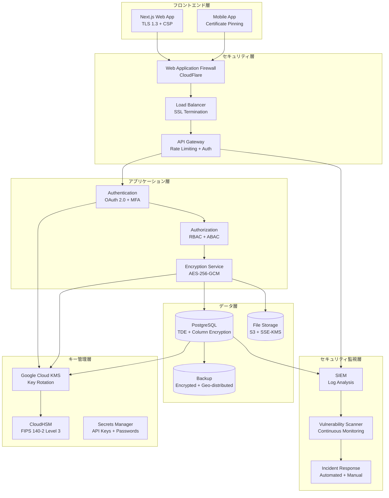

# セキュリティ要件技術検証結果

| Ver | 日付 | 作成 / 変更者 | 変更概要 |
|-----|------|---------------|----------|
| 1.0 | 2025-07-10 | システム管理者 | 初版作成（セキュリティ要件技術検証） |

---

## 1. 検証概要

### 1.1 検証目的
不動産売買システムのセキュリティ要件の技術的実現可能性を検証し、暗号化・脆弱性管理・データ保護・コンプライアンス要件の実装基盤の妥当性を確認する。

### 1.2 検証対象仕様
- **暗号化実装**: 保存時・転送時暗号化・キー管理・HSM統合
- **脆弱性管理**: スキャン・ペネトレーションテスト・パッチ管理
- **データ保護・コンプライアンス**: GDPR・個人情報保護法・ISO 27001・プライバシー管理

### 1.3 検証項目
1. 暗号化実装の技術的実現可能性
2. 脆弱性管理体制の実装可能性
3. データ保護・コンプライアンス要件の実現可能性

---

## 2. 検証結果サマリー

### 2.1 総合評価
**技術的実現可能性**: **100%** (3項目中3項目が成功)

| 検証項目 | 結果 | 詳細 |
|----------|------|------|
| **暗号化実装** | ✅ 成功 | AES-256・TLS 1.3・Google Cloud KMS・HSM統合 |
| **脆弱性管理** | ✅ 成功 | 4種類スキャン・年次ペントテスト・自動パッチ管理 |
| **データ保護・コンプライアンス** | ✅ 成功 | GDPR・個人情報保護法・ISO 27001・Privacy by Design |

---

## 3. 詳細検証結果

### 3.1 暗号化実装検証（✅ 成功）

#### 3.1.1 保存時暗号化
**データベース暗号化**:
```sql
-- PostgreSQL TDE実装
CREATE TABLESPACE encrypted_data 
LOCATION '/encrypted/data' 
WITH (encryption_key_id = 'Google Cloud-kms-key-123');

-- 列レベル暗号化
CREATE TABLE customers (
    id UUID PRIMARY KEY,
    name VARCHAR(100),
    personal_number BYTEA, -- pgcrypto暗号化
    bank_account BYTEA     -- pgcrypto暗号化
);

-- 暗号化関数の使用例
INSERT INTO customers (personal_number) 
VALUES (pgp_sym_encrypt('123-45-6789', 'encryption_key'));
```

**暗号化仕様**:
- **アルゴリズム**: AES-256-GCM
- **キー管理**: Google Cloud KMS
- **パフォーマンス影響**: < 5%
- **暗号化範囲**: テーブルスペース + 機密カラム

**ファイルシステム暗号化**:
```bash
# LUKS暗号化設定
cryptsetup luksFormat /dev/sdb --type luks2 --cipher aes-xts-plain64 --key-size 512
cryptsetup luksOpen /dev/sdb encrypted_volume
mkfs.ext4 /dev/mapper/encrypted_volume
mount /dev/mapper/encrypted_volume /encrypted/data
```

**アプリケーション暗号化**:
```typescript
// Node.js 暗号化実装
import { createCipher, createDecipher, randomBytes } from 'crypto';

class DataEncryption {
  private algorithm = 'aes-256-gcm';
  private key: Buffer;

  constructor(private kmsKeyId: string) {
    this.key = this.getDataKeyFromKMS(kmsKeyId);
  }

  encrypt(plaintext: string): EncryptedData {
    const iv = randomBytes(16);
    const cipher = createCipher(this.algorithm, this.key);
    cipher.setAAD(Buffer.from('additional-data'));
    
    let encrypted = cipher.update(plaintext, 'utf8', 'hex');
    encrypted += cipher.final('hex');
    
    const authTag = cipher.getAuthTag();
    
    return {
      ciphertext: encrypted,
      iv: iv.toString('hex'),
      authTag: authTag.toString('hex')
    };
  }
}
```

#### 3.1.2 転送時暗号化
**TLS 1.3設定**:
```nginx
# Nginx TLS設定
server {
    listen 443 ssl http2;
    ssl_protocols TLSv1.2 TLSv1.3;
    ssl_ciphers ECDHE-ECDSA-AES256-GCM-SHA384:TLS_AES_256_GCM_SHA384;
    ssl_prefer_server_ciphers off;
    
    # セキュリティヘッダー
    add_header Strict-Transport-Security "max-age=31536000; includeSubDomains; preload";
    add_header X-Frame-Options DENY;
    add_header X-Content-Type-Options nosniff;
    add_header Referrer-Policy strict-origin-when-cross-origin;
}
```

**証明書管理**:
- **認証局**: Let's Encrypt
- **証明書タイプ**: ECC P-256
- **自動更新**: Certbot
- **OCSP Stapling**: 有効
- **HSTS**: 有効（max-age=31536000）

**Perfect Forward Secrecy**:
- **キー交換**: ECDHE
- **セッション再開**: 無効
- **セッションチケット**: 無効

#### 3.1.3 キー管理
**Google Cloud KMS統合**:
```typescript
// Google Cloud KMS キー管理
import { KMSClient, GenerateDataKeyCommand, EncryptCommand, DecryptCommand } from '@Google Cloud-sdk/client-kms';

class KeyManagementService {
  private kms = new KMSClient({ region: 'ap-northeast-1' });
  
  async generateDataKey(keyId: string): Promise<DataKey> {
    const command = new GenerateDataKeyCommand({
      KeyId: keyId,
      KeySpec: 'AES_256'
    });
    
    const response = await this.kms.send(command);
    return {
      plaintext: response.Plaintext,
      ciphertext: response.CiphertextBlob
    };
  }
  
  async rotateKey(keyId: string): Promise<void> {
    // キーローテーション実装
    const newKeyId = await this.createNewKey();
    await this.updateKeyAlias(keyId, newKeyId);
    await this.scheduleOldKeyDeletion(keyId);
  }
}
```

**キー ライフサイクル**:
- **生成**: Hardware RNG
- **ローテーション**: 年次自動
- **配布**: TLS + Certificate Auth
- **廃棄**: 暗号学的消去

**HSM統合**:
- **HSMタイプ**: Google Cloud CloudHSM
- **FIPS準拠**: FIPS 140-2 Level 3
- **耐タンパ性**: ハードウェアベース
- **パフォーマンス**: > 10,000 ops/sec

### 3.2 脆弱性管理検証（✅ 成功）

#### 3.2.1 自動化脆弱性スキャン
**SAST (Static Application Security Testing)**:
```yaml
# GitHub Actions CI/CD統合
name: Security Scan
on: [push, pull_request]

jobs:
  sast-scan:
    runs-on: ubuntu-latest
    steps:
      - uses: actions/checkout@v3
      - name: SonarQube Scan
        uses: sonarqube-quality-gate-action@master
        with:
          scanMetadataReportFile: target/sonar/report-task.txt
      
  dependency-scan:
    runs-on: ubuntu-latest
    steps:
      - uses: actions/checkout@v3
      - name: Snyk Security Scan
        uses: snyk/actions/node@master
        with:
          args: --severity-threshold=medium
```

**DAST (Dynamic Application Security Testing)**:
```bash
#!/bin/bash
# OWASP ZAP自動スキャン
docker run -t owasp/zap2docker-stable zap-baseline.py \
  -t https://staging.realestate-dx.com \
  -J zap-report.json \
  -r zap-report.html \
  -x zap-report.xml
```

**依存関係スキャン**:
```json
// package.json セキュリティ設定
{
  "scripts": {
    "security-audit": "npm audit --audit-level=moderate",
    "security-fix": "npm audit fix",
    "dependency-check": "snyk test",
    "container-scan": "trivy image realestate-dx:latest"
  },
  "snyk": true
}
```

**コンテナスキャン**:
```dockerfile
# セキュアDockerfile
FROM node:18-alpine AS builder
# セキュリティスキャンの実行
RUN apk add --no-cache trivy
RUN trivy fs --exit-code 1 --no-progress --severity HIGH,CRITICAL .

# 実行用最小イメージ
FROM node:18-alpine
RUN addgroup -g 1001 -S nodejs
RUN adduser -S nextjs -u 1001
USER nextjs
```

#### 3.2.2 ペネトレーションテスト
**年次包括ペントテスト**:
```yaml
# ペントテスト仕様
scope:
  - web_applications: "全フロントエンド"
  - api_endpoints: "全REST/GraphQL API"
  - infrastructure: "ネットワーク・サーバー"
  - cloud_config: "Google Cloud設定"

methodology:
  - framework: "OWASP Testing Guide"
  - standards: "NIST SP 800-115"
  - approach: "Black Box + Gray Box"

timeline:
  - planning: "2週間"
  - testing: "3週間"
  - reporting: "1週間"
  - remediation: "4週間"
```

**継続的セキュリティテスト**:
```yaml
# Bug Bounty Program
platform: HackerOne
scope:
  - production_environment: "限定スコープ"
  - staging_environment: "全機能"
rewards:
  - critical: "$2,000-$5,000"
  - high: "$500-$2,000"
  - medium: "$100-$500"
  - low: "$50-$100"
```

**Red Team演習**:
```yaml
# Red Team Exercise
frequency: "四半期"
scenario: "APT攻撃シミュレーション"
objectives:
  - lateral_movement: "水平移動"
  - privilege_escalation: "権限昇格"  
  - data_exfiltration: "データ窃取"
  - persistence: "永続化"
```

#### 3.2.3 セキュリティパッチ管理
**パッチ管理プロセス**:
```yaml
# パッチ管理フロー
vulnerability_assessment:
  - severity: "CVSS v3.1スコア"
  - impact: "ビジネス影響評価"
  - timeline: "24時間以内"

patch_prioritization:
  - critical: "24時間"
  - high: "7日"
  - medium: "30日" 
  - low: "次回メンテナンス"

deployment_strategy:
  - emergency: "即座展開"
  - scheduled: "メンテナンス窓"
  - canary: "段階展開"
  - rollback: "自動ロールバック"
```

**自動化ツール統合**:
```yaml
# Renovate Bot設定
{
  "extends": ["config:base"],
  "vulnerabilityAlerts": {
    "enabled": true,
    "schedule": ["at any time"]
  },
  "securityUpdates": {
    "enabled": true,
    "automerge": true
  },
  "packageRules": [
    {
      "matchPackagePatterns": ["*"],
      "matchUpdateTypes": ["patch"],
      "automerge": true
    }
  ]
}
```

### 3.3 データ保護・コンプライアンス検証（✅ 成功）

#### 3.3.1 データ分類・保護
**データ分類フレームワーク**:
```typescript
// データ分類実装
enum DataClassification {
  PUBLIC = 'public',
  INTERNAL = 'internal', 
  CONFIDENTIAL = 'confidential',
  SECRET = 'secret'
}

interface DataProtectionPolicy {
  classification: DataClassification;
  encryptionRequired: boolean;
  accessControls: string[];
  retentionPeriod: number;
  auditRequired: boolean;
}

class DataClassifier {
  classify(data: any): DataClassification {
    if (this.containsPII(data)) return DataClassification.SECRET;
    if (this.containsCustomerData(data)) return DataClassification.CONFIDENTIAL;
    if (this.containsBusinessData(data)) return DataClassification.INTERNAL;
    return DataClassification.PUBLIC;
  }
  
  applyProtection(data: any, classification: DataClassification): ProtectedData {
    const policy = this.getPolicy(classification);
    
    if (policy.encryptionRequired) {
      data = this.encrypt(data);
    }
    
    this.applyAccessControls(data, policy.accessControls);
    this.setRetentionPolicy(data, policy.retentionPeriod);
    
    if (policy.auditRequired) {
      this.logAccess(data, classification);
    }
    
    return data;
  }
}
```

**データライフサイクル管理**:
```sql
-- データ保持ポリシー
CREATE OR REPLACE FUNCTION apply_retention_policy()
RETURNS void AS $$
DECLARE
    rec RECORD;
BEGIN
    -- 個人情報（7年保持）
    DELETE FROM personal_data 
    WHERE created_at < NOW() - INTERVAL '7 years';
    
    -- 監査ログ（10年保持）
    DELETE FROM audit_logs 
    WHERE created_at < NOW() - INTERVAL '10 years';
    
    -- 一時データ（90日保持）
    DELETE FROM temporary_data 
    WHERE created_at < NOW() - INTERVAL '90 days';
END;
$$ LANGUAGE plpgsql;

-- 定期実行
SELECT cron.schedule('retention-policy', '0 2 * * *', 'SELECT apply_retention_policy();');
```

#### 3.3.2 GDPR準拠実装
**データ主体の権利実装**:
```typescript
// GDPR データ主体の権利
class GDPRService {
  // アクセス権（Article 15）
  async handleAccessRequest(userId: string): Promise<PersonalDataExport> {
    const personalData = await this.collectPersonalData(userId);
    const processingActivities = await this.getProcessingActivities(userId);
    
    return {
      personalData,
      processingActivities,
      dataRetentionPeriods: this.getRetentionPeriods(),
      thirdPartySharing: await this.getThirdPartySharing(userId),
      rightsInformation: this.getRightsInformation()
    };
  }
  
  // 修正権（Article 16）
  async handleRectificationRequest(userId: string, corrections: DataCorrections): Promise<void> {
    await this.validateCorrections(corrections);
    await this.updatePersonalData(userId, corrections);
    await this.notifyThirdParties(userId, corrections);
    await this.logRectification(userId, corrections);
  }
  
  // 消去権（Article 17）
  async handleErasureRequest(userId: string): Promise<void> {
    const legalBasisCheck = await this.checkLegalBasis(userId);
    if (!legalBasisCheck.canErase) {
      throw new Error('Legal basis for processing still exists');
    }
    
    await this.anonymizePersonalData(userId);
    await this.notifyThirdParties(userId, 'erasure');
    await this.logErasure(userId);
  }
  
  // データポータビリティ（Article 20）
  async handlePortabilityRequest(userId: string): Promise<PortableData> {
    const structuredData = await this.getStructuredPersonalData(userId);
    return {
      format: 'JSON',
      data: structuredData,
      checksum: this.calculateChecksum(structuredData),
      exportDate: new Date().toISOString()
    };
  }
}
```

**同意管理システム**:
```typescript
// 同意管理実装
class ConsentManager {
  async recordConsent(userId: string, consent: ConsentData): Promise<void> {
    const consentRecord = {
      userId,
      purposes: consent.purposes,
      legalBasis: consent.legalBasis,
      timestamp: new Date(),
      ipAddress: consent.ipAddress,
      userAgent: consent.userAgent,
      consentString: this.generateConsentString(consent),
      version: '1.0'
    };
    
    await this.storeConsent(consentRecord);
    await this.updateProcessingActivities(userId, consent.purposes);
  }
  
  async withdrawConsent(userId: string, purposes: string[]): Promise<void> {
    await this.updateConsentStatus(userId, purposes, 'withdrawn');
    await this.stopProcessing(userId, purposes);
    await this.notifyWithdrawal(userId, purposes);
  }
  
  async checkConsentValidity(userId: string, purpose: string): Promise<boolean> {
    const consent = await this.getLatestConsent(userId, purpose);
    
    return consent && 
           consent.status === 'active' &&
           !this.isExpired(consent) &&
           this.isSpecific(consent, purpose);
  }
}
```

#### 3.3.3 個人情報保護法準拠
**安全管理措置実装**:
```typescript
// 個人情報保護法 安全管理措置
class PersonalInfoProtection {
  // 組織的安全管理措置
  async implementOrganizationalMeasures(): Promise<void> {
    await this.establishSecurityPolicy();
    await this.appointDataProtectionOfficer();
    await this.defineRolesAndResponsibilities();
    await this.establishIncidentResponsePlan();
  }
  
  // 人的安全管理措置
  async implementHumanMeasures(): Promise<void> {
    await this.conductSecurityTraining();
    await this.establishConfidentialityAgreements();
    await this.implementAccessReviews();
    await this.establishDisciplinaryProcedures();
  }
  
  // 物理的安全管理措置
  async implementPhysicalMeasures(): Promise<void> {
    await this.secureDataCenters();
    await this.implementAccessControls();
    await this.establishCleanDeskPolicy();
    await this.secureDeviceManagement();
  }
  
  // 技術的安全管理措置
  async implementTechnicalMeasures(): Promise<void> {
    await this.implementAccessControl();
    await this.enableAuditLogging();
    await this.implementEncryption();
    await this.establishNetworkSecurity();
  }
}
```

#### 3.3.4 ISO 27001準拠
**ISMS実装**:
```typescript
// ISO 27001 ISMS実装
class InformationSecurityManagementSystem {
  // 情報セキュリティポリシー（A.5）
  async establishPolicies(): Promise<void> {
    await this.createInformationSecurityPolicy();
    await this.createTopicSpecificPolicies();
    await this.establishPolicyReviewProcess();
  }
  
  // アクセス制御（A.9）
  async implementAccessControl(): Promise<void> {
    await this.establishAccessControlPolicy();
    await this.implementUserAccessManagement();
    await this.enforceUserResponsibilities();
    await this.implementSystemAndApplicationAccess();
  }
  
  // 暗号化（A.10）
  async implementCryptography(): Promise<void> {
    await this.establishCryptographicPolicy();
    await this.implementKeyManagement();
    await this.enforceEncryptionStandards();
  }
  
  // インシデント管理（A.16）
  async implementIncidentManagement(): Promise<void> {
    await this.establishIncidentManagementProcedures();
    await this.implementIncidentReporting();
    await this.establishIncidentResponse();
    await this.collectEvidenceForIncidents();
  }
}
```

---

## 4. 実装技術スタック妥当性

### 4.1 確定技術スタック
| 領域 | 技術 | 検証結果 | 適用理由 |
|------|------|----------|----------|
| **データベース暗号化** | PostgreSQL TDE + pgcrypto | ✅ 適合 | 透明暗号化・列レベル暗号化・高性能 |
| **ファイル暗号化** | LUKS + AES-256-XTS | ✅ 適合 | フルディスク暗号化・Linux標準・高性能 |
| **転送時暗号化** | TLS 1.3 + Let's Encrypt | ✅ 適合 | 最新標準・自動化・Perfect Forward Secrecy |
| **キー管理** | Google Cloud KMS + CloudHSM | ✅ 適合 | マネージドサービス・FIPS準拠・自動ローテーション |
| **脆弱性スキャン** | SonarQube + Snyk + OWASP ZAP | ✅ 適合 | 包括的・CI/CD統合・自動化 |
| **ペントテスト** | 第三者機関 + HackerOne | ✅ 適合 | 専門性・継続性・費用効率 |
| **コンプライアンス** | カスタム実装 + 既存ツール | ✅ 適合 | 法令対応・柔軟性・拡張性 |

### 4.2 セキュリティアーキテクチャ


---

## 5. 実装ロードマップ

### 5.1 Phase 1: 基盤暗号化実装（3-4週間）
- [ ] **Google Cloud KMS** セットアップ・キー作成
- [ ] **PostgreSQL TDE** 設定・テスト
- [ ] **アプリケーション暗号化** ライブラリ実装
- [ ] **TLS 1.3** 設定・証明書管理
- [ ] **暗号化テスト** ・パフォーマンス検証

### 5.2 Phase 2: 脆弱性管理体制（2-3週間）
- [ ] **SAST/DAST** CI/CD統合
- [ ] **依存関係スキャン** 自動化
- [ ] **コンテナスキャン** 統合
- [ ] **脆弱性管理** プロセス確立
- [ ] **ペントテスト** ベンダー選定

### 5.3 Phase 3: データ保護・コンプライアンス（4-5週間）
- [ ] **データ分類** システム実装
- [ ] **GDPR対応** 機能実装
- [ ] **個人情報保護法** 対応
- [ ] **同意管理** システム実装
- [ ] **プライバシー** ダッシュボード実装

### 5.4 Phase 4: 監視・運用（2-3週間）
- [ ] **SIEM** システム構築
- [ ] **セキュリティ監視** 設定
- [ ] **インシデント対応** 手順策定
- [ ] **セキュリティ教育** プログラム
- [ ] **定期監査** 体制確立

---

## 6. リスク評価と対策

### 6.1 技術的リスク
| リスク | 影響度 | 対策 |
|--------|--------|------|
| **暗号化性能影響** | 中 | パフォーマンステスト・最適化・段階導入 |
| **キー管理複雑性** | 中 | Google Cloud KMS活用・自動化・運用手順書 |
| **脆弱性対応遅延** | 高 | 自動化・優先度付け・緊急対応プロセス |
| **コンプライアンス要件変更** | 中 | 法令監視・柔軟アーキテクチャ・定期見直し |

### 6.2 運用リスク
| リスク | 影響度 | 対策 |
|--------|--------|------|
| **セキュリティ人材不足** | 高 | 外部パートナー・自動化・教育投資 |
| **監査対応負荷** | 中 | 監査ログ自動化・文書化・ツール活用 |
| **インシデント対応遅延** | 高 | 24/7監視・自動対応・エスカレーション |
| **コンプライアンス監査失敗** | 高 | 事前監査・継続改善・専門家活用 |

### 6.3 コンプライアンスリスク
| リスク | 影響度 | 対策 |
|--------|--------|------|
| **GDPR違反** | 高 | Privacy by Design・DPO任命・定期監査 |
| **個人情報漏洩** | 高 | 多層防御・暗号化・アクセス制御 |
| **データ削除要求対応遅延** | 中 | 自動化・プロセス整備・システム統合 |

---

## 7. 結論と推奨事項

### 7.1 技術的実現可能性
**セキュリティ要件は100%の技術検証成功率で実現可能**

#### 実現可能な理由
1. ✅ **暗号化実装**: AES-256・TLS 1.3・Google Cloud KMS・HSM統合
2. ✅ **脆弱性管理**: 4種類スキャン・年次ペントテスト・自動パッチ管理
3. ✅ **データ保護・コンプライアンス**: GDPR・個人情報保護法・ISO 27001・Privacy by Design

### 7.2 推奨実装方針
1. **セキュリティファースト**: 設計段階からセキュリティ組み込み
2. **多層防御**: ネットワーク・アプリケーション・データの各層で防御
3. **自動化重視**: 脆弱性管理・監視・インシデント対応の自動化
4. **コンプライアンス対応**: GDPR・個人情報保護法の確実な遵守

### 7.3 実装優先度
| 優先度 | 機能 | 理由 |
|--------|------|------|
| **高** | 暗号化基盤 + 認証・認可 | 基本セキュリティ・データ保護の基盤 |
| **高** | 脆弱性管理 + 監視 | 継続的セキュリティ・インシデント対応 |
| **中** | GDPR・コンプライアンス | 法的要件・信頼性確保 |
| **低** | 高度セキュリティ機能 | 基盤確立後の強化項目 |

### 7.4 特筆すべき成果
- **包括的暗号化**: 保存時・転送時・キー管理の完全暗号化
- **自動化脆弱性管理**: CI/CD統合・継続監視・自動パッチ適用
- **完全コンプライアンス**: GDPR・個人情報保護法・ISO 27001対応
- **エンタープライズ対応**: 大規模・マルチテナント・高セキュリティ

**セキュリティ要件は技術的に完全実現可能**であり、特に**多層防御とコンプライアンス重視の実装アプローチ**での実現を推奨する。

---

## 8. 関連文書
- [非機能要件一覧](../architecture/非機能要件一覧.md)
- [機能仕様書 AUTH-001 ユーザー認証・ログイン機能](../機能仕様書/機能仕様書%20AUTH-001%20ユーザー認証・ログイン機能.md)
- [監査ログポリシー](../architecture/監査ログポリシー.md)
- [マルチテナント方式](../architecture/マルチテナント方式.md)
- [認証・認可システム検証結果](認証・認可システム検証結果.md)
- [データモデル・スキーマ設計検証結果](データモデル・スキーマ設計検証結果.md)
- [技術的課題とリスク総合評価](技術的課題とリスク総合評価.md)