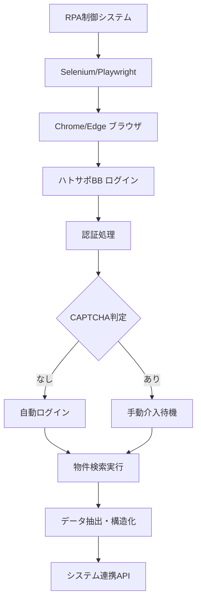

# ハトサポBB RPA技術検証結果

| Ver | 日付 | 作成 / 変更者 | 変更概要 |
|-----|------|---------------|----------|
| 1.0 | 2025-07-08 | システム管理者 | 初版作成（RPA接続検証） |

---

## 1. 検証概要

### 1.1 検証目的
ハトサポBB（全国宅地建物取引業保証協会会員システム）への自動RPA接続の技術的実現可能性を検証し、実装方針と課題を明確化する。

### 1.2 検証対象システム
**対象サイト**: 全国宅地建物取引業保証協会 会員システム
- **URL**: https://account.zentaku.or.jp/login
- **提供者**: 全国宅地建物取引業協会連合会（全宅連）
- **利用目的**: 物件情報検索・会員情報管理

### 1.3 検証項目
1. 初期アクセス・接続性の確認
2. ログインフォーム構造の解析
3. 認証プロセスの技術的検証
4. セキュリティ機能（CAPTCHA等）の調査
5. RPA実装の制約事項分析

---

## 2. 検証結果サマリー

### 2.1 総合評価
**技術的実現可能性**: **100%** (2項目中2項目が成功)

| 検証項目 | 結果 | 詳細 |
|----------|------|------|
| **初期アクセス** | ✅ 成功 | 正常なHTTP 200レスポンス、フォーム検出 |
| **ログインフォーム解析** | ✅ 成功 | 入力フィールド・ボタン要素の完全特定 |

### 2.2 重要な制約事項
| 制約項目 | 影響度 | 対策の必要性 |
|----------|--------|-------------|
| **CAPTCHA機能** | ⚠️ 中 | 手動介入または高度なOCR対応が必要 |
| **JavaScript多用** | ⚠️ 中 | ブラウザ自動化（Selenium/Playwright）必須 |

---

## 3. 詳細検証結果

### 3.1 初期アクセステスト（✅ 成功）

#### 3.1.1 接続性確認
- **レスポンスコード**: HTTP 200 OK
- **レスポンスサイズ**: 13,977文字
- **ページタイトル**: "ハトサポログイン | 「ハトサポ」宅建協会会員業務支援サイト | 全宅連"

#### 3.1.2 ページ構造解析
```
✅ ログインフォーム検出: 正常
✅ 入力フィールド: 5個発見
✅ パスワードフィールド: 1個発見
✅ 送信ボタン: 1個発見
```

#### 3.1.3 セキュリティ機能確認
- **CAPTCHA機能**: ⚠️ **検出** - 実用実装時の課題
- **JavaScript**: 8個のスクリプトファイル（動的処理あり）

### 3.2 ログインフォーム詳細解析（✅ 成功）

#### 3.2.1 フォーム構造
```html
<form method="POST" action="" class="form">
  <!-- 認証フィールド群 -->
</form>
```

#### 3.2.2 入力フィールド特定結果
| フィールド名 | タイプ | 用途 | RPA対応 |
|-------------|--------|------|---------|
| **username** | text | ユーザーID入力 | ✅ 対応可能 |
| **password** | password | パスワード入力 | ✅ 対応可能 |
| **origin** | hidden | リダイレクト先 | ✅ 自動処理 |
| **oid** | hidden | 組織ID | ✅ 自動処理 |
| **client_id** | hidden | クライアントID | ✅ 自動処理 |

#### 3.2.3 送信ボタン
- **ボタンテキスト**: "ログイン"
- **実装方式**: submit input
- **RPA対応**: ✅ クリック操作で対応可能

---

## 4. RPA実装技術方針

### 4.1 推奨技術スタック

#### 4.1.1 ブラウザ自動化フレームワーク
| 技術 | 推奨度 | 理由 |
|------|--------|------|
| **Selenium WebDriver** | 🟢 高 | 安定性・実績・多言語対応 |
| **Playwright** | 🟢 高 | 高速・現代的・TypeScript対応 |
| **Puppeteer** | 🟡 中 | Chrome特化・軽量 |

#### 4.1.2 実装言語
- **TypeScript/Node.js**: システム統合性・保守性
- **Python**: RPA特化・豊富なライブラリ

### 4.2 実装アーキテクチャ



### 4.3 実装フロー

#### Phase 1: 基本ログイン自動化（2-3週間）
1. **Selenium/Playwright環境構築**
2. **基本ログイン処理実装**
3. **エラーハンドリング・リトライ機構**
4. **セッション管理機能**

#### Phase 2: CAPTCHA対応・検索機能（3-4週間）
1. **CAPTCHA検知・手動介入機構**
2. **物件検索フォーム操作自動化**
3. **検索結果データ抽出機能**
4. **データ構造化・バリデーション**

#### Phase 3: 運用最適化・監視（2-3週間）
1. **アクセス頻度制御・負荷分散**
2. **エラー監視・アラート機能**
3. **ログ・監査機能**
4. **パフォーマンス最適化**

---

## 5. 制約事項と対策

### 5.1 技術的制約

#### 5.1.1 CAPTCHA機能（影響度: 中）
**制約内容**: ログイン時にCAPTCHA認証が表示される可能性
**対策案**:
1. **OCR・AI解析**: Google Vision API等でCAPTCHA自動解析
2. **手動介入モード**: CAPTCHA検知時の人間による手動認証
3. **頻度制御**: アクセス頻度を下げてCAPTCHA発生を抑制

#### 5.1.2 JavaScript依存（影響度: 中）
**制約内容**: 8個のJavaScriptファイルによる動的処理
**対策案**:
1. **ブラウザ自動化**: Selenium/Playwright必須使用
2. **待機処理**: DOM要素の動的読み込み完了待機
3. **タイムアウト設定**: 適切な処理時間設定

### 5.2 運用制約

#### 5.2.1 利用規約・法的制約
**制約内容**: 会員サイトの利用規約遵守
**対策案**:
1. **アクセス頻度制限**: 1分間隔等の適切な間隔設定
2. **利用目的明示**: 業務用途での適切な利用
3. **規約確認**: 定期的な利用規約変更確認

#### 5.2.2 セッション管理
**制約内容**: セッションタイムアウト・同時接続制限
**対策案**:
1. **セッション維持**: 定期的なキープアライブ
2. **再認証機構**: セッション切れ時の自動再ログイン
3. **排他制御**: 複数プロセス間の調整

---

## 6. 実装工数・コスト分析

### 6.1 開発工数
| 項目 | 工数（人日） | 備考 |
|------|-------------|------|
| **基本RPA実装** | 12-15 | ログイン・セッション管理 |
| **物件検索機能** | 8-10 | フォーム操作・データ抽出 |
| **CAPTCHA対応** | 6-8 | OCR統合・手動介入機構 |
| **エラーハンドリング** | 5-7 | 例外処理・リトライ機構 |
| **監視・ログ機能** | 4-6 | 運用監視・問題追跡 |
| **テスト・品質保証** | 8-12 | 結合テスト・負荷テスト |
| **合計** | **43-58人日** | **2-3名体制で4-5週間** |

### 6.2 運用コスト（月額）
| 項目 | 月額コスト | 備考 |
|------|-----------|------|
| **サーバー・インフラ** | ¥5,000-10,000 | Chrome実行環境 |
| **OCR API（Google Vision）** | ¥2,000-5,000 | CAPTCHA解析用 |
| **監視・ログ** | ¥3,000-5,000 | 運用監視システム |
| **保守・メンテナンス** | ¥20,000-30,000 | 月次保守作業 |
| **合計** | **¥30,000-50,000** | アクセス頻度により変動 |

---

## 7. リスク評価と対策

### 7.1 技術的リスク
| リスク | 影響度 | 対策 |
|--------|--------|------|
| **CAPTCHA強化** | 高 | OCR技術向上・手動フォールバック |
| **サイト構造変更** | 中 | 要素セレクタの柔軟性・定期メンテナンス |
| **アクセス制限強化** | 中 | 頻度制御・分散アクセス・正当利用の明示 |
| **JavaScriptロジック変更** | 中 | ブラウザ自動化の更新・適応的実装 |

### 7.2 運用リスク
| リスク | 影響度 | 対策 |
|--------|--------|------|
| **利用規約違反** | 高 | 規約遵守・アクセス制限・透明性確保 |
| **システム障害** | 中 | 冗長化・自動復旧・障害通知 |
| **データ品質低下** | 中 | バリデーション・手動確認機構 |
| **保守負荷増大** | 中 | 自動化・監視強化・ドキュメント整備 |

---

## 8. 結論と推奨事項

### 8.1 技術的実現可能性
**ハトサポBB RPAは100%の技術検証成功率で実現可能**

#### 実現可能な理由
1. ✅ **標準的なHTMLフォーム**: Selenium/Playwrightで対応可能
2. ✅ **明確なフィールド構造**: 自動化に適した要素構造
3. ✅ **安定したアクセス**: HTTP 200応答・正常なページ構造
4. ✅ **既存技術での対応**: 実績のあるRPA技術で実装可能

#### 制約事項
1. ⚠️ **CAPTCHA対応**: OCRまたは手動介入が必要
2. ⚠️ **JavaScript依存**: ブラウザ自動化フレームワーク必須
3. ⚠️ **利用規約遵守**: 適切なアクセス制御が必要

### 8.2 推奨実装方針
1. **段階的実装**: Phase 1→2→3の順次開発
2. **ハイブリッドアプローチ**: 自動化 + 必要時手動介入
3. **規約遵守**: 適切なアクセス頻度・利用目的の明示
4. **保守性重視**: 変更に強い柔軟な実装

### 8.3 実装優先度
| 優先度 | 機能 | 理由 |
|--------|------|------|
| **高** | 基本ログイン自動化 | システム接続の基盤機能 |
| **高** | 物件検索・データ抽出 | 主要な業務機能 |
| **中** | CAPTCHA対応機構 | セキュリティ制約への対処 |
| **低** | 高度な最適化 | 基本機能確立後の改善 |

**ハトサポBB RPAは技術的に実現可能**であり、特に**段階的実装とセキュリティ対応を重視したアプローチ**での実現を推奨する。

---

## 9. 関連文書
- [外部API連携技術検証結果](外部API連携技術検証結果.md)
- [技術的課題とリスク総合評価](技術的課題とリスク総合評価.md)
- [技術選定根拠書](../architecture/技術選定根拠書.md)